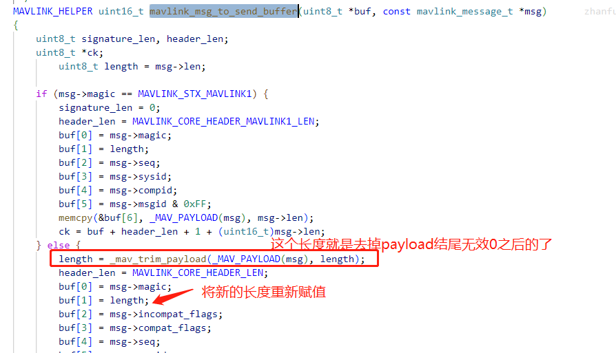

# MAVLink

## 概述

序列化方式为小端字节；

mavlink2协议有截断payload空字节的功能；

## MAVLink Basic

### Packet Format

Packet format定义了mavlink通信协议的数据包格式，打包与解析都需要按照该协议格式进行。

#### mavlink 1


| Byte Index     | C version                  | Content                                                      | Value   | Explanation                                                  |
| -------------- | -------------------------- | ------------------------------------------------------------ | ------- | ------------------------------------------------------------ |
| 0              | `uint8_t magic`            | Packet start marker                                          | 0xFE    | Protocol-specific start-of-text (STX) marker used to indicate the beginning of a new packet. Any system that does not understand protocol version will skip the packet. |
| 1              | `uint8_t len`              | Payload length                                               | 0 - 255 | Indicates length of the following `payload` section (fixed for a particular message). |
| 2              | `uint8_t seq`              | Packet sequence number                                       | 0 - 255 | Used to detect packet loss. Components increment value for each message sent. |
| 3              | `uint8_t sysid`            | System ID                                                    | 1 - 255 | ID of *system* (vehicle) sending the message. Used to differentiate systems on network. Note that the broadcast address 0 may not be used in this field as it is an invalid *source* address. |
| 4              | `uint8_t compid`           | Component ID                                                 | 1 - 255 | ID of *component* sending the message. Used to differentiate components in a *system* (e.g. autopilot and a camera). Use appropriate values in [MAV_COMPONENT](https://mavlink.io/en/messages/common.html#MAV_COMPONENT). Note that the broadcast address `MAV_COMP_ID_ALL` may not be used in this field as it is an invalid *source* address. |
| 5              | `uint8_t msgid`            | Message ID                                                   | 0 - 255 | ID of *message type* in payload. Used to decode data back into message object. |
| 6 to (n+6)     | `uint8_t payload[max 255]` | Payload data                                                 |         | Message data. Content depends on message type (i.e. Message ID). |
| (n+7) to (n+8) | `uint16_t checksum`        | [Checksum](https://mavlink.io/en/guide/serialization.html#checksum) (low byte, high byte) |         | X.25 CRC for message (excluding `magic` byte). Includes [CRC_EXTRA](https://mavlink.io/en/guide/serialization.html#crc_extra) byte. |

#### mavlink 2


| Byte Index       | C version                  | Content                                                      | Value        | Explanation                                                  |
| ---------------- | -------------------------- | ------------------------------------------------------------ | ------------ | ------------------------------------------------------------ |
| 0                | `uint8_t magic`            | Packet start marker                                          | 0xFD         | Protocol-specific start-of-text (STX) marker used to indicate the beginning of a new packet. Any system that does not understand protocol version will skip the packet. |
| 1                | `uint8_t len`              | Payload length                                               | 0 - 255      | Indicates length of the following `payload` section. This may be affected by [payload truncation](https://mavlink.io/en/guide/serialization.html#payload_truncation). |
| 2                | `uint8_t incompat_flags`   | [Incompatibility Flags](https://mavlink.io/en/guide/serialization.html#incompat_flags) |              | Flags that must be understood for MAVLink compatibility (implementation discards packet if it does not understand flag). |
| 3                | `uint8_t compat_flags`     | [Compatibility Flags](https://mavlink.io/en/guide/serialization.html#compat_flags) |              | Flags that can be ignored if not understood (implementation can still handle packet even if it does not understand flag). |
| 4                | `uint8_t seq`              | Packet sequence number                                       | 0 - 255      | Used to detect packet loss. Components increment value for each message sent. |
| 5                | `uint8_t sysid`            | System ID (sender)                                           | 1 - 255      | ID of *system* (vehicle) sending the message. Used to differentiate systems on network. Note that the broadcast address 0 may not be used in this field as it is an invalid *source* address. |
| 6                | `uint8_t compid`           | Component ID (sender)                                        | 1 - 255      | ID of *component* sending the message. Used to differentiate *components* in a *system* (e.g. autopilot and a camera). Use appropriate values in [MAV_COMPONENT](https://mavlink.io/en/messages/common.html#MAV_COMPONENT). Note that the broadcast address `MAV_COMP_ID_ALL` may not be used in this field as it is an invalid *source* address. |
| 7 to 9           | `uint24_t msgid:24`        | Message ID (low, middle, high bytes)                         | 0 - 16777215 | ID of *message type* in payload. Used to decode data back into message object. |
| 10 to (n+10)     | `uint8_t payload[max 255]` | [Payload](https://mavlink.io/en/guide/serialization.html#payload) |              | Message data. Depends on message type (i.e. Message ID) and contents. |
| (n+11) to (n+12) | `uint16_t checksum`        | [Checksum](https://mavlink.io/en/guide/serialization.html#checksum) (low byte, high byte) |              | X.25 CRC for message (excluding `magic` byte). Includes [CRC_EXTRA](https://mavlink.io/en/guide/serialization.html#crc_extra) byte. |
| (n+12) to (n+26) | `uint8_t signature[13]`    | [Signature](https://mavlink.io/en/guide/message_signing.html) |              | (Optional) Signature to ensure the link is tamper-proof.     |


- 最小包长度为12字节，例如不包含payload的acknowledgment消息。
- 最大包长度为280字节，这时包括了签名信息，并且payload是满字节（即255个字节）。

### Payload Format

获取了mavlink数据包后，我们可以通过packet format定义的协议格式提取一个完整的mavlink包，也就是可以获取到mavlink包的len、sysid、compid以及msgid和payload等等。那如何理解这个包发送的内容到底是代表什么意思呢？这个时候就需要根据msgid对应的payload format去解析mavlink包“装载”的信息是什么了。

简单来说，payload就是信息，我们需要根据msgid对应的数据结构去解析这个信息，msgid对应的数据结构定义是由.xml文件定义的，根据不同的.xml文件可以由mavgen工具生成对应编程语言的库文件，编程时可以调用库函数自动解析不同msgid对应的数据结构。

MAVLink does not include information about the message structure in the payload itself (in order to reduce overhead)! Instead the sender and receiver must share a common understanding of the meaning, order and size of message fields in the over-the-wire format.

Messages are encoded within the MAVLink packet:

1) The `msgid` (message id) field identifies the specific message encoded in the packet.

2) The payload field contains the message data.

- MAVLink [reorders the message fields](https://mavlink.io/en/guide/serialization.html#field_reordering) in the payload for over-the-wire transmission (from the order in the original [XML Message Definitions](https://mavlink.io/en/messages/)).
- MAVLink 2 [truncates](https://mavlink.io/en/guide/mavlink_2.html#packet_truncation) any zero-filled bytes at the end of the payload before the message is sent and sets the packet `len` field appropriately (MAVLink 1 always sends all bytes).

3) The `len` field contains the length of the payload data.

4) A [CRC_EXTRA](https://mavlink.io/en/guide/serialization.html#crc_extra) byte is added to the message [checksum](https://mavlink.io/en/guide/serialization.html#checksum). A receiver can use this to confirm that it is compatible with the payload message format/definition.


### Common Message Set

一个完整的mavlink消息机制可包括如下三个部分的概念：

- Mavlink type enumerations

包含了所有需要用到的枚举类型。

- Mavlink commands(MAV_CMD)

包含了关于MAV_CMD相关的枚举类型定义，由于command内容较多，所以单独拿出来说明。当mavlink包的msgid=76(COMMAND_LONG)时，会用到MAV_CMD的枚举类型。

- Mavlink message

定义了所有msgid对应的数据结构。

#### XML

一个.xml文件的根字段为<mavlink>，包含了两个主要字段：<enums>和<messages>，整个文件的的具体格式内容如下：

```xml
<?xml version="1.0"?>
<mavlink>
<enums>
  <enum name="MAV_COMPONENT">
    <entry value="0" name="MAV_COMP_ID_ALL">
      <description>Target id (target_component)...</description>
    </entry>
    <entry value="1" name="MAV_COMP_ID_AUTOPILOT1">
      <description>System flight controller component...</description>
    </entry>
    // other entrys
    ....
    ....
  </enum>
    
  // MAV_CMD  
  <enum name="MAV_CMD">
    <entry value="16" name="MAV_CMD_NAV_WAYPOINT" hasLocation="true" isDestination="true">
      <description>Navigate to waypoint.</description>
      <param index="1" label="Hold" units="s" minValue="0">Hold time.</param>
      <param index="2" label="Accept Radius" units="m" minValue="0"></param>
      <param index="3" label="Pass Radius" units="m"></param>
      <param index="4" label="Yaw" units="deg"></param>
      <param index="5" label="Latitude">Latitude</param>
      <param index="6" label="Longitude">Longitude</param>
      <param index="7" label="Altitude" units="m">Altitude</param>
    </entry>
    // other entrys
    ....
    ....
  </enum>
  //
  <enum name="MAV_CMD_ACK">
    <entry name="MAV_CMD_ACK_OK">
        <description>Command / mission item is ok.</description>
    </entry>
    <entry name="MAV_CMD_ACK_ERR_FAIL">
      <description>Generic error message .....</description>
    </entry>
    // other entrys
    ....
    ....
  </enum>
  
</enums>

<messages>
  //msgid=0
  <message id="0" name="HEARTBEAT">
    <description>The heartbeat message shows that...</description>
    <field type="uint8_t" name="type" enum="MAV_TYPE">Vehicle </field>
    <field type="uint8_t" name="autopilot" enum="MAV_AUTOPILOT">Auto...  </field>
    <field type="uint8_t" name="base_mode" enum="MAV_MODE_FLAG">Sys...   </field>
    <field type="uint32_t" name="custom_mode">A bitfield for use...      </field>
    <field type="uint8_t" name="system_status" enum="MAV_STATE">System...</field>
    <field type="uint8_t_mavlink_version" name="mavlink_version">MAVLink...</field>
  </message>
    
  <message id="76" name="COMMAND_LONG">
    <description>Send a command with up to seven parameters...</description>
    <field type="uint8_t" name="target_system">System which should... </field>
    <field type="uint8_t" name="target_component">Component which ... </field>
    <field type="uint16_t" name="command" enum="MAV_CMD">Command...   </field>
    <field type="uint8_t" name="confirmation">0: First transmission...</field>
    <field type="float" name="param1">Parameter 1</field>
    <field type="float" name="param2">Parameter 2</field>
    <field type="float" name="param3">Parameter 3</field>
    <field type="float" name="param4">Parameter 4</field>
    <field type="float" name="param5">Parameter 5</field>
    <field type="float" name="param6">Parameter 6</field>
    <field type="float" name="param7">Parameter 7</field>
  </message>
  // other message ids
  ....
  ....
</messages>
</mavlink>
```


#### Message example

##### HEARTBEAT

```XML
<message id="0" name="HEARTBEAT">
    <description>The heartbeat message shows that a system or component is present and responding. The type and autopilot fields (along with the message component id), allow the receiving system to treat further messages from this system appropriately (e.g. by laying out the user interface based on the autopilot). This microservice is documented at https://mavlink.io/en/services/heartbeat.html</description>
    <field type="uint8_t" name="type" enum="MAV_TYPE">Vehicle or component type. For a flight controller component the vehicle type (quadrotor, helicopter, etc.). For other components the component type (e.g. camera, gimbal, etc.). This should be used in preference to component id for identifying the component type.</field>
    <field type="uint8_t" name="autopilot" enum="MAV_AUTOPILOT">Autopilot type / class. Use MAV_AUTOPILOT_INVALID for components that are not flight controllers.</field>
    <field type="uint8_t" name="base_mode" enum="MAV_MODE_FLAG" display="bitmask">System mode bitmap.</field>
    <field type="uint32_t" name="custom_mode">A bitfield for use for autopilot-specific flags</field>
    <field type="uint8_t" name="system_status" enum="MAV_STATE">System status flag.</field>
    <field type="uint8_t_mavlink_version" name="mavlink_version">MAVLink version, not writable by user, gets added by protocol because of magic data type: uint8_t_mavlink_version</field>
</message>
```

生成的**mavlink_msg_heartbeat.h**主要包括了如下几个部分：

- 数据结构体

  **mavlink_heartbeat_t**

- 打包函数

  **mavlink_msg_heartbeat_pack**或者**mavlink_msg_heartbeat_encode**

- 解析函数

  **mavlink_msg_heartbeat_decode**

```c
#define MAVLINK_MSG_ID_HEARTBEAT 0

typedef struct __mavlink_heartbeat_t {
     uint32_t custom_mode; /*<  A bitfield for use for autopilot-specific flags*/
     uint8_t type; 
     uint8_t autopilot; 
     uint8_t base_mode; /*<  System mode bitmap.*/
     uint8_t system_status; /*<  System status flag.*/
     uint8_t mavlink_version; /*<  MAVLink version, not writable by user, gets added by protocol because of magic data type: uint8_t_mavlink_version*/
} mavlink_heartbeat_t;

static inline uint16_t mavlink_msg_heartbeat_pack(uint8_t system_id, uint8_t component_id, mavlink_message_t* msg,uint8_t type, uint8_t autopilot, uint8_t base_mode, uint32_t custom_mode, uint8_t system_status)
{
}
static inline uint16_t mavlink_msg_heartbeat_encode(uint8_t system_id, uint8_t component_id, mavlink_message_t* msg, const mavlink_heartbeat_t* heartbeat)
{
    return mavlink_msg_heartbeat_pack(system_id, component_id, msg, heartbeat->type, heartbeat->autopilot, heartbeat->base_mode, heartbeat->custom_mode, heartbeat->system_status);
}

static inline void mavlink_msg_heartbeat_decode(const mavlink_message_t* msg, mavlink_heartbeat_t* heartbeat)
{
}
```


##### COMMAND_LONG

```xml
<message id="76" name="COMMAND_LONG">
    <description>Send a command with up to seven parameters to the MAV. The command microservice is documented at https://mavlink.io/en/services/command.html</description>
    <field type="uint8_t" name="target_system">System which should execute the command</field>
    <field type="uint8_t" name="target_component">Component which should execute the command, 0 for all components</field>
    <field type="uint16_t" name="command" enum="MAV_CMD">Command ID (of command to send).</field>
    <field type="uint8_t" name="confirmation">0: First transmission of this command. 1-255: Confirmation transmissions (e.g. for kill command)</field>
    <field type="float" name="param1">Parameter 1 (for the specific command).</field>
    <field type="float" name="param2">Parameter 2 (for the specific command).</field>
    <field type="float" name="param3">Parameter 3 (for the specific command).</field>
    <field type="float" name="param4">Parameter 4 (for the specific command).</field>
    <field type="float" name="param5">Parameter 5 (for the specific command).</field>
    <field type="float" name="param6">Parameter 6 (for the specific command).</field>
    <field type="float" name="param7">Parameter 7 (for the specific command).</field>
</message>
```

## How To Use

### Generate headers

首先下载[mavlink](https://github.com/mavlink/mavlink/)仓库代码，MAVLink仓库代码提供了GUI或者命令行两种方式生成不同语言的”Header"，最方便的就是运行GUI，可以通过如下命令行：

```
$python2 mavgenerate.py
```

接下来根据GUI界面提示即可，根据你的编程语言选择生成不同语言版本的库。

### Demo in C

```shell
mavlink_msg_xxx_.h --> common.h
mavlink_helpers.h --> protocol.h --> common.h --> mavlink.h 
```


### Demo in python

我们以python环境编程为例，讲解如何使用mavlink进行通信。

**python工程配置说明**

生成的python版本的mavlink库文件中需要依赖*mavcrc.py*文件，因为在mavlink库文件中你会看到如下依赖的库：

```python
from __future__ import print_function
from builtins import range
from builtins import object
import struct, array, time, json, os, sys, platform

'''
注意，根据mavcrc的路径，你可能需要进行适当修改导入路径
'''
from ...generator.mavcrc import x25crc
import hashlib
```

*mavcrc.py*文件在mavlink GitHub的路径为：*mavlink-master/pymavlink/generator/mavcrc.py* ，你需要将这个文件拷贝到你的工程目录下，例如拷贝至工程目录的*generator*文件夹下面。

**代码示例**

```python
import time
import socket

from mavlink import *
"""
    向GCS发送Heartbeat消息并接收GCS发送的Heartbeat消息
"""
class Device(object): 
    """
    创建设备文件，作为file参数传入MAVLink类，由于MAVLink发送数据使用file.write()，故Device需要将设备发送函数映射至write()。
    """
    def __init__(self, device_ip, device_port = 14550):
        #udp协议
        self.server      = socket.socket(socket.AF_INET, socket.SOCK_DGRAM)  
        self.device_ip   = device_ip     # gcs(目标) IP
        self.device_port = device_port # gcs(目标) 端口
        self.device_address = (self.device_ip, self.device_port)
    
    def write(self, data_send): 
        # mavlink对象调用此函数发送数据
        sent_callback = self.server.sendto(data_send, self.device_address)

def main():
    local_addr = ("127.0.0.1", 14551)
    gcs_addr   = ("127.0.0.1", 14550)
    sock       = socket.socket(socket.AF_INET, socket.SOCK_DGRAM)
    # 绑定本地端口，方便接收外部数据
    sock.bind(local_addr)
    dev = Device(gcs_addr[0], gcs_addr[1])
    drone = MAVLink(dev, 1, 200)

    for i in range(10):
        print(f">>> Communite loop {i}th")
        print(f"send heartbeat msg")
        drone.heartbeat_send(MAV_TYPE_HELICOPTER, MAV_AUTOPILOT_GENERIC, MAV_MODE_GUIDED_ARMED, 0, MAV_STATE_ACTIVE)
        # 接收消息
        data, addr = sock.recvfrom(1024)
        if len(data) > 0:
            result = drone.parse_char(data)
            # 判断msg的类型
            if isinstance(result, MAVLink_heartbeat_message):
                print(f"received heartbeat: sys={result.get_srcSystem()}, cmp={result.get_srcComponent()}")
        time.sleep(1)
if __name__ == '__main__':
    main()
```

### GCS setting

在进行mavlink开发测试中，最好的方式是与GCS进行通信测试，GCS默认会发送1hz的hearbeat message，并且其接收的mavlink消息能够显示出来，这样你写的mavlink工程就能往GCS发送数据或者接收GCS发送的heartbeat消息了。

**新建一个mavlink连接**

最常用的连接是UDP或者串口，在本机测试中，我们一般使用UDP方式进行mavlink通信调试，可以点击`Comm Links->Add`添加一个连接，如下图：


点击`Edit`进行配置编辑，例如对于UDP连接来说，可以配置GCS端的tx和rx端口以及目的IP，如下图所示：


### Display In HTML

在mavlink\doc文件夹下给出了两种生成HTML的方法。

1. php: 可以使用PHP study创建一个网页，将doc下的内容放到该网页对应的本地文件夹中。

   修改一下mavlink.php文件内容：

```
# 将common.xml文件拷贝到网页对应的本地文件夹，并指定下文件路径
$xml_file_name = "./common.xml";
# mavlink_to_html_table.xsl已经存在，重新指定下路径即可
$xsl_file_name= "./mavlink_to_html_table.xsl";
```

​      在php study的设置菜单，选择“配置文件”->php.ini，双击下面的php7.3.4.nts即可打开php.ini文件，然后找  到**;extension=xsl**并去掉**;**（即去掉注释）

2. python: 运行doc/mavlink_gitbook.py文件即可，默认在doc文件夹下生成messages文件夹，存放生成后的html文件。


## 飞行控制相关的MAVLink消息

### MAVLink Commands

#### COMMAND_LONG ([ #76 ](https://mavlink.io/en/messages/common.html#COMMAND_LONG))

#### MAV_CMD_SET_MESSAGE_INTERVAL ([511](https://mavlink.io/en/messages/common.html#MAV_CMD_SET_MESSAGE_INTERVAL) )


### MAVLink Messages

#### SET_POSITION_TARGET_LOCAL_NED

#### SET_MODE ([ #11 ](https://mavlink.io/en/messages/common.html#SET_MODE))

MAVLink协议没有规定具体的模式对应的参数值，各飞控需要自定义，PX4飞控的各模式对应的参数如下：

| PX4 mode<br>(mavros) | target_system       | base_mode | custom_mode               |
| -------------------- | ------------------- | --------- | ------------------------- |
| AUTO.TAKEOFF         | 根据FCU的sys_id确定 | 1         | 33816576      (0x2040000) |
| AUTO.LAND            | 根据FCU的sys_id确定 | 1         | 100925440   (0x6040000)   |
| AUTO.RTL             | 根据FCU的sys_id确定 | 1         | 84148224     (0x5040000)  |
| AUTO.MISSION         | 根据FCU的sys_id确定 | 1         | 67371008     (0x4040000)  |
| AUTO.LOITER          | 根据FCU的sys_id确定 | 1         | 50593792                  |
| MANUAL               | 根据FCU的sys_id确定 | 129       | 65536                     |
| POSCTL               | 根据FCU的sys_id确定 | 129       | 196608                    |
| ALTCTL               | 根据FCU的sys_id确定 | 129       | 131072                    |
| OFFBOARD             | 根据FCU的sys_id确定 | 129       | 393216         (0x60000)  |
|                      |                     |           |                           |


### 单位

```shell
{'s', 'ds', 'cs', 'ms', 'us', 'Hz', 'MHz', 'km', 'dam', 'm', 'm/s', 'm/s/s', 'm/s*5', 'dm', 'dm/s', 'cm', 'cm^2', 'cm/s', 'mm', 'mm/s', 'mm/h', 'K', 'degC', 'cdegC', 'rad', 'rad/s', 'mrad/s', 'deg', 'deg/2', 'deg/s', 'cdeg', 'cdeg/s', 'degE5', 'degE7', 'rpm', 'V', 'cV', 'mV', 'A', 'cA', 'mA', 'mAh', 'mT', 'gauss', 'mgauss', 'hJ', 'W', 'mG', 'g', 'Pa', 'hPa', 'kPa', 'mbar', '%', 'd%', 'c%', 'dB', 'dBm', 'KiB', 'KiB/s', 'MiB', 'MiB/s', 'bytes', 'bytes/s', 'bits/s', 'pix', 'dpix', 'g/min'}.
```


## 截断功能

### 说明

对于payload是变长的消息来说（例如gps_inject_data，其payload长度为113），有时其payload只有少量字节，如果每次还按照最大长度传输，就非常占用带宽。

mavlin v2提供了payload截断功能，如果

### 源码分析

获取消息结构体之后，使用mavlink_msg_to_send_buffer函数进行序列化




通过查看`_mav_trim_payload()`函数可知，其确实将payload结尾是0x00的空字节去掉了。

```c
/**
 * @brief Trim payload of any trailing zero-populated bytes (MAVLink 2 only).
 *
 * @param payload Serialised payload buffer.
 * @param length Length of full-width payload buffer.
 * @return Length of payload after zero-filled bytes are trimmed.
 */
MAVLINK_HELPER uint8_t _mav_trim_payload(const char *payload, uint8_t length)
{
	while (length > 1 && payload[length-1] == 0) {
		length--;
	}
	return length;
}
```

### 使用注意

每次调用消息的pack函数前，将payload的buffer清空置0。

### 测试

```c
void mavlink_test() {
    uint8_t buf_rtca[180];
    uint8_t buffer_send1[256];
    uint8_t buffer_send2[256];

    mavlink_message_t msg_send1{}, msg_send2{}, msg_recv1{};
    rt_memset(&msg_send1, 0x00, sizeof(msg_send1));
    rt_memset(&msg_send2, 0x00, sizeof(msg_send2));

    mavlink_gps_inject_data_t data_send1{}, data_send2{}, data_recv{};
    rt_memset(data_send1.data, 0x00, sizeof(data_send1.data));
    rt_memset(data_send2.data, 0x00, sizeof(data_send2.data));

    for (int i = 0; i < 8;++i) {
        data_send1.data[i] = i;
        buf_rtca[i]       = i;
    }
    mavlink_msg_gps_inject_data_encode_chan(1, 1, 0, &msg_send1, &data_send1);
    msg_send1.magic = MAVLINK_STX;                         /// 强制使用mavlink v2
    mavlink_msg_to_send_buffer(buffer_send1, &msg_send1);  /// 序列化后buffer[1]=payload_len=11

    mavlink_msg_gps_inject_data_pack_chan(1, 1, 0, &msg_send2, 10, 10, 8, buf_rtca);
    msg_send2.magic = MAVLINK_STX_MAVLINK1;                /// 强制使用mavlink v1
    mavlink_msg_to_send_buffer(buffer_send2, &msg_send2);  /// 序列化后buffer[1]=payload_len=113
    
}
```

