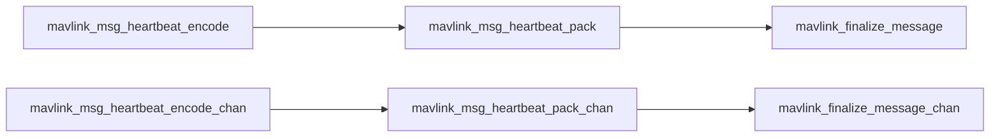

# mavlink 如何打包


mavlink_msg_xxx_xxx_send_struct(mavlink_channel_t chan, const mavlink_xxx_xxx_t* msg)


_mav_finalize_message_chan_send()

这个是mavlink私有函数，打包结构体


## 打包函数

### 由特定消息生成通用消息

将特定消息mavlink_xxx_xxx_t生成mavlink_message_t。例如这里以特定消息为heartbeat(结构体类型为mavlink_heartbeat_t)进行说明。

可以使用如下几个函数实现。

- mavlink_msg_heartbeat_pack
  - 使用通道0
  - 需要对应传入特定消息结构体内每个成员变量，参数较多，写起来麻烦
- mavlink_msg_heartbeat_encode
  - 调用mavlink_msg_heartbeat_pack
  - 使用通道0
  - 传入特定消息结构体变量指针即可，参数较少，但需要先创建特定消息结构体变量

这些函数包括了两个步骤：

1. 将特定消息使用memcpy拷贝至通用消息的payload位置；
2. 对通用消息其他部分（除payload部分）进行最终确定，也就是finalize message，包括指定协议版本、sys_id、comp_id、seq、CRC等，由mavlink_finalize_message_buffer函数实现。


> 另外有带后缀`_chan`的一组函数，可以用于指定通道。如mavlink_msg_heartbeat_encode_chan()

函数调用关系如下




- mavlink_msg_engine_status_send
  - 需要对应传入特定消息结构体内每个成员变量，参数较多，写起来麻烦
- mavlink_msg_engine_status_send_struct
  - 传入特定消息结构体变量指针即可


## 示例

### 典型消息的字节序列化

心跳包

```bash
fd 9 0 0 0 2 1 0 0 0 0 0 1 0 2 c 1 f7 3 9c 9b
```


arm指令

```c++
fd 20 00 00 1e 02 01 4c 00 00 00 00 80 3f 00 00 00 00 d8 7a b7 80 ff ff 00 00 02 00 00 00 00 00 00 00 00 00 00 00 90 01 01 01 af 2d 
```

disarm指令

```c++
fd 20 00 00 1f 02 01 4c 00 00 00 00 00 00 00 00 00 00 d8 7a b7 80 ff ff 00 00 02 00 00 00 00 00 00 00 00 00 00 00 90 01 01 01 56 3f
```

