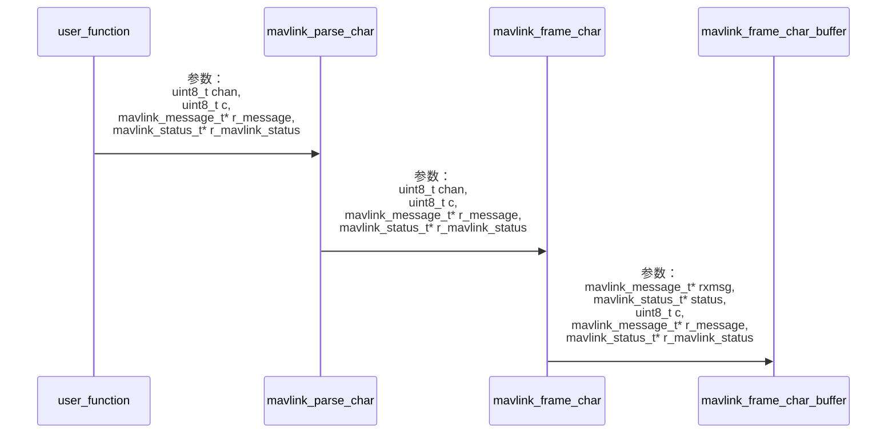

# MAVLink-如何解析

## 协议解析流程

​		MAVLink的解析包括两个步骤：1）将接收到的字节数据转成mavlink基本消息，及解析出mavlink_message_t；2）将mavlink基本消息转成特定消息，例如转成mavlink_heartbeat_t。

​		MAVLink的协议解析的低层原理很简单，就是对收到的数据一个字节一个字节的判断，先找到帧头，然后找到包长度，然后解析包内容，然后找到校验字节，当接收完校验字节后进行校验判断。解析的结果可能是完成、校验不通过等，后续用户可以根据解析结果进行相应处理。

## 基本概念

### 解析状态缓存

​		mavlink实际解析时，每获取一个字节就需要调用一次解析函数，解析状态就要更新一次，故该函数需要“缓存”变量，用于保存当前的解析状态。

​		解析状态有两个变量：mavlink_message_t类型变量、mavlink_status_t类型变量。其中二者作用如下：

- mavlink_status_t类型变量

  - 解析过程状态机记录，描述当前解析处于什么过程下，例如已经接收到帧头、接收到包长等；
  - 记录接收消息使用的mavlink协议版本；
  - 记录接收到的消息数量、丢包数量、包校验错误数量等；

- mavlink_message_t类型变量

  mavlink_message_t类型就是最基本的mavlink消息类型，当接收到起始帧头后，每接收到一个字节，就将该字节放到mavlink_message_t消息变量对应位置，直到消息解析完成。

  > 该变量相当于一个正在“成长的”消息，每收到一个有效字节就将该字节组装到该变量上，直到该变量长成一个完整的消息。

### 通道

​        同一个设备上往往不仅仅运行一个mavlink通信实例，每个通信实例都需要收发mavlink数据，为了保证每个实例解析过程的独立性，那么必须保证每个实例都使用不同的解析“缓存”变量才能避免相关干扰。考虑到方便开发者写代码，MAVLink库可以预先创建多组解析“缓存”变量提供使用，这时就提出了通道的概念。

​		每路通道对应的就是一个通信实例，对应一组解析“缓存”。


## 解析过程

### 解析基本消息

#### 解析函数

最底层解析函数为**mavlink_frame_char_buffer()**，


在mavlink_helpers.h中，定义了**mavlink_message_t**类型静态数组m_mavlink_buffer，作为“缓存”用于保存每个通道的解析状态。

可以通过**mavlink_get_channel_buffer()**函数获取某个通道的"缓存"。

```c
#ifndef MAVLINK_GET_CHANNEL_BUFFER
MAVLINK_HELPER mavlink_message_t* mavlink_get_channel_buffer(uint8_t chan)
{
	
#ifdef MAVLINK_EXTERNAL_RX_BUFFER
	// No m_mavlink_buffer array defined in function,
	// has to be defined externally
#else
	static mavlink_message_t m_mavlink_buffer[MAVLINK_COMM_NUM_BUFFERS];
#endif
	return &m_mavlink_buffer[chan];
}
#endif // MAVLINK_GET_CHANNEL_BUFFER
```


```c
#ifndef MAVLINK_GET_CHANNEL_STATUS
MAVLINK_HELPER mavlink_status_t* mavlink_get_channel_status(uint8_t chan)
{
#ifdef MAVLINK_EXTERNAL_RX_STATUS
	// No m_mavlink_status array defined in function,
	// has to be defined externally
#else
	static mavlink_status_t m_mavlink_status[MAVLINK_COMM_NUM_BUFFERS];
#endif
	return &m_mavlink_status[chan];
}
#endif
```


#### 各解析函数区别




- mavlink_parse_char

  - 返回0或1，只有正确收到完整一帧消息并校验通过、签名正确才返回1；
  - 需要通道参数，并根据通道自动获取对应的解析“缓存”；
- mavlink_frame_char

  - 没有校验或签名通过也能解析出完整一帧消息，返回MAVLINK_FRAMING_INCOMPLETE=0表示未解析成功，返回MAVLINK_FRAMING_OK=1表示完整且正确解析，MAVLINK_FRAMING_BAD_CRC=2表示完整解析但校验错误，MAVLINK_FRAMING_BAD_SIGNATURE=3表示完整解析但签名错误；
  - 需要通道参数，并根据通道自动获取对应的解析“缓存”；
- mavlink_frame_char_buffer()

  - 没有校验或签名通过也能解析出完整一帧消息，返回MAVLINK_FRAMING_INCOMPLETE=0表示未解析成功，返回MAVLINK_FRAMING_OK=1表示完整且正确解析，MAVLINK_FRAMING_BAD_CRC=2表示完整解析但校验错误，MAVLINK_FRAMING_BAD_SIGNATURE=3表示完整解析但签名错误；

  - 不需要通道参数，需要手动传入解析“缓存”参数；

​		可以看出来mavlink_frame_char_buffer()函数使用起来灵活性最强。

### 转成特定消息
