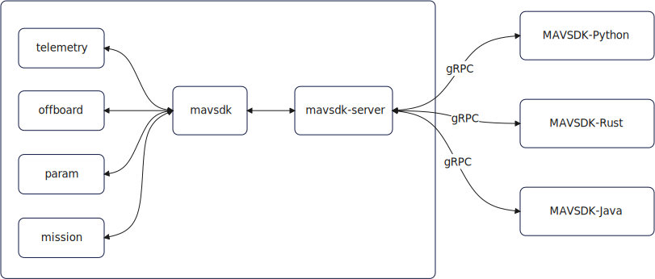

# MAVSDK（一）简介

## 简介

​		MAVSDK是PX4开源团队贡献的基于mavlink通信协议的用于无人机应用开发的SDK，其可以部署在Windows、Linux、Android等多种平台，并且支持多种语言如c/c++、python、Java等。

​		在官网你会看到不同语言的MAVSDK，对应新手来说可能有点懵，其实MAVSDK的核心是MAVSDK-C++，这个版本实现了包括接口驱动（串口、udp等）、mavlink通信、各种交互逻辑处理，并且创建了server，建立gRPC通信，其他不同的语言版本都是只实现了gRPC通信接口而已。

​		下图可能会更清晰一些：



> MAVSDK包括了library和server，如果我们使用的是C++，那么可以不用server，如果是使用其他语言（如python等）必须使用server，用于跟各种语言的客户端建立gRPC通信。
>
> 除 C++ 之外的 MAVSDK 语言包装器使用 gRPC 连接到 MAVSDK C++ 核心。这个围绕 MAVSDK C++ 库的 gRPC 服务器称为 mavsdk_server（过去称为后端）。


- 官网：https://mavsdk.mavlink.io/main/en/index.html

- mavsdk文档-cpp：https://mavsdk.mavlink.io/main/en/cpp/

## 环境配置

### 安装MAVSDK Library-使用安装包

官方提供了已经打包好的安装包，可以直接去MAVSDK仓库下载[release版](https://github.com/mavlink/MAVSDK/releases?page=2)。

或者直接使用如下命令下载并安装：

```shell
wget https://github.com/mavlink/MAVSDK/releases/download/v1.0.0/mavsdk_1.0.0_ubuntu20.04_amd64.deb
sudo dpkg -i mavsdk_1.0.0_ubuntu20.04_amd64.deb
```

### 安装MAVSDK Library-源码

- 系统更新

```shell
sudo apt-get update
sudo apt-get install build-essential cmake git

$ pip3 install future
```

- 下载源码

```shell
git clone https://github.com/mavlink/MAVSDK.git
git submodule update --init --recursive
```

- 编译

```shell
cmake -DCMAKE_BUILD_TYPE=Debug -Bbuild/default -H.
cmake --build build/default -j8
```

> 在编译过程中，会需要下载一些依赖仓库，并且会放置到`MAVSDK/build/default/third_party/`文件夹下。

- 安装

```shell
sudo cmake --build build/default --target install
```

### 安装路径

完成安装后，动态链接库和头文件会安装在系统默认路径下。

链接库为：**/usr/local/lib/**

```shell
$ ls /usr/local/lib/
cmake  libmavsdk.so  libmavsdk.so.1  libmavsdk.so.1.4.0  python2.7  python3.8
```

头文件为：**/usr/local/include**

```shell
$ ls /usr/local/include/mavsdk/
connection_result.h  geometry.h  log_callback.h  mavlink_include.h  plugin_base.h  server_component.h    system.h
deprecated.h         handle.h    mavlink         mavsdk.h           plugins        server_plugin_base.h
```

**在使用时，需要添加环境变量，编辑`~/.bashrc`文件，在末尾添加如下：**

```bash
export LD_LIBRARY_PATH=$LD_LIBRARY_PATH:/usr/local/lib/
```

## 应用样例

### 起飞降落控制

- 编译

```shell
cd examples/takeoff_and_land/
cmake -Bbuild -H.
cmake --build build -j4
```

- 运行

```shell
build/takeoff_and_land udp://:14540

[04:36:00|Info ] MAVSDK version: v1.4.0-253-g425577aa-dirty (mavsdk_impl.cpp:24)
Waiting to discover system...
```


## 使用

### 无人机连接

| Connection | URL Format                   |
| ---------- | ---------------------------- |
| UDP        | `udp://[host][:port]`        |
| TCP        | `tcp://[host][:port]`        |
| Serial     | `serial://[path][:baudrate]` |

#### 串口连接

```c++
Mavsdk mavsdk;
ConnectionResult connection_result = mavsdk.add_any_connection("serial:///dev/serial/by-id/usb-FTDI_FT232R_USB_UART_XXXXXXXX-if00-port0:57600");
if (connection_result != ConnectionResult::Success) {
    std::cout << "Adding connection failed: " << connection_result << '\n';
    return;
}
```

#### UDP连接

MAVSDK作为服务端

```c++
Mavsdk mavsdk;
ConnectionResult connection_result = mavsdk.add_any_connection("udp://:14540");
if (connection_result != ConnectionResult::Success) {
    std::cout << "Adding connection failed: " << connection_result << '\n';
    return;
}
```

MAVSDK作为客户端

```c++
Mavsdk mavsdk;
ConnectionResult connection_result = mavsdk.add_any_connection("udp://192.168.1.12:14550");
if (connection_result != ConnectionResult::Success) {
    std::cout << "Adding connection failed: " << connection_result << '\n';
    return;
}
```


## API

### mavsdk::Mavsdk

This is the main class of MAVSDK (a MAVLink API Library). It is used to discover vehicles and manage active connections.

这是 MAVSDK（一个 MAVLink API 库）的主要类。它用于发现飞行器和管理活动连接。

###  mavsdk::System

This class represents a system, made up of one or more components (e.g. autopilot, cameras, servos, gimbals, etc).

[System](https://mavsdk.mavlink.io/main/en/cpp/api_reference/classmavsdk_1_1_system.html) objects are used to interact with UAVs (including their components) and standalone cameras. They are not created directly by application code, but are returned by the [Mavsdk](https://mavsdk.mavlink.io/main/en/cpp/api_reference/classmavsdk_1_1_mavsdk.html) class.

此类代表一个系统，由一个或多个组件（例如自动驾驶仪、相机、伺服系统、云台等）组成。 系统对象用于与 UAV（包括其组件）和独立摄像机进行交互。它们不是由应用程序代码直接创建的，而是由 Mavsdk 类返回的。

### mavsdk::Telemetry

https://mavsdk.mavlink.io/main/en/cpp/api_reference/classmavsdk_1_1_telemetry.html

Allow users to get vehicle telemetry and state information (e.g. battery, GPS, RC connection, flight mode etc.) and set telemetry update rates.

允许用户获取飞行器遥测和状态信息（例如电池、GPS、RC 连接、飞行模式等）并设置遥测更新率。


