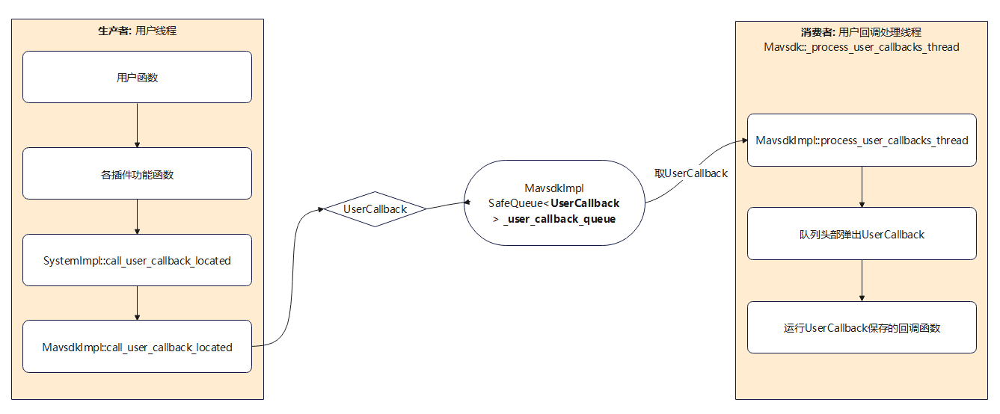

# MAVSDK（四）源码解析


## 软件框架

MavsdkImpl

SystemImpl构造函数会创建MavsdkImpl实例作为_parent；

插件（如TelemetryImpl）、MAVLinkParameters等构造函数会创建SystemImpl实例作为_parent；


Mavsdk会创建MavsdkImpl实例

System会创建SystemImpl实例


### 线程设计

#### 启动的线程

​		MAVSDK启动后会创建如下线程：

- MavsdkImpl::work_thread()

  执行超时列表内存放的工作；处理周期性的工作，如发送心跳包等。

- MavsdkImpl::process_user_callbacks_thread()

  处理用户的回调，用户调用SDK一些异步功能函数时会传入回调，一旦该功能执行完成就需要执行用户回调。该线程会将这些用户回调函数放到超时处理列表中。

- SystemImpl::system_thread()

  一旦连接了飞控将创建System，并处理飞控相关功能的流程，包括处理param、处理命令（command）发送、处理时间同步、处理mission。

- connection接收线程

  通过UDP、串口等连接飞控后就会创建connection线程，用于接收飞控的mavlink消息。


#### 线程交互

​		MAVSDK存在很多线程，那么需要解决线程和线程之间通信问题，在MAVSDK中，线程之间通过各种“工作队列/缓存池”来进行交互，这些“工作队列/缓存池”本质上就是各种列表，根据线程之间的通信需求创建对应的消息（各种类实例）放到“工作队列/缓存池”中，一个线程做为“生产者”创建并放消息，一个线程做为“消费者”取消息并执行相应处理。

##### 工作队列：mavlink消息响应

​		飞控会产生各种mavlink消息，SDK需要对各消息（ID）进行处理，故会将各消息的处理回调函数放到一个队列中，每当接收到一条mavlink消息就会执行对应的回调处理函数。

​		一般由MavlinkCommanderSender、MavlinkCommandReceiver、Telemetry插件提供各消息响应的回调函数；

- 队列：std::vector\<Entry\> MAVLinkMessageHandler::_table，其中Entry类：

  ```c++
  struct Entry {
      uint32_t msg_id;
      std::optional<uint8_t> cmp_id;
      Callback callback;
      const void* cookie; // This is the identification to unregister.
  };
  ```

- 消费者线程：connection接收线程，当接收到飞控数据后进行解析，并根据消息ID查找对应的Entry进行处理；

- 生产者线程：初始化线程，生成一般发生在类初始化，由各类构造函数向队列添加消息响应；


##### 工作队列：用户回调

​		用户可以使用SDK获取飞控数据、给飞控发送指令，这些操作都是异步的，故需要传入用户回调函数。当”条件满足要求“时（如接收到飞控数据）由SDK自动执行这些用户的回调函数。例如使用Telemetry插件获取飞控位置数据时，往往需要提供回调函数，当接收到飞控位置数据就会调用该回调函数。

- 队列：SafeQueue\<UserCallback\> **Mavsdk**::**_user_callback_queue**

  这是FIFO队列，从尾部放入，头部弹出。

- 消费者线程：Mavsdk::_process_user_callbacks_thread

  从队列头部取UserCallback（弹出），并运行回调函数。

- 生产者线程：一般主要是用户线程，向队列存UserCallback



##### 工作队列：超时处理

##### 工作队列：commander命令发送


#### cookie


## 初始化工作

### 添加新的system

在`src/npsdk/core/mavsdk_impl.cpp`中，接收到消息后，判断是否是新的system，如果是则就添加。

```c++
void MavsdkImpl::receive_message(mavlink_message_t& message, Connection* connection)
{
    make_system_with_component(message.sysid, message.compid);
}

void MavsdkImpl::make_system_with_component(
    uint8_t system_id, uint8_t comp_id, bool always_connected)
{
    // Needs _systems_lock

    if (_should_exit) {
        // When the system got destroyed in the destructor, we have to give up.
        return;
    }

    if (static_cast<int>(system_id) == 0 && static_cast<int>(comp_id) == 0) {
        LogDebug() << "Initializing connection to remote system...";
    } else {
        LogDebug() << "New: System ID: " << static_cast<int>(system_id)
                   << " Comp ID: " << static_cast<int>(comp_id);
    }

    // Make a system with its first component
    auto new_system = std::make_shared<System>(*this);
    new_system->init(system_id, comp_id, always_connected);

    _systems.emplace_back(system_id, new_system);
}
```

system添加后，即使该system对应的heartbeat超时或者连接中断，也不会删除该system。


### system初始化

```c++
void System::init(uint8_t system_id, uint8_t component_id, bool connected) const
{
    return _system_impl->init(system_id, component_id, connected);
}
```


SystemImpl::init函数

- 处理heartbeat，process_heartbeat
- process_statustext
- process_autopilot_version
- process_autopilot_version_request


注册插件

```c++
void SystemImpl::register_plugin(PluginImplBase* plugin_impl)
```


 启动后发送的指令：

MAV_CMD_REQUEST_AUTOPILOT_CAPABILITIES ([520](https://mavlink.io/en/messages/common.html#MAV_CMD_REQUEST_AUTOPILOT_CAPABILITIES) )


## 发送command流程

- 设置消息频率：SystemImpl::set_msg_rate_async()
- 设置飞行模式：SystemImpl::set_flight_mode_async()

- 请求飞行信息：SystemImpl::send_flight_information_request()

- 请求版本：SystemImpl::send_autopilot_version_request()，然而实际上这里请求的是MAV_CMD_REQUEST_AUTOPILOT_CAPABILITIES

以上请求会调用

SystemImpl::send_command_async()

MavlinkCommandSender::queue_command_async()


## 运行中的线程

### MavsdkImpl

#### MavsdkImpl::work_thread()

在`src/npsdk/core/mavsdk_impl.cpp`中：

MavsdkImpl构造函数，创建线程：

```c++
_work_thread = new std::thread(&MavsdkImpl::work_thread, this);
```

该线程以10ms为周期周期性执行

```c++
void MavsdkImpl::work_thread()
{
    while (!_should_exit) {
        timeout_handler.run_once();
        call_every_handler.run_once();
        std::this_thread::sleep_for(std::chrono::milliseconds(10));
    }
}
```


其中CallEveryHandler实例添加了如下执行函数：

- 发送心跳包，调用MavsdkImpl::send_heartbeat()函数。

其中TimeoutHandler，处理回调，并且可以判断是否超时，这里处理的回调函数一般是用户传入的。


#### MavsdkImpl::process_user_callbacks_thread()

从`_user_callback_queue`队列中拿取回调函数，并放到`timeout_handler`中。

```c++
void MavsdkImpl::process_user_callbacks_thread()
{
    while (!_should_exit) {
        auto callback = _user_callback_queue.dequeue();
        if (!callback) {
            continue;
        }

        void* cookie{nullptr};

        const double timeout_s = 1.0;
        timeout_handler.add(
            [&]() {
                if (_callback_debugging) {
                    LogWarn() << "Callback called from " << callback.value().filename << ":"
                              << callback.value().linenumber << " took more than " << timeout_s
                              << " second to run.";
                    fflush(stdout);
                    fflush(stderr);
                    abort();
                } else {
                    LogWarn()
                        << "Callback took more than " << timeout_s << " second to run.\n"
                        << "See: https://mavsdk.mavlink.io/main/en/cpp/troubleshooting.html#user_callbacks";
                }
            },
            timeout_s,
            &cookie);
        callback.value().func();
        timeout_handler.remove(cookie);
    }
}
```


增加user_callbacks

```c++
#define call_user_callback(...) call_user_callback_located(FILENAME, __LINE__, __VA_ARGS__)
```


SystemImpl::call_user_callback_located()

MavsdkImpl::call_user_callback_located()


用户使用如下函数时，都可以传入用户定义的回调函数，等待“某个条件满足时”由MAVSDK调用该回调函数。例如：

TelemetryImpl::process_heartbeat()

TelemetryImpl::process_attitude()

OffboardImpl::start_async()


### SystemImpl

在SystemImpl构造函数中，创建线程`_system_thread`：

```c++
_system_thread = new std::thread(&SystemImpl::system_thread, this);
```

这个线程绑定`system_thread()`函数，有以下工作：

- 处理param
- 处理命令发送，command
- 处理时间同步
- 处理mission

```c++
void SystemImpl::system_thread(){
    dl_time_t last_ping_time{};

    while (!_should_exit) {
        _params.do_work();
        _command_sender.do_work();
        _timesync.do_work();
        _mission_transfer.do_work();

        if (_time.elapsed_since_s(last_ping_time) >= SystemImpl::_ping_interval_s) {
            if (_connected) {
                _ping.run_once();
            }
            last_ping_time = _time.steady_time();
        }

        if (_connected) {
            // Work fairly fast if we're connected.
            std::this_thread::sleep_for(std::chrono::milliseconds(10));
        } else {
            // Be less aggressive when unconnected.
            std::this_thread::sleep_for(std::chrono::milliseconds(100));
        }
    }
}
```


### mavlink消息接收解析

MAVSDK可以通过TCP、UDP、串口实现mavlink通信连接，创建通信接口后会自动创建接收线程，用于接收mavlink通信数据并解析。

例如在串口（SerialConnection）中，创建接收线程如下：

```c++
void SerialConnection::start_recv_thread()
{
    _recv_thread = std::make_unique<std::thread>(&SerialConnection::receive, this);
}
```


## 如何超时检测

调用插件函数，添加要执行的“工作”到工作列表；

周期性调用插件do_work()，遍历工作列表，并为工作注册超时；

如果未超时前收到“响应”，则注销对应的超时注册cookie；


周期性判断time_out列表内注册的超时事件，如果时间已经超时则调用响应的回调函数。


### heartbeat超时检测


## 如何获取飞控数据

### mavlink消息接收和解析

硬件接口（如串口、网口）接收到数据后，调用MAVLinkReceiver::parse_message()函数进行解析，一旦解析出消息后，会调用Connection::receive_message()函数处理接收到的消息。

### 用户获取

用户调用`subscribe_position()`函数设置回调函数，当位置数据更新后会自动调用用户的函数。

```c++
void TelemetryImpl::subscribe_position(Telemetry::PositionCallback& callback)
{
    std::lock_guard<std::mutex> lock(_subscription_mutex);
    _position_subscription = callback;
}
```

这里设置用户回调函数，只需要将用户定义的回调函数赋值给`_position_subscription`。

TelemetryImpl类提供了mavlink消息处理函数，例如`process_global_position_int()`函数处理位置消息，这里将`_position_subscription`回调（也就是用户的回调函数）添加至`MavsdkImpl::_user_callback_queue`用户回调队列中。

```c++
void TelemetryImpl::process_global_position_int(const mavlink_message_t& message) {
    if (_position_subscription) {
        auto callback = _position_subscription;
        auto arg = position();
        _parent->call_user_callback([callback, arg]() { callback(arg); });
    }
}

```

在`TelemetryImpl`实例初始化函数中，将注册mavlink消息（GLOBAL_POSITION_INT）处理函数，一旦接收到GLOBAL_POSITION_INT消息后，将调用`process_global_position_int()`函数。

```c++
void TelemetryImpl::init(){
	_parent->register_mavlink_message_handler(
        MAVLINK_MSG_ID_GLOBAL_POSITION_INT,
        [this](const mavlink_message_t& message) { process_global_position_int(message); },
        this); 
}
```


## 如何获取参数

MAVLinkParameters类实现参数操作，get_param_int_async()函数用于获取参数。

### 基本流程

​		调用MAVLinkParameters::get_param_int_async()函数，传入要获取的参数名和完成操作后执行的回调函数；

​		MAVLinkParameters::get_param_int_async()将创建获取参数的工作项（WorkItem）；

​		MAVLinkParameters::do_work()处理工作项，并注册超时处理函数；

​		MAVLinkParameters::receive_timeout()处理超时；

> 其中：
>
> SystemImpl::system_thread()会调用MAVLinkParameters::do_work()；
>
> 使用SystemImpl::register_timeout_handler()注册超时处理函数，将超时处理添加到MavsdkImpl::timeout_handler；
>
> MavsdkImpl::work_thread()会周期性调用timeout_handler.run_once()处理超时；
>
> 由`Mavsdk::DEFAULT_TIMEOUT_S`定义默认超时时间；

### 代码说明

```c++
void MAVLinkParameters::get_param_int_async(
    const std::string& name,
    const GetParamIntCallback& callback,
    const void* cookie,
    std::optional<uint8_t> maybe_component_id,
    bool extended)
{
    // LogDebug() << "getting param " << name << ", extended: " << (extended ? "yes" : "no");

    if (name.size() > PARAM_ID_LEN) {
        LogErr() << "Error: param name too long";
        if (callback) {
            callback(MAVLinkParameters::Result::ParamNameTooLong, 0);
        }
        return;
    }

    // Otherwise, push work onto queue.
    auto new_work = std::make_shared<WorkItem>(_parent.timeout_s());
    new_work->type = WorkItem::Type::Get;
    new_work->callback = callback;
    new_work->maybe_component_id = maybe_component_id;
    new_work->param_name = name;
    new_work->param_value = {};
    new_work->extended = extended;
    new_work->cookie = cookie;

    _work_queue.push_back(new_work);
}
```


## 时间处理

npsdk_time.h

```c++
typedef std::chrono::time_point<std::chrono::steady_clock> dl_time_t;
typedef std::chrono::time_point<std::chrono::system_clock> dl_system_time_t;
typedef std::chrono::time_point<std::chrono::system_clock> dl_autopilot_time_t;
```


## 如何？

### 如何发送mavlink command

#### 代码分析

##### 发送命令

SystemImpl::send_command()

MavlinkCommandSender::send_command()


```c++
MavlinkCommandSender::Result SystemImpl::send_command(MavlinkCommandSender::CommandInt& command)
{
    if (_target_address.system_id == 0 && _components.empty()) {
        return MavlinkCommandSender::Result::NoSystem;
    }
    command.target_system_id = get_system_id();
    return _command_sender.send_command(command);
}
```


##### 调用回调函数

等待飞控反馈控制命令后，会发送ACK消息。

SystemImpl::process_mavlink_message

MAVLinkMessageHandler.process_message


#### 示例：设置消息更新频率(async方式)

Telemetry::set_rate_position_async()函数设置频率和回调函数。

TelemetryImpl::set_rate_position_async()函数设置频率和回调函数。

SystemImpl::set_msg_rate_async()函数设置消息id、频率、回调函数、comp_id。

> - 首先生成控制指令
>
>   生成MavlinkCommandSender::CommandLong类型数据
>
> - 发送控制指令并注册回调
>
>   调用SystemImpl::send_command_async()
>
>   调用MavlinkCommandSender::queue_command_async()
>
> - 生成工作事项
>
>   生成MavlinkCommandSender::Work类型的工作事项并放入工作队列
>
> - 工作
>
>   在MavlinkCommandSender::do_work()中遍历工作队列，一项项进行处理


## 附录

### MAVLink消息

| msg id            | 说明             | 备注 |
| ----------------- | ---------------- | ---- |
| COMMAND_ACK (#77) | 控制指令应答消息 |      |
|                   |                  |      |
|                   |                  |      |


### MAVLink控制命令对照表

| command id                         | 说明             | 备注            |
| ---------------------------------- | ---------------- | --------------- |
| MAV_CMD_SET_MESSAGE_INTERVAL (511) | 设置消息更新频率 | Telemetry模块用 |
|                                    |                  |                 |
| SET_POSITION_TARGET_GLOBAL_INT     |                  |                 |
| SET_POSITION_TARGET_LOCAL_NED      |                  |                 |
| SET_ATTITUDE_TARGET                |                  |                 |


