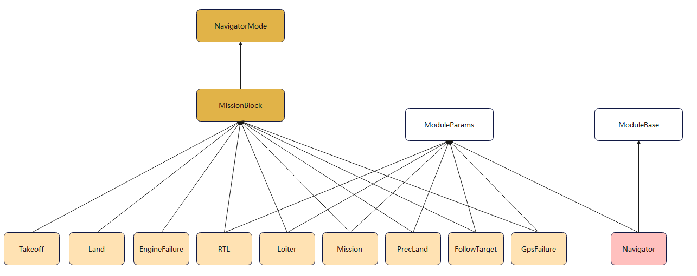

# navigator

## 框架说明

### 类说明



#### NavigatorMode

NavigatorMode构造函数参数为Navigator！并用该参数初始化成员变量**_navigator**.

统一定义了各模式的运行流程，run()函数中实现了具体的运行流程，主要就是根据_active调用如下四个函数。

- on_activation()：第一次启动该模式时的处理
- on_active()：第一次启动后，处于运行状态时的处理
- on_inactivation()：模式退出时的处理
- on_inactive()：退出后处于不运行状态的处理

#### MissionBlock

MissionBlock构造函数参数为Navigator，同时用该参数对父类NavigatorMode进行构造！

#### 模式类

包括Takeoff、Land等等模式。

各模式类都需要操作成员变量**_navigator**。

#### Navigator

Navigator中创建了各模式实例（并把自身作为参数用于各模式的实例构造），只会调用各模式的run()函数，没有调用任何其他函数。

#### Mission

mission中包括：

set_loiter_item、set_vtol_transition_item

不包括：

set_takeoff_item、set_land_item、set_idle_item

## 基础知识

### Navigator消息

所有的消息定义都在`msg/*`下，编译后生成的头文件都在`build\px4_fmu-v5_default\uORB\topics\*`下，例如position_setpoint.msg生成position_setpoint.h头文件，且头文件中定义了position_setpoint_s结构体。

#### 订阅消息

##### parameter_update.msg

描述：参数更新

##### home_position.msg

##### vehicle_global_position.msg

描述：无人机global position

发布者：

发布函数：

##### vehicle_gps_position.msg

描述：无人机gps position

发布者：

发布函数：

##### vehicle_local_position.msg

描述：无人机gps position

发布者：

发布函数：

##### vehicle_land_detected.msg

描述：无人机降落检测

##### vehicle_command.msg

描述：对应mavlink中command_long(#76)消息

发布者：mavlink模块，在mavlink_receiver.cpp，变量为_cmd_pub

发布函数：

```c++
void MavlinkReceiver::handle_message_command_both{
    if (!send_ack) {
        _cmd_pub.publish(vehicle_command);
    }
}
```

##### vehicle_status.msg

描述：定义了导航状态（Navigation state）

发布者：commander模块，在Commander.cpp，变量为_status_pub

发布函数：Commander::run()

```c++
Commander::run(){
    if (hrt_elapsed_time(&_status.timestamp) >= 500_ms || _status_changed || nav_state_changed) {
        // alex，这里发布ORB_ID(vehicle_status), navigator_main会订阅
		
        _status_pub.publish(_status);
    }
}
```


##### mission.msg 

描述：任务消息，好像没有用！订阅变量_mission_sub

发布者：commander模块，在Commander.cpp，变量为_mision_pub

#### 发布消息

##### position_setpoint_triplet.msg

包括了previous、current、next三个状态的位置期望

_pos_sp_triplet

_reposition_triplet

_takeoff_triplet

##### mission_result_s

vehicle_command_s


### 各类模式

#### takeoff

完成takeoff后，commander模块进程根据参数`COM_TAKEOFF_ACT`决定完成takeoff后进入什么飞行模式。模式切换为loiter。

```c++
// Transition main state to loiter or auto-mission after takeoff is completed.
if (_armed.armed && !_land_detector.landed
    && (_status.nav_state == vehicle_status_s::NAVIGATION_STATE_AUTO_TAKEOFF)
    && (mission_result.timestamp >= _status.nav_state_timestamp)
    && mission_result.finished) {

    if ((_param_takeoff_finished_action.get() == 1) && _status_flags.condition_auto_mission_available) {
        main_state_transition(_status, commander_state_s::MAIN_STATE_AUTO_MISSION, _status_flags, _internal_state);

    } else {
        main_state_transition(_status, commander_state_s::MAIN_STATE_AUTO_LOITER, _status_flags, _internal_state);
    }
}
```

#### land

降落流程只设置了降落点经纬度，如何进行的高度方向下降的操控？？？

固定翼模态下降落，地面站发送SET_MODE(11)指令，内容如下：

```yaml
custom_mode: 100925440
target_system: 1
base_mode: 157
```


#### loiter

根据CMD_DO_REPOSITION获取位置期望，并悬停（该位置可以是当前位置也可以是其他指定位置）。

#### mission


### 位置期望详细信息

position_setpoint.h

```c++
struct position_setpoint_s {
	uint64_t timestamp;
	double lat;
	double lon;
	float vx;
	float vy;
	float vz;
	float alt;
	float yaw;
	float yawspeed;
	float loiter_radius;
	float acceptance_radius;
	float cruising_speed;
	float cruising_throttle;
	bool valid;
	uint8_t type;
	bool velocity_valid;
	uint8_t velocity_frame;
	bool alt_valid;
	bool yaw_valid;
	bool yawspeed_valid;
	int8_t landing_gear;
	int8_t loiter_direction;
	bool disable_weather_vane;
	uint8_t _padding0[6]; // required for logger

	static constexpr uint8_t SETPOINT_TYPE_POSITION = 0;
	static constexpr uint8_t SETPOINT_TYPE_VELOCITY = 1;
	static constexpr uint8_t SETPOINT_TYPE_LOITER = 2;
	static constexpr uint8_t SETPOINT_TYPE_TAKEOFF = 3;
	static constexpr uint8_t SETPOINT_TYPE_LAND = 4;
	static constexpr uint8_t SETPOINT_TYPE_IDLE = 5;
	static constexpr uint8_t SETPOINT_TYPE_FOLLOW_TARGET = 6;
	static constexpr uint8_t VELOCITY_FRAME_LOCAL_NED = 1;
	static constexpr uint8_t VELOCITY_FRAME_BODY_NED = 8;
}
```


## 导航流程

导航类为**Navigator**，其继承了ModuleBase和ModuleParams。

导航主函数就是**void Navigator::run()**，下面根据run()的流程解释整个导航的工作流程。

### 订阅消息

订阅并更新消息

- 订阅local position

```c++
orb_copy(ORB_ID(vehicle_local_position), _local_pos_sub, &_local_pos);
```

- 订阅无人机状态

  订阅无人机状态，发布者为commander模块，其发布频率为2Hz或者状态有更新时立即发送。

```c++
orb_copy(ORB_ID(vehicle_status), _vehicle_status_sub, &_vstatus);
```

- 订阅mission

```c++
orb_copy(ORB_ID(mission), _mission_sub, &mission);
```

- 订阅GPS

```c++
_gps_pos_sub.copy(&_gps_pos);
```

- 订阅global position

```c+++
_global_pos_sub.copy(&_global_pos);
```

- 订阅降落检测

```c++
_land_detected_sub.update(&_land_detected);
```

- 订阅home坐标

```c++
_home_pos_sub.update(&_home_pos);
```

- 订阅无人机控制指令

```c++
_vehicle_command_sub.copy(&cmd);
```

有两个，不确定是哪个？Commander.cpp，mavlink_receiver.h

### 更新参数

全部更新，调用父类ModuleParams成员函数更新

```c++
params_update();
```

获取param

```c++
// 查找参数
param_t _handle_mpc_acc_hor = param_find("MPC_ACC_HOR");
// 获取参数，并存到成员变量中
param_get(_handle_mpc_acc_hor, &_param_mpc_acc_hor);
```

### 判断控制指令

- 更新订阅消息

更新无人机控制指令

```c++
vehicle_command_s cmd{};
_vehicle_command_sub.copy(&cmd);
```

- 判断控制指令

根据控制指令类型进行对应处理

```c++
if(cmd.command == vehicle_command_s::VEHICLE_CMD_DO_GO_AROUND){
    
}
else if (cmd.command == vehicle_command_s::VEHICLE_CMD_DO_REPOSITION) {
    // reposition
}
else if (cmd.command == vehicle_command_s::VEHICLE_CMD_NAV_TAKEOFF) {
    
}
else if (cmd.command == vehicle_command_s::VEHICLE_CMD_DO_LAND_START) {
    
}
else if (cmd.command == vehicle_command_s::VEHICLE_CMD_MISSION_START) {
    
}
```


### 判断无人机状态

根据commander设置的无人机状态进行处理

```c++
switch (_vstatus.nav_state) 
{

}
```

> _vstatus是vehicle_status_s类型的变量。


### 发布

位置期望存放在成员变量**_pos_sp_triplet**中，该变量为**position_setpoint_triplet_s**类型结构体变量，包含了上一次、当前、下一次的期望位置。

- 计算并更新位置期望

在各导航模式具体实现的代码中修改位置期望

例如在**land.cpp**的on_active()内：

```c++
// 先获取当前位置期望
struct position_setpoint_triplet_s *pos_sp_triplet = _navigator->get_position_setpoint_triplet();

// 根据计算后的_mission_item，设置位置期望
mission_item_to_position_setpoint(_mission_item, &pos_sp_triplet->current);

// 使能发布, _pos_sp_triplet_updated=true
_navigator->set_position_setpoint_triplet_updated();
```


- 发布位置期望

在navigator_main.cpp中，发布更新后的位置期望

```c++
if (_pos_sp_triplet_updated) {
	publish_position_setpoint_triplet();
}

//
void Navigator::publish_position_setpoint_triplet()
{
	_pos_sp_triplet.timestamp = hrt_absolute_time();
	_pos_sp_triplet_pub.publish(_pos_sp_triplet);
	_pos_sp_triplet_updated = false;
}
```


### 各类模式处理

#### MissionBlock类

```c++
NavigatorMode	*_navigation_mode{nullptr};	/**< abstract pointer to current navigation mode class */

Mission		_mission;			/**< class that handles the missions */
Loiter		_loiter;			/**< class that handles loiter */
Takeoff		_takeoff;			/**< class for handling takeoff commands */
Land		_land;			    /**< class for handling land commands */
PrecLand	_precland;			/**< class for handling precision land commands */
RTL 		_rtl;				/**< class that handles RTL */
EngineFailure	_engineFailure;	/**< class that handles the engine failure mode (FW only!) */
GpsFailure	_gpsFailure;		/**< class that handles the OBC gpsfailure loss mode */
FollowTarget	_follow_target;

NavigatorMode *_navigation_mode_array[NAVIGATOR_MODE_ARRAY_SIZE];	/**< array of navigation modes */
```


## 专业词汇

course over ground：对地航向

braking distance：刹车距离