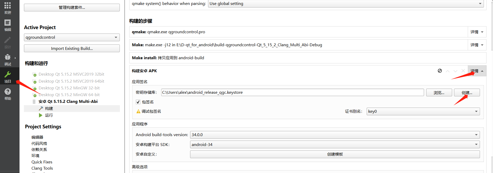
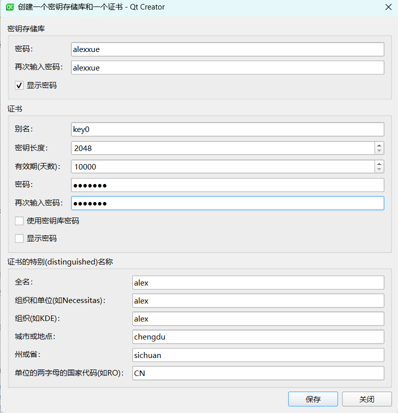

# QGC编译

## 参考

https://blog.csdn.net/fittec/article/details/132939929

## 开发环境

### 环境1：qt5.12.6

QGC版本： 4.1.4
Qt版本： 5.12.6（现官网已更新至5.15.2）
windows平台开发：vs2017
andorid平台： JDK Java SE 8u281
       andorid sdk
       andorid ndk ndk-r21e

如果是5.12.6：
在qt安装时选中
vs2017、QT charts、Android ARMv7
如果是5.15.2：
在qt安装时选中
vs2019、QT charts、Android ARMv7

## 编译

### 创建密钥和证书

点击项目->构建安卓APK，点击详情后显示出全部内容，点击创建。

填写信息

### 点击编译

编译（即构建）完成后会在构建目录下生成android-build文件夹。打开Android studio，file->open，选择android-build文件夹并打开。

