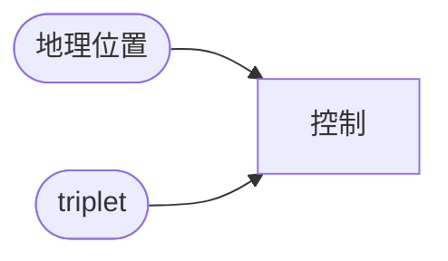
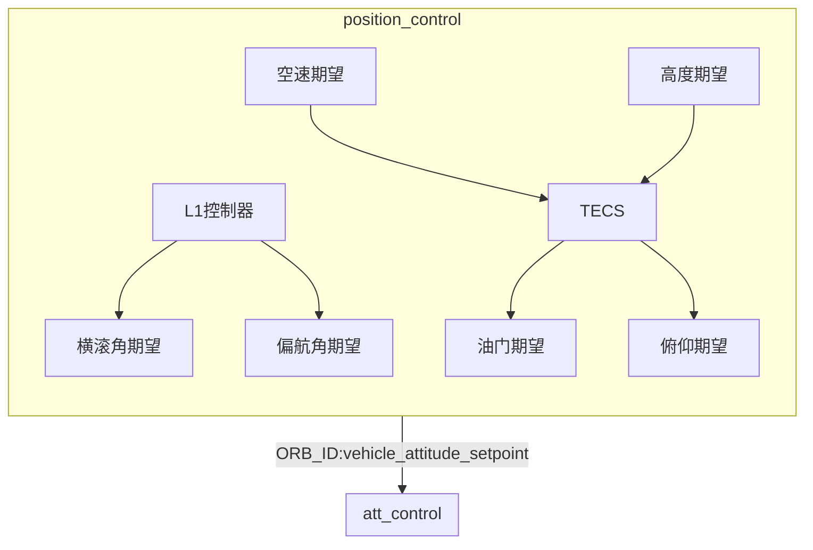

# 固定翼位置控制（L1）

## 介绍

local位置有效才进行固定翼位置控制。

```mermaid
flowchart LR
global_pos([地理位置])-->control[控制]
triplet([triplet]) --> control
```

### 框架

```mermaid
flowchart TB
subgraph position_control
	direction TB
    L1控制器-->横滚角期望
    L1控制器-->偏航角期望
	
    空速期望-->TECS[TECS]
    高度期望-->TECS
    TECS-->油门期望
    TECS-->俯仰期望
end

subgraph att_control
	
end
position_control -- ORB_ID:vehicle_attitude_setpoint --> att_control
```

