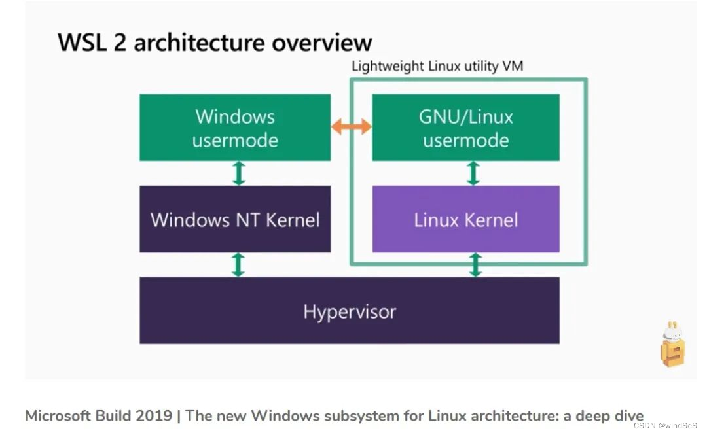
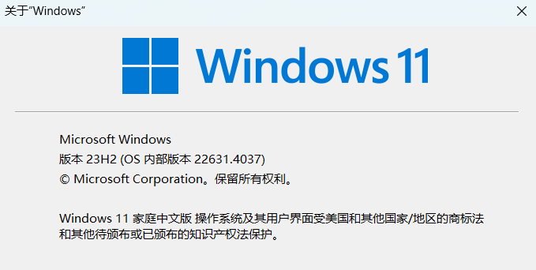
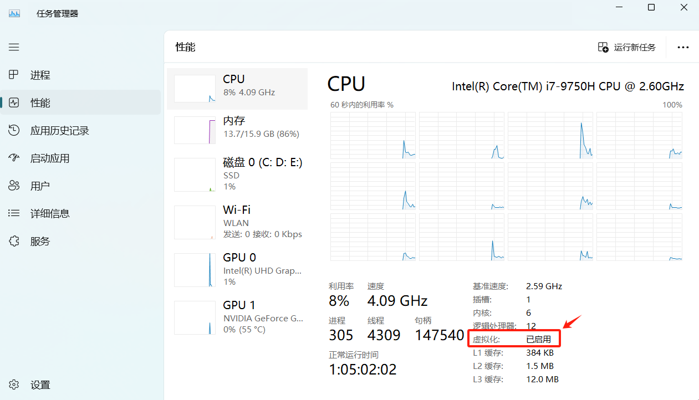
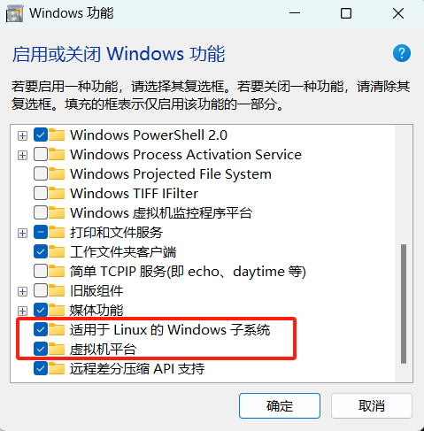
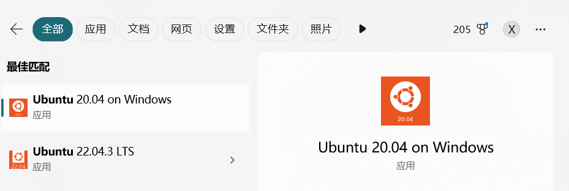
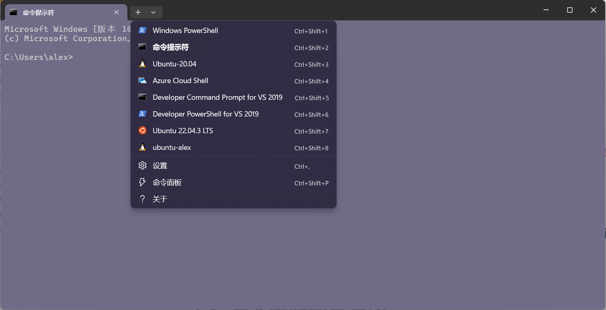

[TOC]

# 课程描述

## 课程目标

本课程主要讲解如何在 Windows 下启用 WSL2 并安装分发版，完成 PX4 开发环境的系统搭建。

## 课程内容

- 了解 WSL2；
- 安装分发版；
- 导入自定义分发版；

# 简介

## 我们的需求

根据 PX4 官网描述，推荐我们在 Ubuntu 系统下进行开发。那么创建 Ubuntu 系统的方式大致包括如下几种：

- 方式一：在计算机上直接安装 Ubuntu 系统，或者双系统引导；
- 方式二：在 Windows 下使用 VMware Workstation，创建 Ubuntu 虚拟机；
- 方式三：在 Windows 下使用 WSL 安装 Ubuntu 发行版。

|           开发方式            |                             优点                             |                             缺点                             |
| :---------------------------: | :----------------------------------------------------------: | :----------------------------------------------------------: |
| 直接安装 Ubuntu 或双系统引导  | 性能最佳，直接利用硬件资源。完整的 Ubuntu 环境，支持所有功能和软件。更加稳定，适合长期开发。 | 安装过程复杂，可能需要分区和备份数据。需要重启计算机切换操作系统。对于不熟悉 Linux 的用户，学习曲线较陡。 |
| VMware Workstation 创建虚拟机 | 可以在 Windows 环境中同时运行 Ubuntu，方便切换。不影响主系统，易于管理和备份虚拟机。支持快照功能，可以轻松恢复到之前的状态。 | 性能相对较差，虚拟化会消耗额外资源。需要购买 VMware Workstation（如果使用专业版）。配置虚拟机可能需要一定的技术知识。 |
|  使用 WSL 安装 Ubuntu 发行版  | 安装简单，直接在 Windows 上运行。轻量级，启动速度快，资源占用少。可以直接访问 Windows 文件系统，方便文件管理。 | 功能有限，不支持所有 Linux 应用（如 GUI 应用）。性能可能不如原生 Ubuntu。对于某些开发任务（如驱动开发），可能不够灵活。 |

我们在综合考虑了性能、效率、易用性等方面后，选择了使用 WSL 安装 Ubuntu 发行版作为开发方式。

## WSL 是什么？

WSL 全称 Windows Subsystem for Linux，即适用于 Linux 的 Windows 子系统 （WSL）。是微软推出的一项 Windows 的功能，通过该功能，实现了Windows与Linux的二合一。WSL 允许用户在 Windows 上原生运行 Linux 二进制可执行文件。它提供了一个轻量级的 Linux 环境，用户可以在其中运行命令行工具和应用程序。

目前 Windows11 默认采用 WSL2，与 WSL1 相比，通过 WSL2 安装的 Linux 是具备真实的 Linux 内核，而 WSL1 只是一个翻译层，底层执行的还是Windows内核指令。



## WSL参考资料

- <https://learn.microsoft.com/zh-cn/windows/wsl/>
- <https://learn.microsoft.com/zh-cn/windows/wsl/install（自动安装）>
- <https://learn.microsoft.com/zh-cn/windows/wsl/install-manual（手动一步步安装）>

# 手动逐步安装

## 安装条件

### 查看Windows版本

若要更新到 WSL 2，需要运行 Windows 10。

- 对于 x64 系统：版本 1903 或更高版本，内部版本为 18362.1049 或更高版本。
- 对于 ARM64 系统：版本 2004 或更高版本，内部版本为 19041 或更高版本。

或 **Windows 11（推荐，在Windows 11下支持Linux GUI）**。

按 win 键，输入 `winver`，查看版本：



### 开启CPU虚拟化

大部分电脑默认开启了，可以在任务管理器->CPU选项中确认是否启用。



如果没有启用，则需要进入 BIOS 进行设置，启用 Intel（VMX）。

## 安装步骤

本节课讲解在 Windows11 系统安装 WSL 的步骤。

### 开启WSL功能

在启用或关闭 Windows 功能对话框中，勾选如下两项：



### 查看可用分发版

在管理员模式下打开 PowerShell 或 Windows 命令提示符，方法是右键单击并选择“以管理员身份运行”。注意，两种方式任选一种即可。

- 打开 PowerShell 终端：按下 win 键，输入 powershell，然后右键点击 Windows PowerShell，选择以管理员身份运行。（推荐）
- 打开 Windows 命令提示符终端：按下 win 键，输入 cmd，然后右键点击命令提示符，选择以管理员身份运行。

输入如下命令：

```bash
C:\Windows\System32>wsl --list --online
# 或者
C:\Windows\System32>wsl -l -o
```

**如果显示无法连接服务器，可以在 hosts 文件中增加如下内容：**

> 185.199.108.133 raw.githubusercontent.com

其中，hosts文件的路径如下：

> C:\Windows\System32\drivers\etc

如果 win11 提示没有权限修改 hosts 文件，可参考链接：https://blog.csdn.net/qiqi_king/article/details/123214334

结果显示如下：

```bash
C:\Windows\System32>wsl --list --online
以下是可安装的有效分发的列表。
使用 'wsl.exe --install <Distro>' 安装。

NAME                                   FRIENDLY NAME
Ubuntu                                 Ubuntu
Debian                                 Debian GNU/Linux
kali-linux                             Kali Linux Rolling
Ubuntu-18.04                           Ubuntu 18.04 LTS
Ubuntu-20.04                           Ubuntu 20.04 LTS
Ubuntu-22.04                           Ubuntu 22.04 LTS
Ubuntu-24.04                           Ubuntu 24.04 LTS
OracleLinux_7_9                        Oracle Linux 7.9
OracleLinux_8_7                        Oracle Linux 8.7
OracleLinux_9_1                        Oracle Linux 9.1
openSUSE-Leap-15.6                     openSUSE Leap 15.6
SUSE-Linux-Enterprise-15-SP5           SUSE Linux Enterprise 15 SP5
SUSE-Linux-Enterprise-Server-15-SP6    SUSE Linux Enterprise Server 15 SP6
openSUSE-Tumbleweed                    openSUSE Tumbleweed
```

### 安装指定分发版

根据分发版列表，查看要安装的分发版名称，通过如下命令安装即可。

```bash
wsl --install -d <Distribution Name>
# 例如
wsl --install -d Ubuntu-20.04
```

此命令将启用运行 WSL 并安装 Linux 的 Ubuntu 发行版所需的功能。

>安装的默认位置是：
>
>C:\Users\user_name\AppData\Local\Packages\CanonicalGroupLimited.UbuntuonWindows_79rhkp1fndgsc\LocalState\ext4.vhdx

### 启动 Ubuntu 虚拟机

按下 win 键，输入 Ubuntu，选择要启动的分发版即可，如下图：



首次启动分发版，会要求设置用户名和密码，稍微等待几分钟即可安装成功。

### 运行 Linux GUI 应用

如果已在计算机上安装 WSL，可通过从提升的命令提示符运行更新命令来更新到包含 Linux GUI 支持的最新版本。

1. 选择“开始”，键入 PowerShell，右键单击“Windows PowerShell”，然后选择“以管理员身份运行”。
2. 输入 WSL 更新命令：
```bash
wsl --update
```
3. 需要重启 WSL，更新才能生效。 可通过在 PowerShell 中运行关闭命令来重启 WSL。
```bash
wsl --shutdown
```

### 安装Windows终端（可选）

我们推荐安装 Windows 终端，因为使用 Windows 终端可以打开多个选项卡或窗口窗格，以显示多个 Linux 发行版或其他命令行（PowerShell、命令提示符）并在它们之间快速切换。

在 Microsoft Store 中安装 [Windows终端](https://apps.microsoft.com/detail/9n0dx20hk701?rtc=1&hl=zh-cn&gl=CN)。

启动 Windows 终端，可以点击"+"按钮，选择要启动的终端即可。



# 导入做好的分发版

前面描述了如何安装 WSL2 以及官方提供的 Ubuntu 分发版，为了实现 PX4 开发，我们还需要启动 Ubuntu 后配置开发环境，如下载代码、开发工具、软件等。

为了避免重复性工作，我们做好了带有一整套开发环境的 Ubuntu 分发版，开发者可以直接导入。

## 导入分发版

1. 在 D 盘创建一个 **wsl文件夹** 专门存放 Ubuntu 分发版，避免过度占用 C 盘空间；
2. 拷贝要导入的分发版压缩包到本地硬盘；
3. 运行导入命令，格式如下：

```bash
wsl --import <Distribution Name> <InstallLocation> <FileName>
```

例如：

```bash
wsl --import ubuntu-alex D:\wsl2 C:\Users\alex\Desktop\ubuntu.tar
```

## 恢复原用户

**迁移后的 Ubuntu 启动之后往往是 root 用户，为了恢复原先用户，需要进行如下操作：**

- 启动 Ubuntu 后，首先，先安装 `gedit` 软件

  ```bash
  sudo apt-get install gedit
  ```

- 然后，再创建 `/etc/wsl.conf` 文件

  ```bash
  gedit /etc/wsl.conf
  ```

  将如下内容拷贝过来。这里 nextpilot 是迁移前就创建的默认用户名，根据情况改为你自己的用户名即可。

  ```bash
  [user]
  default=nextpilot
  [boot]
  systemd=true
  ```

- 重启分发版

  首先运行如下命令关闭 wsl，等待 30s 后再启动 Ubuntu 即可。

  ```bash
  wsl --shutdown
  ```

# WSL基本命令

- 查看当前分发版：`wsl -l -v`
- 停止所有分发版运行：`wsl --shutdown`
- 卸载分发版：`wsl --unregister [Linux版本名称]`
- 导入分发版：`wsl --import <Distribution Name> <InstallLocation> <FileName>`
- 导出分发版：wsl --export <Distribution Name> <FileName>
