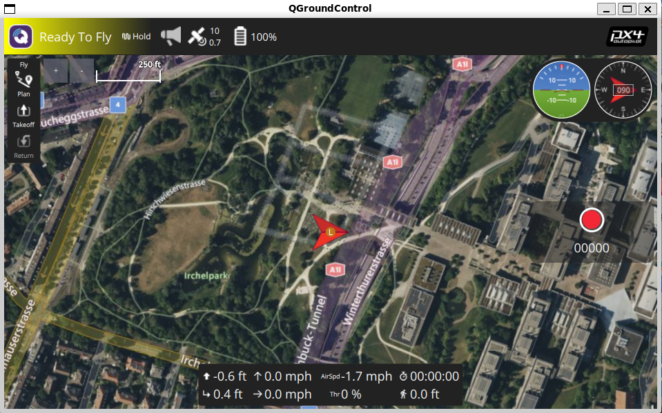

[TOC]

# 简介

本章节详细描述如何完成基于 Gazebo 的 PX4 仿真飞行。

## 参考链接

PX4官网仿真部分：

- <https://docs.px4.io/v1.14/en/sim_gazebo_gz/>

Gazebo官网：

- <https://gazebosim.org/home>
- <https://gazebosim.org/docs/garden/getstarted/>

## 版本选择

系统：WSL2 + Ubuntu22.04

Gazebo：Garden

## 仿真说明

在 PX4 的开发环境中，主要提供了以下几种仿真环境：

1. **Gazebo**：Gazebo 是一个开源的机器人仿真工具，能够提供高保真的物理仿真和复杂的环境建模。它与 PX4 无缝集成，支持多种无人机模型和传感器。支持 Ubuntu22.04 版本及以后版本，并做为默认工具集成，用于取代Gazebo Classic，具有更高级的渲染、物理和传感器模型。支持多机仿真，支持 ROS。支持机型包括 Quad, Standard VTOL, Plane。**（推荐使用）**

   **优点**：真实的物理仿真：能够模拟真实世界中的物理现象，如重力、摩擦等。丰富的环境：支持创建复杂的环境和场景，适合进行多种测试。插件支持：可以通过插件扩展功能，适合深入研究。

   **缺点**：资源消耗大：对计算机硬件要求较高，可能需要强大的 GPU。学习曲线陡峭：配置和使用相对复杂，初学者可能需要时间适应。

2. **SITL (Software In The Loop)**：SITL 是一种轻量级的仿真方式，允许在本地计算机上运行 PX4 飞控软件，而不需要实际的硬件。它模拟飞行控制系统的行为。

   **优点**：快速迭代：适合快速测试和开发，便于调试。无需额外硬件：可以在普通计算机上运行，方便开发者使用。易于集成：与其他软件工具和库的集成较为简单。

   **缺点**：物理仿真不够真实：相较于 Gazebo，SITL 的物理模型较为简单。环境交互有限：对于复杂的传感器和环境交互，可能不够准确。

3.  **HITL (Hardware In The Loop)**：HITL 是将真实硬件（如飞控板）与仿真环境结合的测试方法，能够验证硬件和软件的集成。

   **优点**：真实反馈：能够测试真实硬件在仿真环境中的表现，提供更真实的反馈。验证集成：适合验证硬件与软件的交互，确保系统的可靠性。

   **缺点**：设置复杂：需要额外的硬件和配置，设置过程较为繁琐。资源需求高：可能需要更多的时间和资源进行调试。

4.  **AirSim**：AirSim 是一个基于 Unreal Engine 的开源仿真平台，提供高质量的图形和物理仿真，支持多种无人机和地面车辆模型。

   **优点**：高质量图形：提供真实的视觉效果，适合进行视觉相关的研究。丰富的 API：支持多种编程语言，便于开发和测试。多种模型支持：可以模拟多种类型的无人机和车辆。

   **缺点**：高硬件要求：对计算机的图形处理能力要求较高。学习曲线陡峭：配置和使用可能需要一定的时间和技术知识。

**小结：**

选择合适的仿真环境取决于具体的开发需求。对于高保真的物理仿真，Gazebo 和 AirSim 是不错的选择；对于快速迭代和调试，SITL 更为合适；而如果需要验证硬件与软件的集成，HITL 是最佳选择。基于通用性、易用性考虑，我们选择Gazebo。

# 编译工程

## 下载依赖

进入 PX4 项目目录后，运行官方提供的脚本进行自动化配置：

```bash
cd PX4-Autopilot
bash ./Tools/setup/ubuntu.sh
```

如果遇到问题：module 'em' has no attribute 'RAW_OPT'，那么改变下empy的版本

```bash
pip uninstall empy
pip install empy==3.3.2
```

## 编译固件

运行如下命令启动 Gazebo 仿真：

```bash
cd /path/to/PX4-Autopilot
make px4_sitl gz_standard_vtol
```

仿真支持多种机型，对应的编译命令如下：

| 载具                                                         | 编译命令                         | PX4_SYS_AUTOSTART |
| :----------------------------------------------------------- | :------------------------------- | :---------------- |
| [Quadrotor(x500)](https://docs.px4.io/main/en/sim_gazebo_gz/vehicles.html#x500-quadrotor) | make px4_sitl gz_x500            | 4001              |
| [Quadrotor(x500) with Depth Camera](https://docs.px4.io/main/en/sim_gazebo_gz/vehicles.html#x500-quadrotor-with-depth-camera) | make px4_sitl gz_x500_depth      | 4002              |
| [Quadrotor(x500) with Vision Odometry](https://docs.px4.io/main/en/sim_gazebo_gz/vehicles.html#x500-quadrotor-with-visual-odometry) | make px4_sitl gz_x500_vision     | 4005              |
| [Quadrotor(x500) with 2D LIDAR](https://docs.px4.io/main/en/sim_gazebo_gz/vehicles.html#x500-quadrotor-with-2d-lidar) | make px4_sitl gz_x500_lidar      | 4013              |
| [VTOL](https://docs.px4.io/main/en/sim_gazebo_gz/vehicles.html#standard-vtol) | make px4_sitl gz_standard_vtol   | 4004              |
| [Plane](https://docs.px4.io/main/en/sim_gazebo_gz/vehicles.html#standard-plane) | make px4_sitl gz_rc_cessna       | 4003              |
| [Advanced Plane](https://docs.px4.io/main/en/sim_gazebo_gz/vehicles.html#advanced-plane) | make px4_sitl gz_advanced_plane  | 4008              |
| [Differential Rover](https://docs.px4.io/main/en/sim_gazebo_gz/vehicles.html#differential-rover) | make px4_sitl gz_r1_rover        | 4009              |
| [Ackermann Rover](https://docs.px4.io/main/en/sim_gazebo_gz/vehicles.html#ackermann-rover) | make px4_sitl gz_rover_ackermann | 401               |

在编译完固件后，Gazebo 软件会自动启动，并显示一架标准的垂起无人机，界面如下：


通过该界面，我们可以直观的感受飞机的姿态，位置等信息。

# 连接地面站

## 下载

进入 [QGroundControl官网](http://qgroundcontrol.com/)，点击 DOWNLOAD，根据系统选择对应版本下载即可。


如果对版本有要求，可以在 [QGC仓库发布页面](https://github.com/mavlink/qgroundcontrol/releases) 进行选择性下载。这里我们选择使用的版本是 v4.2.4。

## 启动

对于 QGC 的启动方式，建议在 WSL2 仿真环境下直接启用 WSL2 中的 QGC，这样操作比较方便；当需要烧录固件到硬件中时，我们建议直接拷贝固件到桌面，然后使用 Windows 下的 QGC 软件进行固件升级。

### Ubuntu 下启动

官方提供了编译好的二进制文件，不需要安装，我们在 WSL2 环境下，进入 QGC 文件所在目录，直接输入如下命令启动即可：

```bash
./QGroundControl_v4.2.4.AppImage
```

启动地面站后会默认开启 UDP 接收14550端口，建立无人机通信连接。

如果出现如下错误：

>/tmp/.mount_QGrounkE96Ul/QGroundControl: error while loading shared libraries: libpulse-mainloop-glib.so.0: cannot open shared object file: No such file or directory

则需要安装相关库，运行如下命令：

```bash
sudo apt-get install libpulse-mainloop-glib0
```

首次运行时，我们可以点击左上角的 Q 图标，然后将单位设置国际单位如下：


### Windows 下启动

下载安装包，双击安装即可，完成安装后会在桌面生成快捷方式，双击即可启动。

## 通信连接

### 通信连接设置

QGC 支持 UDP 组播、单播、串口等连接方式。

仿真启动后，会自动创建多路mavlink通信连接：

```bash
INFO  [mavlink] mode: Normal, data rate: 4000000 B/s on udp port 18570 remote port 14550
INFO  [mavlink] mode: Onboard, data rate: 4000000 B/s on udp port 14580 remote port 14540
INFO  [mavlink] mode: Onboard, data rate: 4000 B/s on udp port 14280 remote port 14030
INFO  [mavlink] mode: Gimbal, data rate: 400000 B/s on udp port 13030 remote port 13280
```

其中与地面站的连接是第一路（UDP服务端），本地端口是18570，远端是14550。

启动 QGC，默认会自动开启 14550 端口的连接。

> 如果在Ubuntu下启动QGC会自动连接PX4仿真，如果在Windows下启动QGC，可能因为wsl网络隔离问题无法连接，这时需要进行如下设置：
>
> 1. 查看ubuntu的IP
>
> 打开Ubuntu后，输入`ifconfig`，获取IP地址。
>
> 
>
> 2. 配置通信
>
> 在Windows下启动QGC后，打开通信配置，添加一个新的连接命名px4-wsl，然后添加目标主机。点击确认保存后返回连接界面，选中刚创建的连接然后点击连接按钮即可。
>
> 

### 连接地面站

通过上述步骤后，成功连接地面站界面如下：



## 界面介绍

在 QGroundControl (QGC) 的地面站界面中，主要包括以下几个部分和相关图标的含义：

### 主界面

地图视图：显示无人机当前位置和航线，支持缩放和拖动。

状态栏：显示无人机的状态信息，如电池电量、GPS 信号强度、飞行模式等。


### 工具栏

飞行模式切换：允许用户选择不同的飞行模式（如手动、自动、返航等）。

任务管理：用于创建、编辑和管理飞行任务。

设置：访问无人机的参数设置和配置选项。


### 状态图标

无人机图标：表示无人机在地图上的位置，图标颜色通常表示状态（如绿色表示正常，红色表示故障）。

电池图标：显示电池电量状态，通常用不同的颜色和图形表示电量水平。

GPS 图标：表示 GPS 信号强度，通常用不同的图标（如卫星图标）表示信号质量。

信号强度图标：显示与无人机之间的通信信号强度，通常用波形图标表示。


###  侧边栏

飞行信息：显示实时飞行数据，如高度、速度、航向等。

传感器数据：显示传感器状态和数据，如 IMU、气压计等。

日志记录：访问飞行日志，便于后续分析和调试。


###  任务和航线

航线图标：用于添加和编辑航线，通常是带有箭头的线条。

任务点图标：表示任务中的特定点，通常用不同的图标（如圆点）表示不同类型的任务点（如拍照、测量等）。


### 设置和配置

参数设置：访问无人机的各种参数设置，通常以列表形式展示。

固件更新：用于检查和更新无人机的固件版本。


# 仿真飞行

在上述课程中，我们了解了 PX4 的相关的基本概念与 QGC 的相关界面，我们这里进行 VTOL 的仿真飞行。

## 一键起飞

首先，回到 QGC 的主界面，点击一键起飞按钮


在 Gazebo 软件中我们可以看到，无人机的起飞动作


当飞机到达指定的高度后，将切换悬停模式。

## 指点飞行

我们还可以通过点击 QGC 界面上任意位置，让飞机飞往目的地。


## 转换固定翼

然后，我们将无人机切换为固定翼模式


在 QGC 中，我们可以直观的看出无人机的飞行轨迹等信息，同时还可以在 Gazebo 软件中实时看到无人机的姿态动作


## 一键返航

最后，我们可以点击 QGC 中的一键返航按钮，执行无人机的返航任务，这时无人机将自动规划返航路线，并在合适的时间切换为多旋翼并降落在起飞点。


至此，一次完整的虚拟仿真飞行就结束了。

# 常见问题

1. 起飞按钮灰色状态，不可点击，原因是启用了强制使用起飞检查清单。在地面站取消该选项即可。以下是操作示意图：


