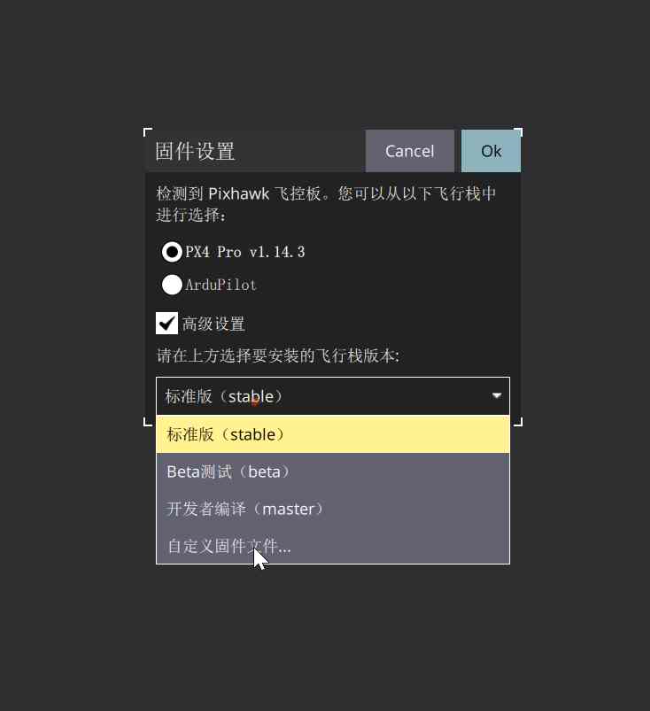
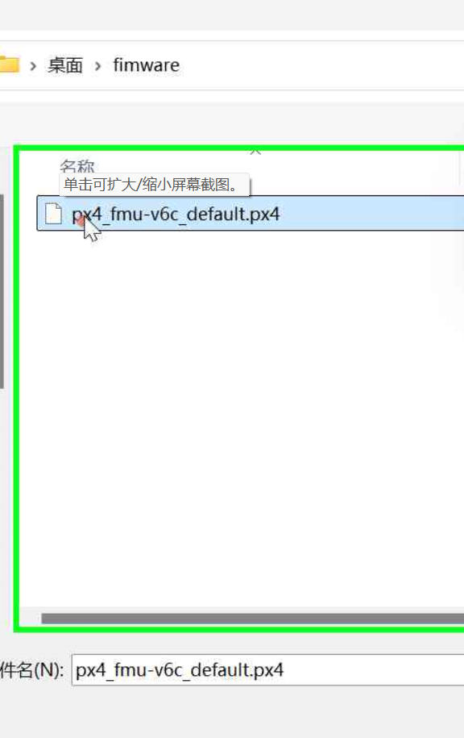

[TOC]

# 简介

本章节详细描述如何编译并下载固件至飞控板。

# 编译固件

## 下载依赖

进入 PX4 项目目录后，运行官方提供的脚本进行自动化配置：

```bash
cd PX4-Autopilot
bash ./Tools/setup/ubuntu.sh
```

> 如果遇到问题：module 'em' has no attribute 'RAW_OPT'，那么改变下 empy 的版本
>
> ```bash
> pip uninstall empy
> pip install empy==3.3.2
>  ```

## 编译

运行如下命令编译 fmu-v6c 的固件：

```bash
cd PX4-Autopilot
make px4_fmu-v6c_default
```

其中，常用的 Pixhawk 飞控版对应的编译命令如下：

- [Holybro Pixhawk 6X (FMUv6X)](https://px-4.com/v1.14/en/flight_controller/pixhawk6x.html): `make px4_fmu-v6x_default`
- [Holybro Pixhawk 6C (FMUv6C)](https://px-4.com/v1.14/en/flight_controller/pixhawk6c.html): `make px4_fmu-v6c_default`
- [Holybro Pixhawk 6C Mini (FMUv6C)](https://px-4.com/v1.14/en/flight_controller/pixhawk6c_mini.html): `make px4_fmu-v6c_default`
- [Holybro Pix32 v6 (FMUv6C)](https://px-4.com/v1.14/en/flight_controller/holybro_pix32_v6.html): `make px4_fmu-v6c_default`
- [Holybro Pixhawk 5X (FMUv5X)](https://px-4.com/v1.14/en/flight_controller/pixhawk5x.html): `make px4_fmu-v5x_default`
- [Pixhawk 4 (FMUv5)](https://px-4.com/v1.14/en/flight_controller/pixhawk4.html): `make px4_fmu-v5_default`
- [Pixhawk 4 Mini (FMUv5)](https://px-4.com/v1.14/en/flight_controller/pixhawk4_mini.html): `make px4_fmu-v5_default`
- [CUAV V5+ (FMUv5)](https://px-4.com/v1.14/en/flight_controller/cuav_v5_plus.html): `make px4_fmu-v5_default`
- [CUAV V5 nano (FMUv5)](https://px-4.com/v1.14/en/flight_controller/cuav_v5_nano.html): `make px4_fmu-v5_default`
- [Pixracer (FMUv4)](https://px-4.com/v1.14/en/flight_controller/pixracer.html): `make px4_fmu-v4_default`
- [Pixhawk 3 Pro](https://px-4.com/v1.14/en/flight_controller/pixhawk3_pro.html): `make px4_fmu-v4pro_default`
- [Pixhawk Mini](https://px-4.com/v1.14/en/flight_controller/pixhawk_mini.html): `make px4_fmu-v3_default`
- [Pixhawk 2 (Cube Black) (FMUv3)](https://px-4.com/v1.14/en/flight_controller/pixhawk-2.html): `make px4_fmu-v3_default`
- [mRo Pixhawk (FMUv3)](https://px-4.com/v1.14/en/flight_controller/mro_pixhawk.html): `make px4_fmu-v3_default` (supports 2MB Flash)
- [Holybro pix32 (FMUv2)](https://px-4.com/v1.14/en/flight_controller/holybro_pix32.html): `make px4_fmu-v2_default`
- [Pixfalcon (FMUv2)](https://px-4.com/v1.14/en/flight_controller/pixfalcon.html): `make px4_fmu-v2_default`
- [Dropix (FMUv2)](https://px-4.com/v1.14/en/flight_controller/dropix.html): `make px4_fmu-v2_default`
- [Pixhawk 1 (FMUv2)](https://px-4.com/v1.14/en/flight_controller/pixhawk.html): `make px4_fmu-v2_default`

编译完成后输出如下信息：

```bash
[1112/1114] Linking CXX executable px4_fmu-v6c_default.elf
Memory region         Used Size  Region Size  %age Used
        ITCM_RAM:          0 GB        64 KB      0.00%
           FLASH:     1937868 B      1920 KB     98.57%
       DTCM1_RAM:          0 GB        64 KB      0.00%
       DTCM2_RAM:          0 GB        64 KB      0.00%
        AXI_SRAM:       61480 B       512 KB     11.73%
           SRAM1:          0 GB       128 KB      0.00%
           SRAM2:          0 GB       128 KB      0.00%
           SRAM3:          0 GB        32 KB      0.00%
           SRAM4:          0 GB        64 KB      0.00%
          BKPRAM:          0 GB         4 KB      0.00%
```

会在 `build/px4_fmu-v6c_default` 目录下生成 `px4_fmu-v6c_default.px4` 固件，可通过 QGC 烧写到硬件中。

# 固件烧录

PX4 固件的烧录方式主要有以下几种，每种方式都有其优缺点：

1. **QGroundControl**

   **优点**：用户友好：图形界面直观，适合初学者。自动化：自动下载和烧录固件，简化流程。实时反馈：可以实时查看烧录进度和状态。

   **缺点**：依赖于软件：需要安装 QGroundControl，且可能对某些硬件支持有限。网络要求：需要网络连接以下载固件。

   **操作步骤**：

   1. 下载并安装 QGroundControl。
   2. 通过 USB 数据线连接飞控板到计算机。打开 QGroundControl，选择“Firmware”选项。
   3. 选择适合的固件版本，点击“Update”进行烧录。
   4. 等待烧录完成，检查固件版本以确认成功。

2.  **使用命令行工具（如 px4-uploader）**

   **优点**：灵活性高：适合开发者，支持批量操作和自动化脚本。无图形界面依赖：可以在无 GUI 环境下使用。

   **缺点**：学习曲线：对初学者不够友好，需要一定的命令行知识。配置复杂：可能需要手动设置环境变量和工具链。

   **操作步骤**：

   1. 确保已安装 PX4 Toolchain。
1. 使用命令行进入固件目录。执行烧录命令：make px4_fmu-v5_default upload
   1.  等待烧录完成，检查输出信息确认成功。

3.  **使用 STM32CubeProgrammer**

   **优点**：低级控制：适合需要更细致控制的用户。多种接口支持：支持多种编程接口（如 ST-LINK）。

   **缺点**：操作复杂：需要手动配置和操作，适合有经验的用户。图形界面不够直观：相较于 QGroundControl，界面较为复杂。

   **操作步骤**：

   1. 下载并安装 STM32CubeProgrammer。
   1. 通过 ST-LINK 或 USB 连接飞控板。
   1.  打开 STM32CubeProgrammer，选择正确的接口。加载编译好的固件文件（.bin 或 .hex）。
   1.  点击 “Start Programming” 进行烧录。等待烧录完成，检查状态以确认成功。

4.  **使用 PX4 Firmware GitHub Releases**

   **优点**：快速更新：无需编译，直接下载预编译的固件。简单易用：适合快速测试和更新。

   **缺点**：版本限制：只能使用官方发布的固件，无法自定义。依赖于其他工具：仍需使用 QGroundControl 或 STM32CubeProgrammer 进行烧录。

   **操作步骤**：
   
   1. 从 PX4 GitHub Releases 页面下载预编译的固件文件。
   2.  使用 QGroundControl 或 STM32CubeProgrammer 进行烧录。
   3.  按照相应工具的操作步骤完成烧录。

PX4 固件的烧录方式包括使用 QGroundControl、命令行工具、STM32CubeProgrammer 和直接下载预编译固件。选择合适的方式取决于用户的技术水平和具体需求。初学者可以选择 QGroundControl，而开发者可能更倾向于使用命令行工具或 STM32CubeProgrammer。综合考量以上因素，我们采用 QGroundControl 进行 PX4 的固件烧录。

我们通过 USB-type c 线连接飞控硬件如下


首先，我们点击 QGC 界面左上角的 Q 图标，然后选择固件


然后通过如下的操作，选择升级自定义固件





之后，等待升级完成，完成升级之后飞控会自动连接地面站。

