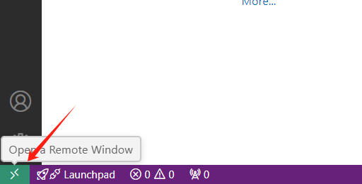
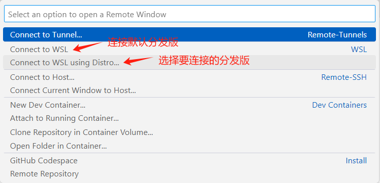
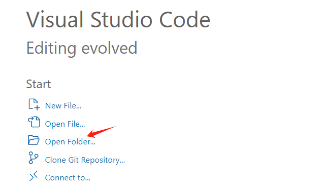

[TOC]

# 简介

本节课详细描述如何使用 VSCode 配置 PX4 开发环境。

## 参考

- github官网：https://docs.px4.io/v1.14/en/dev_setup/vscode.html

- 国内镜像地址：https://px-4.com/v1.14/en/dev_setup/vscode.html

# 安装VSCode

在实际开发过程中，我们是在 Windows 下运行 VSCode 并通过 WSL 连接的方式实现 Ubuntu 下代码编辑、调试、仿真。故首先需要在 Windows 下安装 VSCode。

安装非常简单，只需要去 [VSCode官网](https://code.visualstudio.com/?wt.mc_id=vscom_downloads) 下载并安装即可。

## 启动 vscode

### 方式一（Ubuntu终端内启动）

1. 启动 Ubuntu

在Windows下打开Windows终端，然后点击分发版下拉列表选择Ubuntu。

2. 打开项目

进入PX4目录，然后启动vscode并打开项目。

```bash
cd Desktop/PX4-Autopilot
code .
```

首次 vscode 启动会自动安装 vscode server，**故一定要在联网环境下进行这一步操作**。

### 方式二（Windows下启动并进行WSL连接）

在 Windows 下启动 VSCode，然后点击左下角远程连接。



打开选择列表，我们这里是需要连接 WSL 下安装的 Ubuntu 分发版，如果计算机上只有一个分发版就直接点击 `Connect to WSL` 即可，如果有多个分发版，可以点击 `Connect to WSL using Distro...`。



完成 WSL 连接后，左下角会更新连接状态。这时再点击 `Open Folder` 选择项目文件夹即可。



## 安装插件

启动 vscode 后，左下角会提示安装工作空间推荐的插件，点击安装即可。

如果不小心把提示关掉了，也可以点击左侧工具栏选择扩展，然后输入 `@recommended` 即可显示推荐插件列表，一个个点击 `install` 按钮进行安装即可。

# 常用插件（可选）

在 VSCode 中开发 PX4 时，我们可以安装以下插件辅助我们进行开发，提升开发效率：

## C/C++ (Microsoft)

作用：提供 C/C++ 语言的语法高亮、智能感知、代码导航和调试支持。对于 PX4 的 C++ 代码开发至关重要。

## CMake Tools

作用：支持 CMake 项目的构建和管理，提供 CMake 配置、生成和构建的功能，方便在 PX4 项目中使用 CMake 构建系统。

##  GitLens

作用：增强 Git 功能，提供代码版本控制的可视化支持，帮助开发者更好地理解代码的历史和变更。

##  Python (Microsoft)

作用：如果在 PX4 开发中使用 Python（如用于脚本或测试），该插件提供语法高亮、智能感知和调试支持。

##  Remote - SSH

作用：允许通过 SSH 连接到远程服务器，方便在远程开发环境中进行 PX4 开发和调试。

## . Docker

作用：支持 Docker 容器的管理和开发，适合在容器中进行 PX4 开发和测试，确保环境的一致性。

## Doxygen Documentation Generator

作用：帮助生成代码文档，适合为 PX4 项目编写和维护文档，提升代码可读性和可维护性。

##  Code Spell Checker

作用：提供拼写检查功能，帮助开发者避免代码注释和文档中的拼写错误。

## Prettier - Code formatter

作用：自动格式化代码，确保代码风格一致，提升代码可读性。

