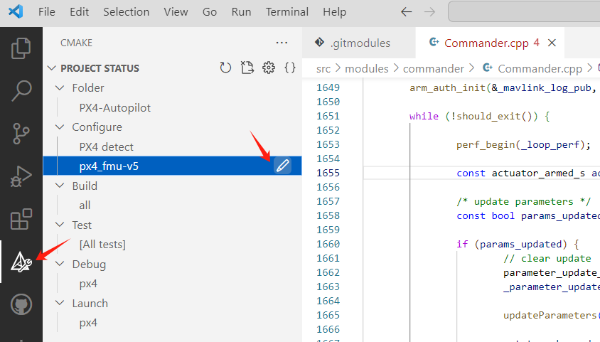
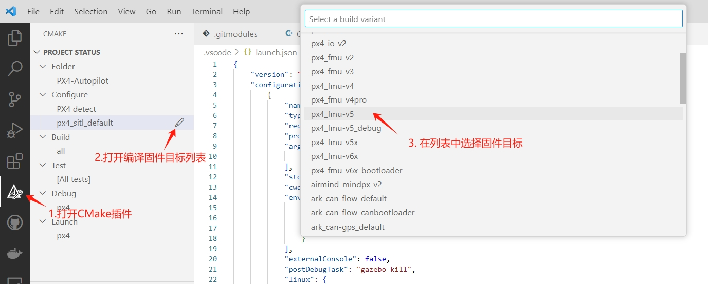
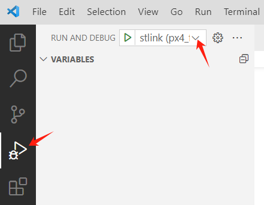
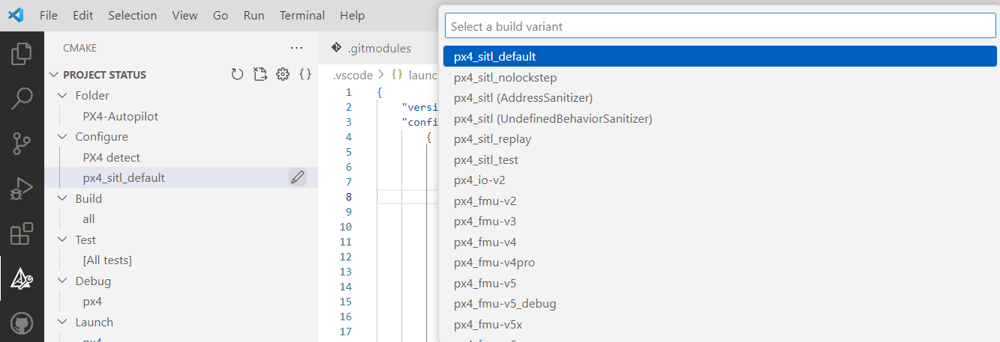
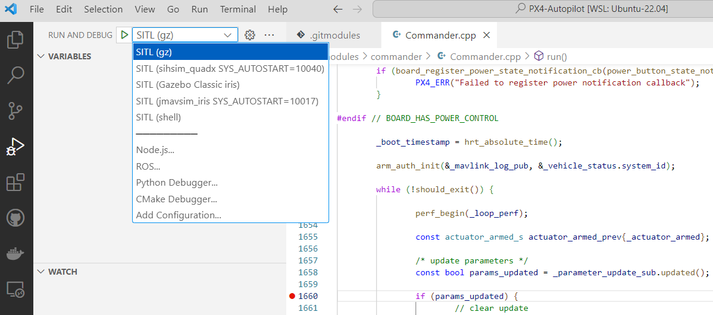
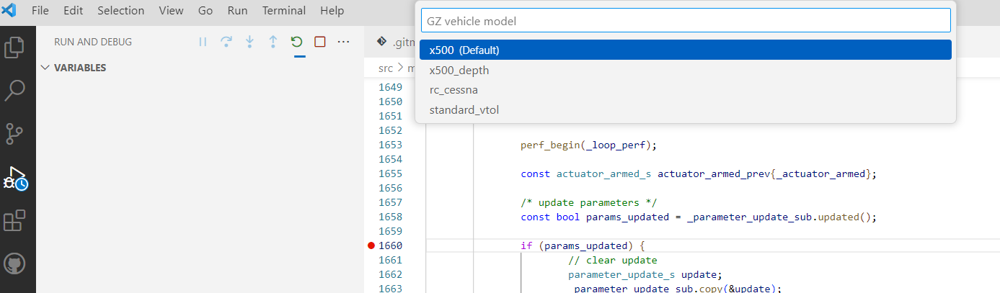

[TOC]


# 简介

本章节详细描述如何使用 VSCode 进行固件编译、仿真调试。

# 编译

由于整个 PX4 工程使用 CMake 构建的，点击左侧工具栏选择 **CMake**，就能够显示 CMake 工程目录。



然后点击 Configure->px4_fmu-v5，这时会弹出编译目标列表，根据实际选择即可：

**注意，如果 CMake 下显示的Configure配置内为 px4_sitl_default，那么你需要选中它并点击其右边的铅笔图标，然后在弹出的编译固件列表中选中你需要的硬件固件目标即可。**




# 调试

## 硬件调试

PX4 项目在 .vscode 目录 launch.json 文件中增加了调试配置，点击左侧工具栏选择**调试**，如下图所示：



然后在调试列表选择待调试的目标即可。

> 注意，如果硬件调试需要stlink等，需要实现连接好。

## 仿真调试

首先在 **CMake** 中选择编译目标为 `px4_sitl_default`。



完成编译后，在**调试**中选择目标即可，例如选择 SITL(gz)，如下图：





## 调试说明

需要先编译固件才能够启动调试，故首先通过 **CMake** 选择编译目标，编译完成后会自动生成对应的 launch.json 文件（见附录）。然后再在**调试**中选择需要调试的目标。


# 附录

## 硬件调试的launch.json文件

```json
{
    "version": "0.2.0",
    "configurations": [
        {
            "name": "jlink (px4_fmu-v5)",
            "gdbPath": "/opt/gcc-arm-none-eabi-9-2020-q2-update/bin/arm-none-eabi-gdb",
            "device": "STM32F765II",
            "svdFile": "",
            "rtos": "/home/alex/Desktop/D-px4/PX4-Autopilot/platforms/nuttx/NuttX/nuttx/tools/jlink-nuttx.so",
            "executable": "${command:cmake.launchTargetPath}",
            "request": "launch",
            "type": "cortex-debug",
            "servertype": "jlink",
            "interface": "swd",
            //"ipAddress": "server:19020",
            "cwd": "${workspaceFolder}",
            "internalConsoleOptions": "openOnSessionStart",
            "preLaunchCommands": [
                "source ${workspaceFolder}/platforms/nuttx/Debug/PX4",
                "source ${workspaceFolder}/platforms/nuttx/Debug/NuttX",
                "source ${workspaceFolder}/platforms/nuttx/Debug/ARMv7M",
                "set mem inaccessible-by-default off",
                "set print pretty",
            ]
        },
        {
            "name": "stlink (px4_fmu-v5)",
            "gdbPath": "/opt/gcc-arm-none-eabi-9-2020-q2-update/bin/arm-none-eabi-gdb",
            "device": "STM32F765II",
            "svdFile": "",
            "executable": "${command:cmake.launchTargetPath}",
            "request": "launch",
            "type": "cortex-debug",
            "servertype": "stutil",
            "cwd": "${workspaceFolder}",
            "internalConsoleOptions": "openOnSessionStart",
            "preLaunchCommands": [
                "source ${workspaceFolder}/platforms/nuttx/Debug/PX4",
                "source ${workspaceFolder}/platforms/nuttx/Debug/NuttX",
                "source ${workspaceFolder}/platforms/nuttx/Debug/ARMv7M",
                "set mem inaccessible-by-default off",
                "set print pretty",
            ]
        },
        {
            "name": "blackmagic (px4_fmu-v5)",
            "gdbPath": "/opt/gcc-arm-none-eabi-9-2020-q2-update/bin/arm-none-eabi-gdb",
            "device": "STM32F765II",
            "svdFile": "",
            "executable": "${command:cmake.launchTargetPath}",
            "request": "launch",
            "type": "cortex-debug",
            "servertype": "bmp",
            "BMPGDBSerialPort": "/dev/ttyACM0",
            "interface": "swd",
            "cwd": "${workspaceFolder}",
            "internalConsoleOptions": "openOnSessionStart",
            "preLaunchCommands": [
                "source ${workspaceFolder}/platforms/nuttx/Debug/PX4",
                "source ${workspaceFolder}/platforms/nuttx/Debug/NuttX",
                "source ${workspaceFolder}/platforms/nuttx/Debug/ARMv7M",
                "set mem inaccessible-by-default off",
                "set print pretty",
            ]
        }
    ]
}

```

## 仿真调试的launch.json文件

```json
{
    "version": "0.2.0",
    "configurations": [
        {
            "name": "SITL (gz)",
            "type": "cppdbg",
            "request": "launch",
            "program": "${command:cmake.launchTargetPath}",
            "args": [
                "${workspaceFolder}/ROMFS/px4fmu_common"
            ],
            "stopAtEntry": false,
            "cwd": "${command:cmake.buildDirectory}/rootfs",
            "environment": [
                {
                    "name": "PX4_SIM_MODEL",
                    "value": "gz_${input:PX4_GZ_MODEL}"
                }
            ],
            "externalConsole": false,
            "postDebugTask": "gazebo kill",
            "linux": {
                "MIMode": "gdb",
                "externalConsole": false,
                "setupCommands": [
                    {
                        "description": "Enable pretty-printing for gdb",
                        "text": "-enable-pretty-printing",
                        "ignoreFailures": true
                    },
                    {
                        "description": "PX4 ignore wq signals",
                        "text": "handle SIGCONT nostop noprint nopass",
                        "ignoreFailures": true
                    }
                ]
            },
            "osx": {
                "MIMode": "lldb",
                "externalConsole": true,
                "setupCommands": [
                    {
                        "text": "pro hand -p true -s false -n false SIGCONT",
                    }
                ]
            }
        },
        {
            "name": "SITL (sihsim_quadx SYS_AUTOSTART=10040)",
            "type": "cppdbg",
            "request": "launch",
            "program": "${command:cmake.launchTargetPath}",
            "args": [
                "${workspaceFolder}/ROMFS/px4fmu_common"
            ],
            "stopAtEntry": false,
            "cwd": "${command:cmake.buildDirectory}/rootfs",
            "environment": [
                {
                    "name": "PX4_SYS_AUTOSTART",
                    "value": "10040"
                }
            ],
            "postDebugTask": "px4_sitl_cleanup",
            "linux": {
                "MIMode": "gdb",
                "setupCommands": [
                    {
                        "description": "Enable pretty-printing for gdb",
                        "text": "-enable-pretty-printing",
                        "ignoreFailures": true
                    },
                    {
                        "description": "PX4 ignore wq signals",
                        "text": "handle SIGCONT nostop noprint nopass",
                        "ignoreFailures": true
                    }
                ]
            },
            "osx": {
                "MIMode": "lldb",
                "setupCommands": [
                    {
                        "text": "pro hand -p true -s false -n false SIGCONT",
                    }
                ]
            }
        },
        {
            "name": "SITL (Gazebo Classic iris)",
            "type": "cppdbg",
            "request": "launch",
            "program": "${command:cmake.launchTargetPath}",
            "args": [
                "${workspaceFolder}/ROMFS/px4fmu_common"
            ],
            "stopAtEntry": false,
            "cwd": "${command:cmake.buildDirectory}/rootfs",
            "environment": [
                {
                    "name": "PX4_SIM_MODEL",
                    "value": "gazebo-classic_iris"
                }
            ],
            "externalConsole": false,
            "preLaunchTask": "gazebo-classic",
            "postDebugTask": "gazebo-classic kill",
            "linux": {
                "MIMode": "gdb",
                "externalConsole": false,
                "setupCommands": [
                    {
                        "description": "Enable pretty-printing for gdb",
                        "text": "-enable-pretty-printing",
                        "ignoreFailures": true
                    },
                    {
                        "description": "PX4 ignore wq signals",
                        "text": "handle SIGCONT nostop noprint nopass",
                        "ignoreFailures": true
                    }
                ]
            },
            "osx": {
                "MIMode": "lldb",
                "externalConsole": true,
                "setupCommands": [
                    {
                        "text": "pro hand -p true -s false -n false SIGCONT",
                    }
                ]
            }
        },
        {
            "name": "SITL (jmavsim_iris SYS_AUTOSTART=10017)",
            "type": "cppdbg",
            "request": "launch",
            "program": "${command:cmake.launchTargetPath}",
            "args": [
                "${workspaceFolder}/ROMFS/px4fmu_common"
            ],
            "stopAtEntry": false,
            "cwd": "${command:cmake.buildDirectory}/rootfs",
            "environment": [
                {
                    "name": "PX4_SYS_AUTOSTART",
                    "value": "10017"
                }
            ],
            "postDebugTask": "jmavsim kill",
            "linux": {
                "MIMode": "gdb",
                "setupCommands": [
                    {
                        "description": "Enable pretty-printing for gdb",
                        "text": "-enable-pretty-printing",
                        "ignoreFailures": true
                    },
                    {
                        "description": "PX4 ignore wq signals",
                        "text": "handle SIGCONT nostop noprint nopass",
                        "ignoreFailures": true
                    }
                ]
            },
            "osx": {
                "MIMode": "lldb",
                "setupCommands": [
                    {
                        "text": "pro hand -p true -s false -n false SIGCONT",
                    }
                ]
            }
        },
        {
            "name": "SITL (shell)",
            "type": "cppdbg",
            "request": "launch",
            "program": "${command:cmake.launchTargetPath}",
            "args": [
                "${workspaceFolder}/ROMFS/px4fmu_common"
            ],
            "stopAtEntry": false,
            "cwd": "${command:cmake.buildDirectory}/rootfs",
            "environment": [
                {
                    "name": "PX4_SIM_MODEL",
                    "value": "shell"
                }
            ],
            "linux": {
                "MIMode": "gdb",
                "externalConsole": false,
                "setupCommands": [
                    {
                        "description": "Enable pretty-printing for gdb",
                        "text": "-enable-pretty-printing",
                        "ignoreFailures": true
                    },
                    {
                        "description": "PX4 ignore wq signals",
                        "text": "handle SIGCONT nostop noprint nopass",
                        "ignoreFailures": true
                    }
                ]
            },
            "osx": {
                "MIMode": "lldb",
                "externalConsole": true,
                "setupCommands": [
                    {
                        "text": "pro hand -p true -s false -n false SIGCONT",
                    }
                ]
            }
        }
    ],
    "inputs": [
        {
            "type": "pickString",
            "id": "PX4_GZ_MODEL",
            "description": "GZ vehicle model",
            "options": [
              "x500",
              "x500_depth",
              "rc_cessna",
              "standard_vtol",
            ],
            "default": "x500"
        }
    ]
}
```

