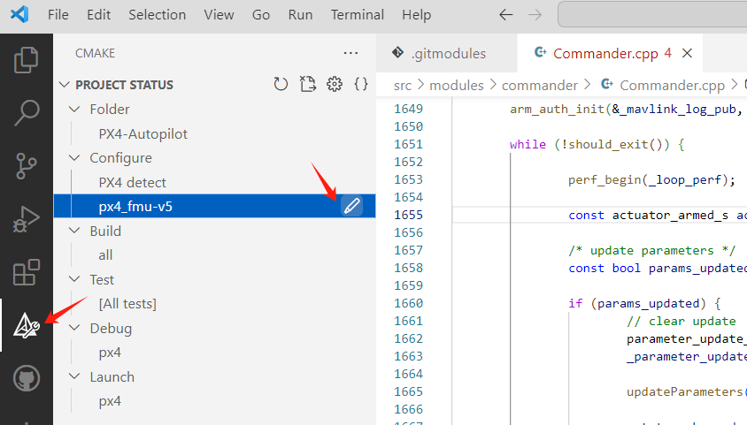
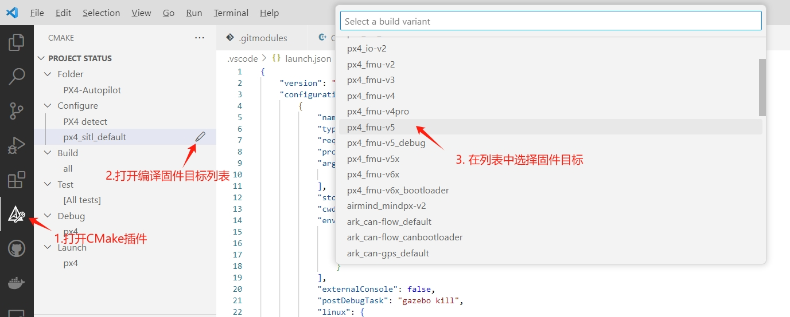
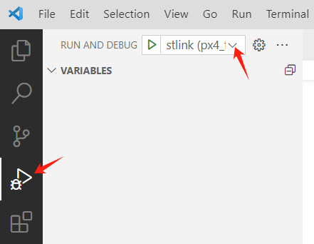
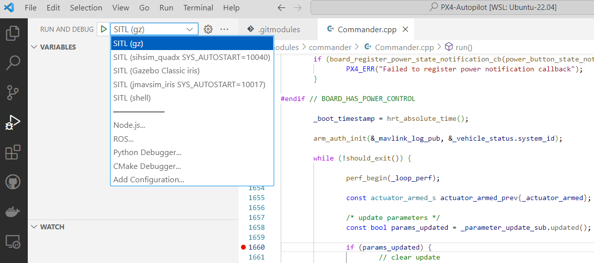
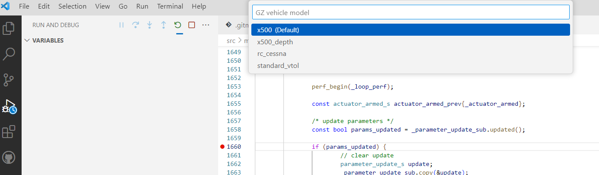

# 搭建开发环境

## 概述

这里我们选择Ubuntu-22.04系统配置开发环境。

- 官方

https://docs.px4.io/main/en/dev_setup/dev_env.html

https://docs.px4.io/main/en/dev_setup/dev_env_windows_wsl.html

- 如果官方网站不好打开，可以试试如下镜像网站：

https://px-4.com/v1.14/en/

## 编译

### 下载依赖

进入PX4项目目录后，运行官方提供的脚本进行自动化配置：

```bash
cd PX4-Autopilot
bash ./Tools/setup/ubuntu.sh
```

>  如果遇到问题：module 'em' has no attribute 'RAW_OPT'，那么改变下empy的版本
>
> ```bash
> $ pip uninstall empy
> $ pip install empy==3.3.2
> ```


### 编译

#### 仿真

运行如下命令启动gazebo仿真：

```bash
cd /path/to/PX4-Autopilot
make px4_sitl gz_x500
```

仿真支持多种机型，对应的编译命令如下：

| Vehicle                                                      | Command                          | `PX4_SYS_AUTOSTART` |
| ------------------------------------------------------------ | -------------------------------- | ------------------- |
| [Quadrotor(x500)](https://px-4.com/v1.14/en/sim_gazebo_gz/gazebo_vehicles.html#x500-quadrotor) | `make px4_sitl gz_x500`          | 4001                |
| [Quadrotor(x500) with Depth Camera](https://px-4.com/v1.14/en/sim_gazebo_gz/gazebo_vehicles.html#x500-quadrotor-with-depth-camera) | `make px4_sitl gz_x500_depth`    | 4002                |
| [Quadrotor(x500) with Vision Odometry](https://px-4.com/v1.14/en/sim_gazebo_gz/gazebo_vehicles.html#x500-quadrotor-with-visual-odometry) | `make px4_sitl gz_x500_vision`   | 4005                |
| [VTOL](https://px-4.com/v1.14/en/sim_gazebo_gz/gazebo_vehicles.html#standard-vtol) | `make px4_sitl gz_standard_vtol` | 4004                |
| [Plane](https://px-4.com/v1.14/en/sim_gazebo_gz/gazebo_vehicles.html#rc-cessna) | `make px4_sitl gz_rc_cessna`     | 4003                |

#### 固件

运行如下命令编译适配fmu-v5的固件：

```bash
cd PX4-Autopilot
make px4_fmu-v5_default
```

### 连接地面站

```bash
$ ./QGroundControl_v4.2.4.AppImage
```

> 如果出现如下错误：
>
> /tmp/.mount_QGrounkE96Ul/QGroundControl: error while loading shared libraries: libpulse-mainloop-glib.so.0: cannot open shared object file: No such file or directory
>
> 则需要安装相关库，运行如下命令：
>
> ```bash
> $ sudo apt-get install libpulse-mainloop-glib0
> ```
>
> 


## 使用VSCode开发

### 启动vscode

https://px-4.com/v1.14/en/dev_setup/vscode.html

启动Ubuntu后，进入PX4目录，然后启动vscode。

```bash
$ cd PX4-Autopilot
$ code .
```

首次启动会安装vscode server，一定要在联网环境下进行。

### 安装插件

启动vscode后，左下角会提示安装工作空间推荐的插件，点击安装即可。如果不小心把提示关掉了，也可以点击左侧工具栏选择扩展，然后输入`@recommended`即可显示推荐插件列表，一个个进行安装即可。

### 编译

整个PX4工程使用CMake构建的，点击左侧工具栏选择**CMake**，就能够显示CMake工程目录。

然后点击Configure->px4_fmu-v5，这时会弹出编译目标列表，根据实际选择即可：




### 硬件调试

PX4项目在.vscode目录launch.json文件中增加了调试配置，点击左侧工具栏选择**调试**，如下图所示：



然后在调试列表选择待调试的目标即可。

> 注意，如果硬件调试需要stlink等，需要实现连接好。


### 仿真调试

首先在**CMake**中选择编译目标为`px4_sitl_default`。


完成编译后，在**调试**中选择目标即可，例如选择SITL(gz)，如下图：





### 调试说明

需要先编译固件才能够调试，故首先通过**CMake**选择编译目标，编译完成后会自动生成对应的launch.json文件（见附录）。

然后再在**调试**中选择需要调试的目标。


## 附录

### 硬件调试的launch.json文件

```json
{
    "version": "0.2.0",
    "configurations": [
        {
            "name": "jlink (px4_fmu-v5)",
            "gdbPath": "/opt/gcc-arm-none-eabi-9-2020-q2-update/bin/arm-none-eabi-gdb",
            "device": "STM32F765II",
            "svdFile": "",
            "rtos": "/home/alex/Desktop/D-px4/PX4-Autopilot/platforms/nuttx/NuttX/nuttx/tools/jlink-nuttx.so",
            "executable": "${command:cmake.launchTargetPath}",
            "request": "launch",
            "type": "cortex-debug",
            "servertype": "jlink",
            "interface": "swd",
            //"ipAddress": "server:19020",
            "cwd": "${workspaceFolder}",
            "internalConsoleOptions": "openOnSessionStart",
            "preLaunchCommands": [
                "source ${workspaceFolder}/platforms/nuttx/Debug/PX4",
                "source ${workspaceFolder}/platforms/nuttx/Debug/NuttX",
                "source ${workspaceFolder}/platforms/nuttx/Debug/ARMv7M",
                "set mem inaccessible-by-default off",
                "set print pretty",
            ]
        },
        {
            "name": "stlink (px4_fmu-v5)",
            "gdbPath": "/opt/gcc-arm-none-eabi-9-2020-q2-update/bin/arm-none-eabi-gdb",
            "device": "STM32F765II",
            "svdFile": "",
            "executable": "${command:cmake.launchTargetPath}",
            "request": "launch",
            "type": "cortex-debug",
            "servertype": "stutil",
            "cwd": "${workspaceFolder}",
            "internalConsoleOptions": "openOnSessionStart",
            "preLaunchCommands": [
                "source ${workspaceFolder}/platforms/nuttx/Debug/PX4",
                "source ${workspaceFolder}/platforms/nuttx/Debug/NuttX",
                "source ${workspaceFolder}/platforms/nuttx/Debug/ARMv7M",
                "set mem inaccessible-by-default off",
                "set print pretty",
            ]
        },
        {
            "name": "blackmagic (px4_fmu-v5)",
            "gdbPath": "/opt/gcc-arm-none-eabi-9-2020-q2-update/bin/arm-none-eabi-gdb",
            "device": "STM32F765II",
            "svdFile": "",
            "executable": "${command:cmake.launchTargetPath}",
            "request": "launch",
            "type": "cortex-debug",
            "servertype": "bmp",
            "BMPGDBSerialPort": "/dev/ttyACM0",
            "interface": "swd",
            "cwd": "${workspaceFolder}",
            "internalConsoleOptions": "openOnSessionStart",
            "preLaunchCommands": [
                "source ${workspaceFolder}/platforms/nuttx/Debug/PX4",
                "source ${workspaceFolder}/platforms/nuttx/Debug/NuttX",
                "source ${workspaceFolder}/platforms/nuttx/Debug/ARMv7M",
                "set mem inaccessible-by-default off",
                "set print pretty",
            ]
        }
    ]
}

```


### 仿真launch.json文件

```json
{
    "version": "0.2.0",
    "configurations": [
        {
            "name": "SITL (gz)",
            "type": "cppdbg",
            "request": "launch",
            "program": "${command:cmake.launchTargetPath}",
            "args": [
                "${workspaceFolder}/ROMFS/px4fmu_common"
            ],
            "stopAtEntry": false,
            "cwd": "${command:cmake.buildDirectory}/rootfs",
            "environment": [
                {
                    "name": "PX4_SIM_MODEL",
                    "value": "gz_${input:PX4_GZ_MODEL}"
                }
            ],
            "externalConsole": false,
            "postDebugTask": "gazebo kill",
            "linux": {
                "MIMode": "gdb",
                "externalConsole": false,
                "setupCommands": [
                    {
                        "description": "Enable pretty-printing for gdb",
                        "text": "-enable-pretty-printing",
                        "ignoreFailures": true
                    },
                    {
                        "description": "PX4 ignore wq signals",
                        "text": "handle SIGCONT nostop noprint nopass",
                        "ignoreFailures": true
                    }
                ]
            },
            "osx": {
                "MIMode": "lldb",
                "externalConsole": true,
                "setupCommands": [
                    {
                        "text": "pro hand -p true -s false -n false SIGCONT",
                    }
                ]
            }
        },
        {
            "name": "SITL (sihsim_quadx SYS_AUTOSTART=10040)",
            "type": "cppdbg",
            "request": "launch",
            "program": "${command:cmake.launchTargetPath}",
            "args": [
                "${workspaceFolder}/ROMFS/px4fmu_common"
            ],
            "stopAtEntry": false,
            "cwd": "${command:cmake.buildDirectory}/rootfs",
            "environment": [
                {
                    "name": "PX4_SYS_AUTOSTART",
                    "value": "10040"
                }
            ],
            "postDebugTask": "px4_sitl_cleanup",
            "linux": {
                "MIMode": "gdb",
                "setupCommands": [
                    {
                        "description": "Enable pretty-printing for gdb",
                        "text": "-enable-pretty-printing",
                        "ignoreFailures": true
                    },
                    {
                        "description": "PX4 ignore wq signals",
                        "text": "handle SIGCONT nostop noprint nopass",
                        "ignoreFailures": true
                    }
                ]
            },
            "osx": {
                "MIMode": "lldb",
                "setupCommands": [
                    {
                        "text": "pro hand -p true -s false -n false SIGCONT",
                    }
                ]
            }
        },
        {
            "name": "SITL (Gazebo Classic iris)",
            "type": "cppdbg",
            "request": "launch",
            "program": "${command:cmake.launchTargetPath}",
            "args": [
                "${workspaceFolder}/ROMFS/px4fmu_common"
            ],
            "stopAtEntry": false,
            "cwd": "${command:cmake.buildDirectory}/rootfs",
            "environment": [
                {
                    "name": "PX4_SIM_MODEL",
                    "value": "gazebo-classic_iris"
                }
            ],
            "externalConsole": false,
            "preLaunchTask": "gazebo-classic",
            "postDebugTask": "gazebo-classic kill",
            "linux": {
                "MIMode": "gdb",
                "externalConsole": false,
                "setupCommands": [
                    {
                        "description": "Enable pretty-printing for gdb",
                        "text": "-enable-pretty-printing",
                        "ignoreFailures": true
                    },
                    {
                        "description": "PX4 ignore wq signals",
                        "text": "handle SIGCONT nostop noprint nopass",
                        "ignoreFailures": true
                    }
                ]
            },
            "osx": {
                "MIMode": "lldb",
                "externalConsole": true,
                "setupCommands": [
                    {
                        "text": "pro hand -p true -s false -n false SIGCONT",
                    }
                ]
            }
        },
        {
            "name": "SITL (jmavsim_iris SYS_AUTOSTART=10017)",
            "type": "cppdbg",
            "request": "launch",
            "program": "${command:cmake.launchTargetPath}",
            "args": [
                "${workspaceFolder}/ROMFS/px4fmu_common"
            ],
            "stopAtEntry": false,
            "cwd": "${command:cmake.buildDirectory}/rootfs",
            "environment": [
                {
                    "name": "PX4_SYS_AUTOSTART",
                    "value": "10017"
                }
            ],
            "postDebugTask": "jmavsim kill",
            "linux": {
                "MIMode": "gdb",
                "setupCommands": [
                    {
                        "description": "Enable pretty-printing for gdb",
                        "text": "-enable-pretty-printing",
                        "ignoreFailures": true
                    },
                    {
                        "description": "PX4 ignore wq signals",
                        "text": "handle SIGCONT nostop noprint nopass",
                        "ignoreFailures": true
                    }
                ]
            },
            "osx": {
                "MIMode": "lldb",
                "setupCommands": [
                    {
                        "text": "pro hand -p true -s false -n false SIGCONT",
                    }
                ]
            }
        },
        {
            "name": "SITL (shell)",
            "type": "cppdbg",
            "request": "launch",
            "program": "${command:cmake.launchTargetPath}",
            "args": [
                "${workspaceFolder}/ROMFS/px4fmu_common"
            ],
            "stopAtEntry": false,
            "cwd": "${command:cmake.buildDirectory}/rootfs",
            "environment": [
                {
                    "name": "PX4_SIM_MODEL",
                    "value": "shell"
                }
            ],
            "linux": {
                "MIMode": "gdb",
                "externalConsole": false,
                "setupCommands": [
                    {
                        "description": "Enable pretty-printing for gdb",
                        "text": "-enable-pretty-printing",
                        "ignoreFailures": true
                    },
                    {
                        "description": "PX4 ignore wq signals",
                        "text": "handle SIGCONT nostop noprint nopass",
                        "ignoreFailures": true
                    }
                ]
            },
            "osx": {
                "MIMode": "lldb",
                "externalConsole": true,
                "setupCommands": [
                    {
                        "text": "pro hand -p true -s false -n false SIGCONT",
                    }
                ]
            }
        }
    ],
    "inputs": [
        {
            "type": "pickString",
            "id": "PX4_GZ_MODEL",
            "description": "GZ vehicle model",
            "options": [
              "x500",
              "x500_depth",
              "rc_cessna",
              "standard_vtol",
            ],
            "default": "x500"
        }
    ]
}
```

