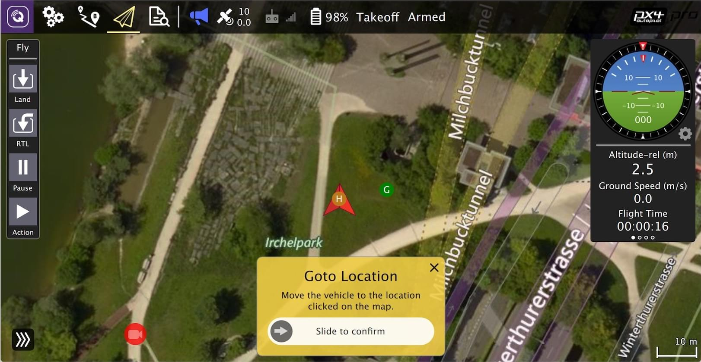

# 编译

## 概述

这里我们选择Ubuntu-22.04系统配置开发环境。

- 官方

https://docs.px4.io/main/en/dev_setup/dev_env.html

https://docs.px4.io/main/en/dev_setup/dev_env_windows_wsl.html

- 如果官方网站不好打开，可以试试如下镜像网站：

https://px-4.com/v1.14/en/

## 编译

### 下载依赖

进入PX4项目目录后，运行官方提供的脚本进行自动化配置：

```bash
cd PX4-Autopilot
bash ./Tools/setup/ubuntu.sh
```

>  如果遇到问题：module 'em' has no attribute 'RAW_OPT'，那么改变下empy的版本
>
> ```bash
> $ pip uninstall empy
> $ pip install empy==3.3.2
> ```


### 编译

#### 仿真

运行如下命令启动gazebo仿真：

```bash
cd /path/to/PX4-Autopilot
make px4_sitl gz_x500
```

仿真支持多种机型，对应的编译命令如下：

| Vehicle                                                      | Command                          | `PX4_SYS_AUTOSTART` |
| ------------------------------------------------------------ | -------------------------------- | ------------------- |
| [Quadrotor(x500)](https://px-4.com/v1.14/en/sim_gazebo_gz/gazebo_vehicles.html#x500-quadrotor) | `make px4_sitl gz_x500`          | 4001                |
| [Quadrotor(x500) with Depth Camera](https://px-4.com/v1.14/en/sim_gazebo_gz/gazebo_vehicles.html#x500-quadrotor-with-depth-camera) | `make px4_sitl gz_x500_depth`    | 4002                |
| [Quadrotor(x500) with Vision Odometry](https://px-4.com/v1.14/en/sim_gazebo_gz/gazebo_vehicles.html#x500-quadrotor-with-visual-odometry) | `make px4_sitl gz_x500_vision`   | 4005                |
| [VTOL](https://px-4.com/v1.14/en/sim_gazebo_gz/gazebo_vehicles.html#standard-vtol) | `make px4_sitl gz_standard_vtol` | 4004                |
| [Plane](https://px-4.com/v1.14/en/sim_gazebo_gz/gazebo_vehicles.html#rc-cessna) | `make px4_sitl gz_rc_cessna`     | 4003                |

#### 固件

运行如下命令编译适配fmu-v5的固件：

```bash
cd PX4-Autopilot
make px4_fmu-v5_default
```

常用的 Pixhawk飞控版对应的编译如下：

- [Holybro Pixhawk 6X (FMUv6X)](https://px-4.com/v1.14/en/flight_controller/pixhawk6x.html): `make px4_fmu-v6x_default`
- [Holybro Pixhawk 6C (FMUv6C)](https://px-4.com/v1.14/en/flight_controller/pixhawk6c.html): `make px4_fmu-v6c_default`
- [Holybro Pixhawk 6C Mini (FMUv6C)](https://px-4.com/v1.14/en/flight_controller/pixhawk6c_mini.html): `make px4_fmu-v6c_default`
- [Holybro Pix32 v6 (FMUv6C)](https://px-4.com/v1.14/en/flight_controller/holybro_pix32_v6.html): `make px4_fmu-v6c_default`
- [Holybro Pixhawk 5X (FMUv5X)](https://px-4.com/v1.14/en/flight_controller/pixhawk5x.html): `make px4_fmu-v5x_default`
- [Pixhawk 4 (FMUv5)](https://px-4.com/v1.14/en/flight_controller/pixhawk4.html): `make px4_fmu-v5_default`
- [Pixhawk 4 Mini (FMUv5)](https://px-4.com/v1.14/en/flight_controller/pixhawk4_mini.html): `make px4_fmu-v5_default`
- [CUAV V5+ (FMUv5)](https://px-4.com/v1.14/en/flight_controller/cuav_v5_plus.html): `make px4_fmu-v5_default`
- [CUAV V5 nano (FMUv5)](https://px-4.com/v1.14/en/flight_controller/cuav_v5_nano.html): `make px4_fmu-v5_default`
- [Pixracer (FMUv4)](https://px-4.com/v1.14/en/flight_controller/pixracer.html): `make px4_fmu-v4_default`
- [Pixhawk 3 Pro](https://px-4.com/v1.14/en/flight_controller/pixhawk3_pro.html): `make px4_fmu-v4pro_default`
- [Pixhawk Mini](https://px-4.com/v1.14/en/flight_controller/pixhawk_mini.html): `make px4_fmu-v3_default`
- [Pixhawk 2 (Cube Black) (FMUv3)](https://px-4.com/v1.14/en/flight_controller/pixhawk-2.html): `make px4_fmu-v3_default`
- [mRo Pixhawk (FMUv3)](https://px-4.com/v1.14/en/flight_controller/mro_pixhawk.html): `make px4_fmu-v3_default` (supports 2MB Flash)
- [Holybro pix32 (FMUv2)](https://px-4.com/v1.14/en/flight_controller/holybro_pix32.html): `make px4_fmu-v2_default`
- [Pixfalcon (FMUv2)](https://px-4.com/v1.14/en/flight_controller/pixfalcon.html): `make px4_fmu-v2_default`
- [Dropix (FMUv2)](https://px-4.com/v1.14/en/flight_controller/dropix.html): `make px4_fmu-v2_default`
- [Pixhawk 1 (FMUv2)](https://px-4.com/v1.14/en/flight_controller/pixhawk.html): `make px4_fmu-v2_default`

## 连接地面站

```bash
$ ./QGroundControl_v4.2.4.AppImage
```

> 如果出现如下错误：
>
> /tmp/.mount_QGrounkE96Ul/QGroundControl: error while loading shared libraries: libpulse-mainloop-glib.so.0: cannot open shared object file: No such file or directory
>
> 则需要安装相关库，运行如下命令：
>
> ```bash
> $ sudo apt-get install libpulse-mainloop-glib0
> ```
>

启动地面站后会默认开启UDP接收14550端口，建立无人机通信连接。


