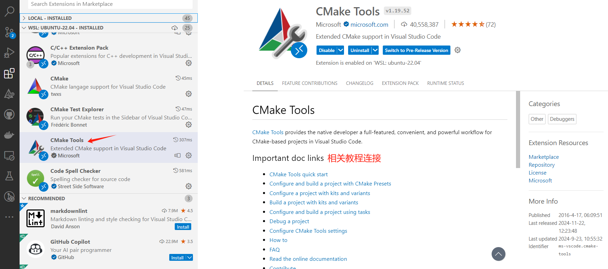
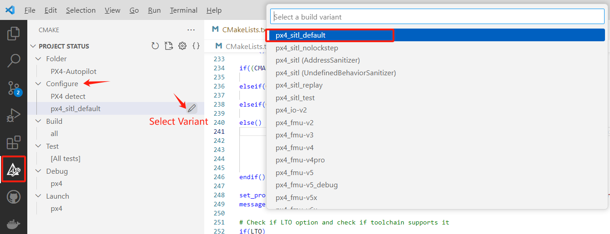
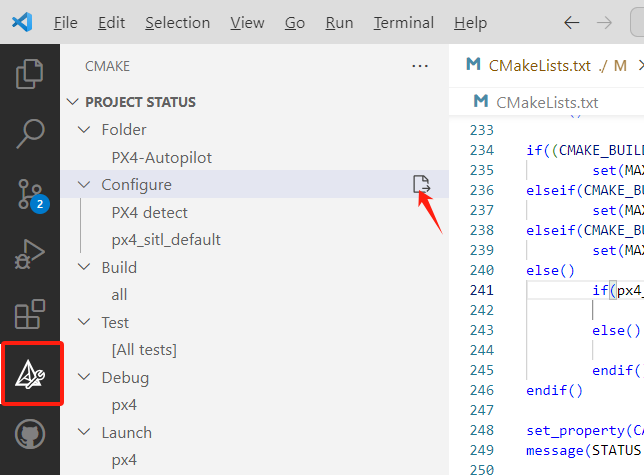
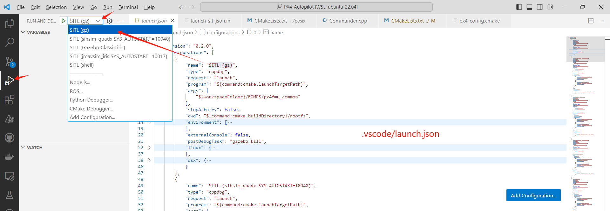
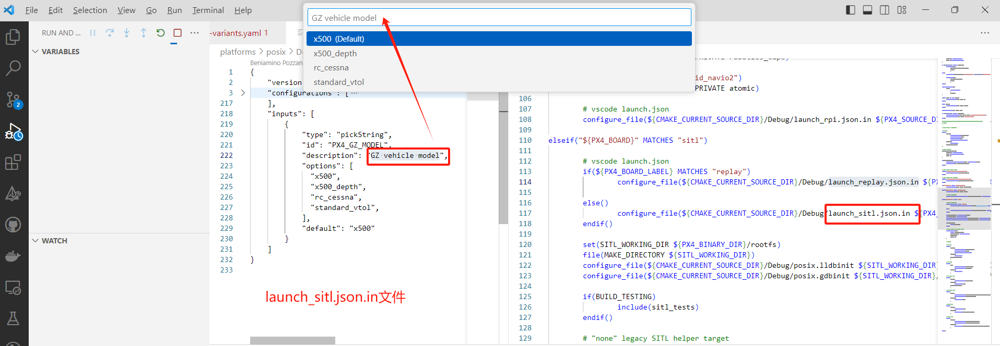

# 插件-CMake Tools

为了支持大型C/C++工程开发，微软官网提供了CMake Tools插件，这个插件提供了交互UI与命令，帮助用户灵活配置cmake项目、编译、调试。首先用户需要安装该插件才能在VSCode下搭建PX4开发环境。



另外在插件介绍界面，可以看到微软提供了教程文档，推荐看下前面5个教程链接。

# 构建流程

## CMake构建流程简介

通常使用CMake构建和编译项目包括两个步骤：

- 第一步：生成构建文件，通过命令`cmake -Bbuild .`即可创建build文件夹并生成构建文件，可以使用`-G`参数选择生成器，常用的有`Unix Makefiles`、`Ninja`；
- 第二步：根据构建文件进行编译，通过命令`cmake --build build`即可执行编译并生成可执行文件。

在VSCode通过CMake Tools对PX4项目进行构建本质上也是围绕以上两个步骤展开的。

## 生成构建文件

### 选择编译目标（variant）

PX4项目提供了很多个编译目标，这些编译目标定义在文件`.vscode/cmake-variants.yaml`中。

在VSCode，点击左侧CMake Tools视图窗口，点击Configure下`Select Variant`，既可以选择编译目标。



在VSCode中，默认选择编译目标为 `px4_sitl_default`。

编译目标内有`settings`字段，**用于给cmake命令传入参数**，当选择了编译目标为 `px4_sitl_default`，那么就会给cmake传入`-DCONFIG:string=px4_sitl_default`参数，这样CMakeLists.txt内就可以根据CONFIG参数选择编译对应的文件。

### 生成构建文件

在VSCode，点击左侧CMake Tools视图窗口，点击Configure，既可以启动生成构建文件。



**点击后启动构建命令**：

```bash
[proc] Executing command: /usr/bin/cmake -DCMAKE_BUILD_TYPE:STRING=RelWithDebInfo -DCONFIG:STRING=px4_sitl_default -DCMAKE_EXPORT_COMPILE_COMMANDS:BOOL=TRUE --no-warn-unused-cli -S/home/nextpilot/Desktop/repositories/PX4-Autopilot -B/home/nextpilot/Desktop/repositories/PX4-Autopilot/build/px4_sitl_default -G Ninja
[cmake] Not searching for unused variables given on the command line.
```

其中`[proc] Executing command`就是调用cmake命令。类似于在一个cmake工程下运行`cmake -Bbuild .`命令

这里执行的程序为/usr/bin/cmake，传入的编译选项有：

- -DCONFIG:STRING=px4_sitl_default：选择boards/px4/sitl/default.px4board；

- --no-warn-unused-cli：不要警告命令行选项；

- -S/home/.../PX4-Autopilot：指定源码路径，这里就是工程根目录；

- -B/home/.../build/px4_sitl_default：指定构建文件生成路径，PX4会在工程根目录下创建build文件夹，统一存放各种构建文件，这里build路径是通过`.vscode/setting.json`下cmake.buildDirectory设定的；

- -G Ninja：生成器选择为Ninja（一个专注于速度的小型构建系统，与make相比启动编译的速度更快），这样就会在`build/px4_sitl_default`目录下生成一个build.ninja文件（这里没有使用make生成器，故不会生成makefile文件）。

**然后在`build/px4_sitl_default`路径下生成构建文件**：

```bash
[cmake] -- PX4 version: v1.14.3 (1.14.3)
[cmake] -- Found PythonInterp: /usr/bin/python3 (found suitable version "3.10.12", minimum required is "3") 
[cmake] -- PX4 config file: /home/nextpilot/Desktop/repositories/PX4-Autopilot/boards/px4/sitl/default.px4board
[cmake] -- PLATFORM posix
[cmake] -- ROMFSROOT px4fmu_common
[cmake] -- ROOTFSDIR .
[cmake] -- TESTING y
[cmake] -- ETHERNET y
[cmake] -- PX4 config: px4_sitl_default
[cmake] -- PX4 platform: posix
[cmake] -- PX4 lockstep: enabled
[cmake] -- The CXX compiler identification is GNU 11.4.0
[cmake] -- The C compiler identification is GNU 11.4.0
[cmake] -- The ASM compiler identification is GNU
[cmake] -- Found assembler: /usr/bin/cc
[cmake] -- Detecting CXX compiler ABI info
[cmake] -- Detecting CXX compiler ABI info - done
[cmake] -- Check for working CXX compiler: /usr/bin/c++ - skipped
[cmake] -- Detecting CXX compile features
[cmake] -- Detecting CXX compile features - done
[cmake] -- Detecting C compiler ABI info
[cmake] -- Detecting C compiler ABI info - done
[cmake] -- Check for working C compiler: /usr/bin/cc - skipped
[cmake] -- Detecting C compile features
[cmake] -- Detecting C compile features - done
[cmake] -- cmake build type: RelWithDebInfo
[cmake] -- Looking for gz-transport12 -- found version 12.2.1
[cmake] -- Searching for dependencies of gz-transport12
[cmake] -- Found Protobuf: /usr/lib/x86_64-linux-gnu/libprotobuf.so (found version "3.12.4") 
[cmake] -- Config-file not installed for ZeroMQ -- checking for pkg-config
[cmake] -- Checking for module 'libzmq >= 4'
[cmake] --   Found libzmq , version 4.3.4
[cmake] -- Found ZeroMQ: TRUE (Required is at least version "4") 
[cmake] -- Checking for module 'uuid'
[cmake] --   Found uuid, version 2.37.2
[cmake] -- Found UUID: TRUE  
[cmake] -- Looking for gz-utils2 -- found version 2.2.0
[cmake] -- Searching for dependencies of gz-utils2
[cmake] -- Searching for <gz-utils2> component [cli]
[cmake] -- Looking for gz-utils2-cli -- found version 2.2.0
[cmake] -- Searching for dependencies of gz-utils2-cli
[cmake] -- Looking for gz-msgs9 -- found version 9.5.0
[cmake] -- Searching for dependencies of gz-msgs9
[cmake] -- Looking for gz-math7 -- found version 7.5.1
[cmake] -- Searching for dependencies of gz-math7
[cmake] -- Looking for gz-utils2 -- found version 2.2.0
[cmake] -- Checking for module 'tinyxml2'
[cmake] --   Found tinyxml2, version 9.0.0
[cmake] -- Found Java: /usr/bin/java (found version "11.0.24") 
[cmake] -- ROMFS: ROMFS/px4fmu_common
[cmake] Architecture:  amd64
[cmake] ==> CPACK_INSTALL_PREFIX = @DEB_INSTALL_PREFIX@
[cmake] -- Configuring done
[cmake] -- Generating done
[cmake] -- Build files have been written to: /home/nextpilot/Desktop/repositories/PX4-Autopilot/build/px4_sitl_default
```


## 编译

### 点击Build


点击Build就会执行编译与构建。我们接下来通过VSCode终端OUTPUT打印一步步分析编译流程。

### 编译与构建过程

调用cmake命令开始构建。

```bash
[build] Starting build
[proc] Executing command: /usr/bin/cmake --build /home/nextpilot/Desktop/repositories/PX4-Autopilot/build/px4_sitl_default --config RelWithDebInfo --target all --
[build] [8/904   0% :: 0.005] git submodule src/modules/uxrce_dds_client/Micro-XRCE-DDS-Client
[build] [15/904   0% :: 0.156] Generating combined event json file
[build] [17/904   0% :: 0.174] git submodule src/drivers/gps/devices
[build] [17/904   0% :: 0.238] Generating XRCE-DDS topic bridge
[build] [18/904   1% :: 0.248] git submodule src/modules/mavlink/mavlink
[build] [18/904   1% :: 0.307] Generating git version header
[build] [19/904   1% :: 0.379] Generating px4 event header file
[build] [19/904   1% :: 0.928] ROMFS: copying, generating airframes
[build] [19/904   1% :: 0.953] Generating actuators.json
[build] [19/904   1% :: 1.146] Generating serial_params.c
### 中间构建流程输出的结果省略了！！！
[build] [901/904  99% :: 57.147] Linking CXX static library src/modules/uxrce_dds_client/libmodules__uxrce_dds_client.a
[build] [902/904  99% :: 58.291] Linking CXX executable bin/px4
[build] [903/904  99% :: 58.348] Building CXX object src/examples/dyn_hello/CMakeFiles/examples__dyn_hello.dir/hello.cpp.o
[build] [904/904 100% :: 58.451] Linking CXX shared library src/examples/dyn_hello/examples__dyn_hello.px4mod
[driver] Build completed: 00:00:58.537
[build] Build finished with exit code 0
```


cmake构建命令为`cmake --build <path-to-build>`，这将根据选择的不同生成器调用对应的构建命令。由于这里选用的Ninja生成器，故相当于调用如下构建命令：

```bash
$ ninja
```


# 仿真调试

## launch.json

### 生成launch配置文件

在cmake构建过程中，通过platforms/posix/CMakeLists.txt内的`configure_file()`生成launch.json文件。

```cmake
# vscode launch.json
if(${PX4_BOARD_LABEL} MATCHES "replay")
configure_file(${CMAKE_CURRENT_SOURCE_DIR}/Debug/launch_replay.json.in ${PX4_SOURCE_DIR}/.vscode/launch.json COPYONLY)

else()
configure_file(${CMAKE_CURRENT_SOURCE_DIR}/Debug/launch_sitl.json.in ${PX4_SOURCE_DIR}/.vscode/launch.json COPYONLY)
endif()
```

这里使用platforms/posix/Debug/launch_sitl.json.in文件来生成。

### 配置内容解析

**配置名称**：在调试工具视图的目标选择列表中列出所有的配置，例如第一个配置名称为`SITL (gz)`；

```json
    "configurations": [
        {
            "name": "SITL (gz)",
            "type": "cppdbg",
            "request": "launch",
            "program": "${command:cmake.launchTargetPath}",
            "args": [
                "${workspaceFolder}/ROMFS/px4fmu_common"
            ],
    ],
```

**type**：设置调试类型，这里为c++程序调试；

**program**：要调试的可执行程序，这里根据cmake-tools中设置的编译目标variant选择对应的程序进行调试；

**args**：设置启动程序后传入的参数；

**environment**：用于设置Linux系统环境变量，使用name-value的方式提供，其中value内的`${input:PX4_GZ_MODEL}`表示从键"input"下取值，其中"input"在launch.json结尾。

这里的environment核心目的就是通过设置系统环境变量，这样在后续运行脚本时根据环境变量进行特定逻辑处理，例如设置PX4_SIM_MODEL后，在运行px4-rc.simulator脚本启动gazebo仿真时方便通过设置好的环境变量获取要加装的模型名称。

```json
    "configurations": [
        {
            "environment": [
                {
                    "name": "PX4_SIM_MODEL",
                    "value": "gz_${input:PX4_GZ_MODEL}"
                }
            ],
        },
    ],
    "inputs": [
        {
            "type": "pickString",
            "id": "PX4_GZ_MODEL",
            "description": "GZ vehicle model",
            "options": [
              "x500",
              "x500_depth",
              "rc_cessna",
              "standard_vtol",
            ],
            "default": "x500"
        }
    ]
```

参考：[Visual Studio Code Variables Reference](https://code.visualstudio.com/docs/editor/variables-reference)

## 启动调试

在调试工具视图，选择调试目标。

在`.vscode/launch.json`下创建了多个调试配置，如下图：



选择模型，这里选择后会设置PX4_SIM_MODEL环境变量值。




# 附录

## VSCode编译仿真的完整输出

```bash
[main] Building folder: /home/nextpilot/Desktop/repositories/PX4-Autopilot/build/px4_sitl_default 
[main] The folder containing the CMake cache is missing. The cache will be regenerated.
[main] Configuring project: PX4-Autopilot 
[proc] Executing command: /usr/bin/cmake -DCMAKE_BUILD_TYPE:STRING=RelWithDebInfo -DCONFIG:STRING=px4_sitl_default -DCMAKE_EXPORT_COMPILE_COMMANDS:BOOL=TRUE --no-warn-unused-cli -S/home/nextpilot/Desktop/repositories/PX4-Autopilot -B/home/nextpilot/Desktop/repositories/PX4-Autopilot/build/px4_sitl_default -G Ninja
[cmake] Not searching for unused variables given on the command line.
[cmake] -- PX4 version: v1.14.3 (1.14.3)
[cmake] -- Found PythonInterp: /usr/bin/python3 (found suitable version "3.10.12", minimum required is "3") 
[cmake] -- PX4 config file: /home/nextpilot/Desktop/repositories/PX4-Autopilot/boards/px4/sitl/default.px4board
[cmake] -- PLATFORM posix
[cmake] -- ROMFSROOT px4fmu_common
[cmake] -- ROOTFSDIR .
[cmake] -- TESTING y
[cmake] -- ETHERNET y
[cmake] -- PX4 config: px4_sitl_default
[cmake] -- PX4 platform: posix
[cmake] -- PX4 lockstep: enabled
[cmake] -- The CXX compiler identification is GNU 11.4.0
[cmake] -- The C compiler identification is GNU 11.4.0
[cmake] -- The ASM compiler identification is GNU
[cmake] -- Found assembler: /usr/bin/cc
[cmake] -- Detecting CXX compiler ABI info
[cmake] -- Detecting CXX compiler ABI info - done
[cmake] -- Check for working CXX compiler: /usr/bin/c++ - skipped
[cmake] -- Detecting CXX compile features
[cmake] -- Detecting CXX compile features - done
[cmake] -- Detecting C compiler ABI info
[cmake] -- Detecting C compiler ABI info - done
[cmake] -- Check for working C compiler: /usr/bin/cc - skipped
[cmake] -- Detecting C compile features
[cmake] -- Detecting C compile features - done
[cmake] -- cmake build type: RelWithDebInfo
[cmake] -- Looking for gz-transport12 -- found version 12.2.1
[cmake] -- Searching for dependencies of gz-transport12
[cmake] -- Found Protobuf: /usr/lib/x86_64-linux-gnu/libprotobuf.so (found version "3.12.4") 
[cmake] -- Config-file not installed for ZeroMQ -- checking for pkg-config
[cmake] -- Checking for module 'libzmq >= 4'
[cmake] --   Found libzmq , version 4.3.4
[cmake] -- Found ZeroMQ: TRUE (Required is at least version "4") 
[cmake] -- Checking for module 'uuid'
[cmake] --   Found uuid, version 2.37.2
[cmake] -- Found UUID: TRUE  
[cmake] -- Looking for gz-utils2 -- found version 2.2.0
[cmake] -- Searching for dependencies of gz-utils2
[cmake] -- Searching for <gz-utils2> component [cli]
[cmake] -- Looking for gz-utils2-cli -- found version 2.2.0
[cmake] -- Searching for dependencies of gz-utils2-cli
[cmake] -- Looking for gz-msgs9 -- found version 9.5.0
[cmake] -- Searching for dependencies of gz-msgs9
[cmake] -- Looking for gz-math7 -- found version 7.5.1
[cmake] -- Searching for dependencies of gz-math7
[cmake] -- Looking for gz-utils2 -- found version 2.2.0
[cmake] -- Checking for module 'tinyxml2'
[cmake] --   Found tinyxml2, version 9.0.0
[cmake] -- Found Java: /usr/bin/java (found version "11.0.24") 
[cmake] -- ROMFS: ROMFS/px4fmu_common
[cmake] Architecture:  amd64
[cmake] ==> CPACK_INSTALL_PREFIX = @DEB_INSTALL_PREFIX@
[cmake] -- Configuring done
[cmake] -- Generating done
[cmake] -- Build files have been written to: /home/nextpilot/Desktop/repositories/PX4-Autopilot/build/px4_sitl_default
[build] Starting build
[proc] Executing command: /usr/bin/cmake --build /home/nextpilot/Desktop/repositories/PX4-Autopilot/build/px4_sitl_default --config RelWithDebInfo --target all --
[build] [8/904   0% :: 0.005] git submodule src/modules/uxrce_dds_client/Micro-XRCE-DDS-Client
[build] [15/904   0% :: 0.156] Generating combined event json file
[build] [17/904   0% :: 0.174] git submodule src/drivers/gps/devices
[build] [17/904   0% :: 0.238] Generating XRCE-DDS topic bridge
[build] [18/904   1% :: 0.248] git submodule src/modules/mavlink/mavlink
[build] [18/904   1% :: 0.307] Generating git version header
[build] [19/904   1% :: 0.379] Generating px4 event header file
[build] [19/904   1% :: 0.928] ROMFS: copying, generating airframes
[build] [19/904   1% :: 0.953] Generating actuators.json
[build] [19/904   1% :: 1.146] Generating serial_params.c
[build] [20/904   1% :: 1.243] Generating Mavlink uAvionix: src/modules/mavlink/mavlink/message_definitions/v1.0/uAvionix.xml
[build] [21/904   1% :: 1.927] Generating Mavlink development: src/modules/mavlink/mavlink/message_definitions/v1.0/development.xml
[build] [21/904   2% :: 2.217] Generating uORB topic headers
[build] [33/904   2% :: 2.307] Building C object platforms/common/work_queue/CMakeFiles/work_queue.dir/dq_addlast.c.o
[build] [34/904   2% :: 2.332] Building C object platforms/common/work_queue/CMakeFiles/work_queue.dir/hrt_queue.c.o
[build] [35/904   2% :: 2.345] Building C object platforms/common/work_queue/CMakeFiles/work_queue.dir/dq_remfirst.c.o
[build] [36/904   2% :: 2.348] Building C object platforms/common/work_queue/CMakeFiles/work_queue.dir/dq_rem.c.o
[build] [37/904   2% :: 2.412] Building C object platforms/common/work_queue/CMakeFiles/work_queue.dir/hrt_work_cancel.c.o
[build] [38/904   2% :: 2.414] Building C object platforms/common/work_queue/CMakeFiles/work_queue.dir/hrt_thread.c.o
[build] [39/904   2% :: 2.422] Building C object src/lib/version/CMakeFiles/version.dir/version.c.o
[build] [40/904   2% :: 2.424] Building C object platforms/common/work_queue/CMakeFiles/work_queue.dir/queue.c.o
[build] [41/904   3% :: 2.456] Building C object platforms/common/work_queue/CMakeFiles/work_queue.dir/sq_addlast.c.o
[build] [42/904   3% :: 2.492] Linking C static library src/lib/version/libversion.a
[build] [43/904   3% :: 2.497] Building C object platforms/common/work_queue/CMakeFiles/work_queue.dir/sq_remfirst.c.o
[build] [44/904   3% :: 2.504] Building C object platforms/common/work_queue/CMakeFiles/work_queue.dir/sq_addafter.c.o
[build] [45/904   3% :: 2.541] Building C object platforms/common/work_queue/CMakeFiles/work_queue.dir/work_cancel.c.o
[build] [46/904   3% :: 2.576] Building C object platforms/common/work_queue/CMakeFiles/work_queue.dir/work_lock.c.o
[build] [47/904   3% :: 2.597] Building C object platforms/common/work_queue/CMakeFiles/work_queue.dir/work_queue.c.o
[build] [47/904   3% :: 2.631] Building CXX object src/lib/perf/CMakeFiles/perf.dir/perf_counter.cpp.o
[build] [48/904   3% :: 2.638] Building CXX object src/modules/commander/ModeUtil/CMakeFiles/mode_util.dir/mode_requirements.cpp.o
[build] [48/904   4% :: 2.643] Building CXX object src/modules/commander/ModeUtil/CMakeFiles/mode_util.dir/control_mode.cpp.o
[build] [49/904   4% :: 2.657] Linking CXX static library src/lib/perf/libperf.a
[build] [49/904   4% :: 2.664] Linking CXX static library src/modules/commander/ModeUtil/libmode_util.a
[build] [49/904   4% :: 2.669] Building C object platforms/common/work_queue/CMakeFiles/work_queue.dir/work_thread.c.o
[build] [50/904   4% :: 2.674] Building CXX object src/lib/tinybson/CMakeFiles/tinybson.dir/tinybson.cpp.o
[build] [51/904   4% :: 2.693] Linking CXX static library src/lib/tinybson/libtinybson.a
[build] [51/904   4% :: 2.693] Linking C static library platforms/common/work_queue/libwork_queue.a
[build] [51/904   4% :: 2.704] Creating directories for 'libmicroxrceddsclient_project'
[build] [52/904   4% :: 2.705] Building CXX object src/lib/world_magnetic_model/CMakeFiles/world_magnetic_model.dir/geo_mag_declination.cpp.o
[build] [53/904   5% :: 2.722] Linking CXX static library src/lib/world_magnetic_model/libworld_magnetic_model.a
[build] [53/904   5% :: 2.727] No download step for 'libmicroxrceddsclient_project'
[build] [54/904   5% :: 2.749] No update step for 'libmicroxrceddsclient_project'
[build] [55/904   5% :: 2.766] Building CXX object src/lib/geo/CMakeFiles/geo.dir/geo.cpp.o
[build] [56/904   5% :: 2.771] No patch step for 'libmicroxrceddsclient_project'
[build] [57/904   5% :: 2.783] Linking CXX static library src/lib/geo/libgeo.a
[build] [57/904   5% :: 2.821] Building CXX object src/lib/wind_estimator/CMakeFiles/wind_estimator.dir/WindEstimator.cpp.o
[build] [58/904   5% :: 2.837] Linking CXX static library src/lib/wind_estimator/libwind_estimator.a
[build] [58/904   5% :: 3.311] Generating parameters.xml
[build] [59/904   6% :: 3.335] Generating uORB topic sources
[build] [69/904   6% :: 3.470] Generating px4 event json file from source
[build] [70/904   6% :: 3.521] Generating px4_parameters.hpp
[build] [71/904   6% :: 3.622] Building CXX object msg/CMakeFiles/uorb_msgs.dir/topics_sources/actuator_armed.cpp.o
[build] [72/904   6% :: 3.625] Building CXX object msg/CMakeFiles/uorb_msgs.dir/topics_sources/action_request.cpp.o
[build] [73/904   6% :: 3.631] Building CXX object msg/CMakeFiles/uorb_msgs.dir/topics_sources/actuator_controls_status.cpp.o
[build] [74/904   6% :: 3.639] Building CXX object msg/CMakeFiles/uorb_msgs.dir/topics_sources/actuator_servos.cpp.o
[build] [75/904   6% :: 3.643] Building CXX object msg/CMakeFiles/uorb_msgs.dir/topics_sources/actuator_outputs.cpp.o
[build] [76/904   6% :: 3.667] Building CXX object msg/CMakeFiles/uorb_msgs.dir/topics_sources/actuator_motors.cpp.o
[build] [77/904   7% :: 3.671] Building CXX object msg/CMakeFiles/uorb_msgs.dir/topics_sources/actuator_servos_trim.cpp.o
[build] [78/904   7% :: 3.689] Building CXX object msg/CMakeFiles/uorb_msgs.dir/topics_sources/adc_report.cpp.o
[build] [79/904   7% :: 3.725] Building CXX object msg/CMakeFiles/uorb_msgs.dir/topics_sources/actuator_test.cpp.o
[build] [80/904   7% :: 3.746] Building CXX object msg/CMakeFiles/uorb_msgs.dir/topics_sources/airspeed.cpp.o
[build] [81/904   7% :: 3.860] Building CXX object msg/CMakeFiles/uorb_msgs.dir/topics_sources/airspeed_validated.cpp.o
[build] [82/904   7% :: 3.904] Building CXX object msg/CMakeFiles/uorb_msgs.dir/topics_sources/airspeed_wind.cpp.o
[build] [83/904   7% :: 3.970] Building CXX object msg/CMakeFiles/uorb_msgs.dir/topics_sources/button_event.cpp.o
[build] [84/904   7% :: 3.978] Building CXX object msg/CMakeFiles/uorb_msgs.dir/topics_sources/camera_capture.cpp.o
[build] [85/904   7% :: 3.986] Building CXX object msg/CMakeFiles/uorb_msgs.dir/topics_sources/battery_status.cpp.o
[build] [86/904   8% :: 4.010] Building CXX object msg/CMakeFiles/uorb_msgs.dir/topics_sources/collision_constraints.cpp.o
[build] [87/904   8% :: 4.018] Building CXX object msg/CMakeFiles/uorb_msgs.dir/topics_sources/camera_status.cpp.o
[build] [88/904   8% :: 4.025] Building CXX object msg/CMakeFiles/uorb_msgs.dir/topics_sources/cellular_status.cpp.o
[build] [89/904   8% :: 4.030] Building CXX object msg/CMakeFiles/uorb_msgs.dir/topics_sources/autotune_attitude_control_status.cpp.o
[build] [90/904   8% :: 4.044] Building CXX object msg/CMakeFiles/uorb_msgs.dir/topics_sources/camera_trigger.cpp.o
[build] [91/904   8% :: 4.070] Building CXX object msg/CMakeFiles/uorb_msgs.dir/topics_sources/collision_report.cpp.o
[build] [92/904   8% :: 4.170] Building CXX object msg/CMakeFiles/uorb_msgs.dir/topics_sources/control_allocator_status.cpp.o
[build] [93/904   8% :: 4.225] Building CXX object msg/CMakeFiles/uorb_msgs.dir/topics_sources/cpuload.cpp.o
[build] [94/904   8% :: 4.330] Building CXX object msg/CMakeFiles/uorb_msgs.dir/topics_sources/differential_pressure.cpp.o
[build] [95/904   9% :: 4.351] Building CXX object msg/CMakeFiles/uorb_msgs.dir/topics_sources/debug_key_value.cpp.o
[build] [96/904   9% :: 4.353] Building CXX object msg/CMakeFiles/uorb_msgs.dir/topics_sources/debug_vect.cpp.o
[build] [97/904   9% :: 4.388] Building CXX object msg/CMakeFiles/uorb_msgs.dir/topics_sources/debug_value.cpp.o
[build] [98/904   9% :: 4.411] Building CXX object msg/CMakeFiles/uorb_msgs.dir/topics_sources/debug_array.cpp.o
[build] [99/904   9% :: 4.423] Building CXX object msg/CMakeFiles/uorb_msgs.dir/topics_sources/esc_report.cpp.o
[build] [100/904   9% :: 4.430] Building CXX object msg/CMakeFiles/uorb_msgs.dir/topics_sources/esc_status.cpp.o
[build] [101/904   9% :: 4.435] Building CXX object msg/CMakeFiles/uorb_msgs.dir/topics_sources/estimator_aid_source1d.cpp.o
[build] [102/904   9% :: 4.445] Building CXX object msg/CMakeFiles/uorb_msgs.dir/topics_sources/distance_sensor.cpp.o
[build] [103/904   9% :: 4.461] Building CXX object msg/CMakeFiles/uorb_msgs.dir/topics_sources/ekf2_timestamps.cpp.o
[build] [104/904  10% :: 4.541] Building CXX object msg/CMakeFiles/uorb_msgs.dir/topics_sources/estimator_aid_source2d.cpp.o
[build] [105/904  10% :: 4.682] Building CXX object msg/CMakeFiles/uorb_msgs.dir/topics_sources/estimator_aid_source3d.cpp.o
[build] [106/904  10% :: 4.692] Building CXX object msg/CMakeFiles/uorb_msgs.dir/topics_sources/estimator_bias.cpp.o
[build] [107/904  10% :: 4.741] Building CXX object msg/CMakeFiles/uorb_msgs.dir/topics_sources/estimator_bias3d.cpp.o
[build] [108/904  10% :: 4.762] Building CXX object msg/CMakeFiles/uorb_msgs.dir/topics_sources/estimator_innovations.cpp.o
[build] [109/904  10% :: 4.770] Building CXX object msg/CMakeFiles/uorb_msgs.dir/topics_sources/estimator_sensor_bias.cpp.o
[build] [110/904  10% :: 4.771] Building CXX object msg/CMakeFiles/uorb_msgs.dir/topics_sources/estimator_selector_status.cpp.o
[build] [111/904  10% :: 4.801] Building CXX object msg/CMakeFiles/uorb_msgs.dir/topics_sources/estimator_gps_status.cpp.o
[build] [112/904  10% :: 4.812] Building CXX object msg/CMakeFiles/uorb_msgs.dir/topics_sources/estimator_states.cpp.o
[build] [113/904  11% :: 4.815] Building CXX object msg/CMakeFiles/uorb_msgs.dir/topics_sources/estimator_event_flags.cpp.o
[build] [114/904  11% :: 4.846] Building CXX object msg/CMakeFiles/uorb_msgs.dir/topics_sources/estimator_status_flags.cpp.o
[build] [115/904  11% :: 4.853] Building CXX object msg/CMakeFiles/uorb_msgs.dir/topics_sources/estimator_status.cpp.o
[build] [116/904  11% :: 4.981] Building CXX object msg/CMakeFiles/uorb_msgs.dir/topics_sources/event.cpp.o
[build] [117/904  11% :: 5.060] Building CXX object msg/CMakeFiles/uorb_msgs.dir/topics_sources/failsafe_flags.cpp.o
[build] [118/904  11% :: 5.088] Building CXX object msg/CMakeFiles/uorb_msgs.dir/topics_sources/follow_target.cpp.o
[build] [119/904  11% :: 5.109] Building CXX object msg/CMakeFiles/uorb_msgs.dir/topics_sources/follow_target_estimator.cpp.o
[build] [120/904  11% :: 5.120] Building CXX object msg/CMakeFiles/uorb_msgs.dir/topics_sources/failure_detector_status.cpp.o
[build] [121/904  11% :: 5.127] Building CXX object msg/CMakeFiles/uorb_msgs.dir/topics_sources/geofence_result.cpp.o
[build] [122/904  12% :: 5.137] Building CXX object msg/CMakeFiles/uorb_msgs.dir/topics_sources/gimbal_controls.cpp.o
[build] [123/904  12% :: 5.152] Building CXX object msg/CMakeFiles/uorb_msgs.dir/topics_sources/follow_target_status.cpp.o
[build] [124/904  12% :: 5.189] Building CXX object msg/CMakeFiles/uorb_msgs.dir/topics_sources/gimbal_device_set_attitude.cpp.o
[build] [125/904  12% :: 5.199] Building CXX object msg/CMakeFiles/uorb_msgs.dir/topics_sources/generator_status.cpp.o
[build] [126/904  12% :: 5.235] Performing configure step for 'libmicroxrceddsclient_project'
[build] [127/904  12% :: 5.243] Building CXX object msg/CMakeFiles/uorb_msgs.dir/topics_sources/gimbal_device_attitude_status.cpp.o
[build] [128/904  12% :: 5.341] Building CXX object msg/CMakeFiles/uorb_msgs.dir/topics_sources/gimbal_device_information.cpp.o
[build] [129/904  12% :: 5.441] Building CXX object msg/CMakeFiles/uorb_msgs.dir/topics_sources/gimbal_manager_information.cpp.o
[build] [130/904  12% :: 5.501] Building CXX object msg/CMakeFiles/uorb_msgs.dir/topics_sources/gimbal_manager_status.cpp.o
[build] [131/904  13% :: 5.522] Building CXX object msg/CMakeFiles/uorb_msgs.dir/topics_sources/gimbal_manager_set_manual_control.cpp.o
[build] [132/904  13% :: 5.590] Building CXX object msg/CMakeFiles/uorb_msgs.dir/topics_sources/heater_status.cpp.o
[build] [133/904  13% :: 5.610] Building CXX object msg/CMakeFiles/uorb_msgs.dir/topics_sources/gps_dump.cpp.o
[build] [134/904  13% :: 5.621] Building CXX object msg/CMakeFiles/uorb_msgs.dir/topics_sources/gps_inject_data.cpp.o
[build] [135/904  13% :: 5.634] Building CXX object msg/CMakeFiles/uorb_msgs.dir/topics_sources/gripper.cpp.o
[build] [136/904  13% :: 5.637] Building CXX object msg/CMakeFiles/uorb_msgs.dir/topics_sources/gimbal_manager_set_attitude.cpp.o
[build] [137/904  13% :: 5.641] Building CXX object msg/CMakeFiles/uorb_msgs.dir/topics_sources/health_report.cpp.o
[build] [138/904  13% :: 5.681] Building CXX object msg/CMakeFiles/uorb_msgs.dir/topics_sources/input_rc.cpp.o
[build] [139/904  13% :: 5.694] Building CXX object msg/CMakeFiles/uorb_msgs.dir/topics_sources/home_position.cpp.o
[build] [140/904  14% :: 5.704] Building CXX object msg/CMakeFiles/uorb_msgs.dir/topics_sources/hover_thrust_estimate.cpp.o
[build] [141/904  14% :: 5.761] Building CXX object msg/CMakeFiles/uorb_msgs.dir/topics_sources/internal_combustion_engine_status.cpp.o
[build] [142/904  14% :: 5.833] Building CXX object msg/CMakeFiles/uorb_msgs.dir/topics_sources/iridiumsbd_status.cpp.o
[build] [143/904  14% :: 5.921] Building CXX object msg/CMakeFiles/uorb_msgs.dir/topics_sources/irlock_report.cpp.o
[build] [144/904  14% :: 5.953] Building CXX object msg/CMakeFiles/uorb_msgs.dir/topics_sources/landing_gear.cpp.o
[build] [145/904  14% :: 5.989] Building CXX object msg/CMakeFiles/uorb_msgs.dir/topics_sources/landing_target_pose.cpp.o
[build] [146/904  14% :: 5.993] Building CXX object msg/CMakeFiles/uorb_msgs.dir/topics_sources/log_message.cpp.o
[build] [147/904  14% :: 6.009] Building CXX object msg/CMakeFiles/uorb_msgs.dir/topics_sources/launch_detection_status.cpp.o
[build] [148/904  14% :: 6.022] Building CXX object msg/CMakeFiles/uorb_msgs.dir/topics_sources/mag_worker_data.cpp.o
[build] [149/904  15% :: 6.026] Building CXX object msg/CMakeFiles/uorb_msgs.dir/topics_sources/landing_gear_wheel.cpp.o
[build] [150/904  15% :: 6.071] Building CXX object msg/CMakeFiles/uorb_msgs.dir/topics_sources/led_control.cpp.o
[build] [151/904  15% :: 6.082] Building CXX object msg/CMakeFiles/uorb_msgs.dir/topics_sources/landing_target_innovations.cpp.o
[build] [152/904  15% :: 6.103] Building CXX object msg/CMakeFiles/uorb_msgs.dir/topics_sources/magnetometer_bias_estimate.cpp.o
[build] [153/904  15% :: 6.151] Building CXX object msg/CMakeFiles/uorb_msgs.dir/topics_sources/manual_control_setpoint.cpp.o
[build] [154/904  15% :: 6.165] Building CXX object msg/CMakeFiles/uorb_msgs.dir/topics_sources/manual_control_switches.cpp.o
[build] [155/904  15% :: 6.170] Building CXX object msg/CMakeFiles/uorb_msgs.dir/topics_sources/logger_status.cpp.o
[build] [156/904  15% :: 6.302] Building CXX object msg/CMakeFiles/uorb_msgs.dir/topics_sources/mavlink_log.cpp.o
[build] [157/904  15% :: 6.314] Building CXX object msg/CMakeFiles/uorb_msgs.dir/topics_sources/mavlink_tunnel.cpp.o
[build] [158/904  16% :: 6.325] Building CXX object msg/CMakeFiles/uorb_msgs.dir/topics_sources/mission_result.cpp.o
[build] [159/904  16% :: 6.347] Building CXX object msg/CMakeFiles/uorb_msgs.dir/topics_sources/mission.cpp.o
[build] [160/904  16% :: 6.387] Building CXX object msg/CMakeFiles/uorb_msgs.dir/topics_sources/mount_orientation.cpp.o
[build] [161/904  16% :: 6.389] Building CXX object msg/CMakeFiles/uorb_msgs.dir/topics_sources/navigator_mission_item.cpp.o
[build] [162/904  16% :: 6.411] Building CXX object msg/CMakeFiles/uorb_msgs.dir/topics_sources/normalized_unsigned_setpoint.cpp.o
[build] [163/904  16% :: 6.421] Building CXX object msg/CMakeFiles/uorb_msgs.dir/topics_sources/mode_completed.cpp.o
[build] [164/904  16% :: 6.449] Building CXX object msg/CMakeFiles/uorb_msgs.dir/topics_sources/obstacle_distance.cpp.o
[build] [165/904  16% :: 6.464] Building CXX object msg/CMakeFiles/uorb_msgs.dir/topics_sources/npfg_status.cpp.o
[build] [166/904  16% :: 6.530] Building CXX object msg/CMakeFiles/uorb_msgs.dir/topics_sources/offboard_control_mode.cpp.o
[build] [167/904  17% :: 6.543] Building CXX object msg/CMakeFiles/uorb_msgs.dir/topics_sources/orb_test.cpp.o
[build] [168/904  17% :: 6.582] Building CXX object msg/CMakeFiles/uorb_msgs.dir/topics_sources/onboard_computer_status.cpp.o
[build] [169/904  17% :: 6.661] Building CXX object msg/CMakeFiles/uorb_msgs.dir/topics_sources/orbit_status.cpp.o
[build] [170/904  17% :: 6.694] Building CXX object msg/CMakeFiles/uorb_msgs.dir/topics_sources/orb_test_large.cpp.o
[build] [171/904  17% :: 6.704] Building CXX object msg/CMakeFiles/uorb_msgs.dir/topics_sources/parameter_update.cpp.o
[build] [172/904  17% :: 6.737] Building CXX object msg/CMakeFiles/uorb_msgs.dir/topics_sources/orb_test_medium.cpp.o
[build] [173/904  17% :: 6.749] Building CXX object msg/CMakeFiles/uorb_msgs.dir/topics_sources/position_controller_status.cpp.o
[build] [174/904  17% :: 6.752] Building CXX object msg/CMakeFiles/uorb_msgs.dir/topics_sources/position_setpoint.cpp.o
[build] [175/904  17% :: 6.768] Building CXX object msg/CMakeFiles/uorb_msgs.dir/topics_sources/position_controller_landing_status.cpp.o
[build] [176/904  18% :: 6.821] Building CXX object msg/CMakeFiles/uorb_msgs.dir/topics_sources/position_setpoint_triplet.cpp.o
[build] [177/904  18% :: 6.836] Building CXX object msg/CMakeFiles/uorb_msgs.dir/topics_sources/ping.cpp.o
[build] [178/904  18% :: 6.860] Building CXX object msg/CMakeFiles/uorb_msgs.dir/topics_sources/power_button_state.cpp.o
[build] [179/904  18% :: 6.882] Building CXX object msg/CMakeFiles/uorb_msgs.dir/topics_sources/power_monitor.cpp.o
[build] [180/904  18% :: 6.961] Building CXX object msg/CMakeFiles/uorb_msgs.dir/topics_sources/pwm_input.cpp.o
[build] [181/904  18% :: 6.982] Building CXX object msg/CMakeFiles/uorb_msgs.dir/topics_sources/pps_capture.cpp.o
[build] [182/904  18% :: 7.021] Building CXX object msg/CMakeFiles/uorb_msgs.dir/topics_sources/px4io_status.cpp.o
[build] [183/904  18% :: 7.056] Building CXX object msg/CMakeFiles/uorb_msgs.dir/topics_sources/qshell_req.cpp.o
[build] [184/904  18% :: 7.103] Building CXX object msg/CMakeFiles/uorb_msgs.dir/topics_sources/rc_channels.cpp.o
[build] [185/904  19% :: 7.116] Building CXX object msg/CMakeFiles/uorb_msgs.dir/topics_sources/rate_ctrl_status.cpp.o
[build] [186/904  19% :: 7.124] Building CXX object msg/CMakeFiles/uorb_msgs.dir/topics_sources/qshell_retval.cpp.o
[build] [187/904  19% :: 7.134] Building CXX object msg/CMakeFiles/uorb_msgs.dir/topics_sources/radio_status.cpp.o
[build] [188/904  19% :: 7.145] Building CXX object msg/CMakeFiles/uorb_msgs.dir/topics_sources/rc_parameter_map.cpp.o
[build] [189/904  19% :: 7.162] Building CXX object msg/CMakeFiles/uorb_msgs.dir/topics_sources/rtl_time_estimate.cpp.o
[build] [190/904  19% :: 7.231] Building CXX object msg/CMakeFiles/uorb_msgs.dir/topics_sources/rpm.cpp.o
[build] [191/904  19% :: 7.253] Building CXX object msg/CMakeFiles/uorb_msgs.dir/topics_sources/sensor_accel.cpp.o
[build] [192/904  19% :: 7.295] Building CXX object msg/CMakeFiles/uorb_msgs.dir/topics_sources/sensor_accel_fifo.cpp.o
[build] [193/904  19% :: 7.312] Building CXX object msg/CMakeFiles/uorb_msgs.dir/topics_sources/satellite_info.cpp.o
[build] [194/904  20% :: 7.421] Building CXX object msg/CMakeFiles/uorb_msgs.dir/topics_sources/sensor_correction.cpp.o
[build] [195/904  20% :: 7.429] Building CXX object msg/CMakeFiles/uorb_msgs.dir/topics_sources/sensor_baro.cpp.o
[build] [196/904  20% :: 7.438] Building CXX object msg/CMakeFiles/uorb_msgs.dir/topics_sources/sensor_gyro.cpp.o
[build] [197/904  20% :: 7.446] Building CXX object msg/CMakeFiles/uorb_msgs.dir/topics_sources/sensor_gyro_fifo.cpp.o
[build] [198/904  20% :: 7.463] Building CXX object msg/CMakeFiles/uorb_msgs.dir/topics_sources/sensor_gnss_relative.cpp.o
[build] [199/904  20% :: 7.466] Building CXX object msg/CMakeFiles/uorb_msgs.dir/topics_sources/sensor_gps.cpp.o
[build] [200/904  20% :: 7.468] Building CXX object msg/CMakeFiles/uorb_msgs.dir/topics_sources/sensor_combined.cpp.o
[build] [201/904  20% :: 7.541] Building CXX object msg/CMakeFiles/uorb_msgs.dir/topics_sources/sensor_gyro_fft.cpp.o
[build] [202/904  20% :: 7.547] Building CXX object msg/CMakeFiles/uorb_msgs.dir/topics_sources/sensor_hygrometer.cpp.o
[build] [203/904  21% :: 7.556] Building CXX object msg/CMakeFiles/uorb_msgs.dir/topics_sources/sensor_mag.cpp.o
[build] [204/904  21% :: 7.608] Building CXX object msg/CMakeFiles/uorb_msgs.dir/topics_sources/sensor_optical_flow.cpp.o
[build] [205/904  21% :: 7.711] Building CXX object msg/CMakeFiles/uorb_msgs.dir/topics_sources/sensor_preflight_mag.cpp.o
[build] [206/904  21% :: 7.731] Building CXX object msg/CMakeFiles/uorb_msgs.dir/topics_sources/sensor_selection.cpp.o
[build] [207/904  21% :: 7.743] Building CXX object msg/CMakeFiles/uorb_msgs.dir/topics_sources/sensor_uwb.cpp.o
[build] [208/904  21% :: 7.782] Building CXX object msg/CMakeFiles/uorb_msgs.dir/topics_sources/sensors_status.cpp.o
[build] [209/904  21% :: 7.791] Building CXX object msg/CMakeFiles/uorb_msgs.dir/topics_sources/sensors_status_imu.cpp.o
[build] [210/904  21% :: 7.821] Building CXX object msg/CMakeFiles/uorb_msgs.dir/topics_sources/takeoff_status.cpp.o
[build] [211/904  21% :: 7.843] Building CXX object msg/CMakeFiles/uorb_msgs.dir/topics_sources/system_power.cpp.o
[build] [212/904  22% :: 7.852] Building CXX object msg/CMakeFiles/uorb_msgs.dir/topics_sources/task_stack_info.cpp.o
[build] [213/904  22% :: 7.893] Building CXX object msg/CMakeFiles/uorb_msgs.dir/topics_sources/tiltrotor_extra_controls.cpp.o
[build] [214/904  22% :: 7.898] Building CXX object msg/CMakeFiles/uorb_msgs.dir/topics_sources/tecs_status.cpp.o
[build] [215/904  22% :: 7.932] Building CXX object msg/CMakeFiles/uorb_msgs.dir/topics_sources/timesync_status.cpp.o
[build] [216/904  22% :: 7.990] Building CXX object msg/CMakeFiles/uorb_msgs.dir/topics_sources/trajectory_bezier.cpp.o
[build] [217/904  22% :: 8.010] Building CXX object msg/CMakeFiles/uorb_msgs.dir/topics_sources/telemetry_status.cpp.o
[build] [218/904  22% :: 8.044] Building CXX object msg/CMakeFiles/uorb_msgs.dir/topics_sources/trajectory_setpoint.cpp.o
[build] [219/904  22% :: 8.045] Building CXX object msg/CMakeFiles/uorb_msgs.dir/topics_sources/trajectory_waypoint.cpp.o
[build] [220/904  22% :: 8.059] Building CXX object msg/CMakeFiles/uorb_msgs.dir/topics_sources/transponder_report.cpp.o
[build] [221/904  23% :: 8.191] Building CXX object msg/CMakeFiles/uorb_msgs.dir/topics_sources/tune_control.cpp.o
[build] [222/904  23% :: 8.217] Building CXX object msg/CMakeFiles/uorb_msgs.dir/topics_sources/uavcan_parameter_request.cpp.o
[build] [223/904  23% :: 8.248] Building CXX object msg/CMakeFiles/uorb_msgs.dir/topics_sources/vehicle_acceleration.cpp.o
[build] [224/904  23% :: 8.258] Building CXX object msg/CMakeFiles/uorb_msgs.dir/topics_sources/ulog_stream.cpp.o
[build] [225/904  23% :: 8.277] Building CXX object msg/CMakeFiles/uorb_msgs.dir/topics_sources/uavcan_parameter_value.cpp.o
[build] [226/904  23% :: 8.291] Building CXX object msg/CMakeFiles/uorb_msgs.dir/topics_sources/ulog_stream_ack.cpp.o
[build] [227/904  23% :: 8.300] Building CXX object msg/CMakeFiles/uorb_msgs.dir/topics_sources/vehicle_angular_acceleration_setpoint.cpp.o
[build] [228/904  23% :: 8.335] Building CXX object msg/CMakeFiles/uorb_msgs.dir/topics_sources/vehicle_air_data.cpp.o
[build] [229/904  23% :: 8.375] Building CXX object msg/CMakeFiles/uorb_msgs.dir/topics_sources/vehicle_angular_velocity.cpp.o
[build] [230/904  24% :: 8.386] Building CXX object msg/CMakeFiles/uorb_msgs.dir/topics_sources/vehicle_command.cpp.o
[build] [231/904  24% :: 8.400] Building CXX object msg/CMakeFiles/uorb_msgs.dir/topics_sources/vehicle_attitude_setpoint.cpp.o
[build] [232/904  24% :: 8.433] Building CXX object msg/CMakeFiles/uorb_msgs.dir/topics_sources/vehicle_command_ack.cpp.o
[build] [233/904  24% :: 8.512] Building CXX object msg/CMakeFiles/uorb_msgs.dir/topics_sources/vehicle_attitude.cpp.o
[build] [234/904  24% :: 8.590] Building CXX object msg/CMakeFiles/uorb_msgs.dir/topics_sources/vehicle_constraints.cpp.o
[build] [235/904  24% :: 8.618] Building CXX object msg/CMakeFiles/uorb_msgs.dir/topics_sources/vehicle_global_position.cpp.o
[build] [236/904  24% :: 8.642] Building CXX object msg/CMakeFiles/uorb_msgs.dir/topics_sources/vehicle_control_mode.cpp.o
[build] [237/904  24% :: 8.655] Building CXX object msg/CMakeFiles/uorb_msgs.dir/topics_sources/vehicle_imu.cpp.o
[build] [238/904  24% :: 8.672] Building CXX object msg/CMakeFiles/uorb_msgs.dir/topics_sources/vehicle_local_position.cpp.o
[build] [239/904  25% :: 8.694] Building CXX object msg/CMakeFiles/uorb_msgs.dir/topics_sources/vehicle_magnetometer.cpp.o
[build] [240/904  25% :: 8.726] Building CXX object msg/CMakeFiles/uorb_msgs.dir/topics_sources/vehicle_land_detected.cpp.o
[build] [241/904  25% :: 8.749] Building CXX object msg/CMakeFiles/uorb_msgs.dir/topics_sources/vehicle_local_position_setpoint.cpp.o
[build] [242/904  25% :: 8.754] Building CXX object msg/CMakeFiles/uorb_msgs.dir/topics_sources/vehicle_optical_flow.cpp.o
[build] [243/904  25% :: 8.779] Building CXX object msg/CMakeFiles/uorb_msgs.dir/topics_sources/vehicle_imu_status.cpp.o
[build] [244/904  25% :: 8.786] Building CXX object msg/CMakeFiles/uorb_msgs.dir/topics_sources/vehicle_odometry.cpp.o
[build] [245/904  25% :: 8.873] Building CXX object msg/CMakeFiles/uorb_msgs.dir/topics_sources/vehicle_rates_setpoint.cpp.o
[build] [246/904  25% :: 8.909] Building CXX object msg/CMakeFiles/uorb_msgs.dir/topics_sources/vehicle_optical_flow_vel.cpp.o
[build] [247/904  25% :: 8.913] Building CXX object msg/CMakeFiles/uorb_msgs.dir/topics_sources/vehicle_roi.cpp.o
[build] [248/904  25% :: 8.963] Building CXX object msg/CMakeFiles/uorb_msgs.dir/topics_sources/vehicle_thrust_setpoint.cpp.o
[build] [249/904  26% :: 8.979] Building CXX object msg/CMakeFiles/uorb_msgs.dir/topics_sources/vehicle_status.cpp.o
[build] [250/904  26% :: 8.988] Building CXX object msg/CMakeFiles/uorb_msgs.dir/topics_sources/vehicle_trajectory_bezier.cpp.o
[build] [251/904  26% :: 9.038] Building CXX object msg/CMakeFiles/uorb_msgs.dir/topics_sources/vehicle_torque_setpoint.cpp.o
[build] [252/904  26% :: 9.091] Building CXX object msg/CMakeFiles/uorb_msgs.dir/topics_sources/uORBTopics.cpp.o
[build] [253/904  26% :: 9.129] Building CXX object msg/CMakeFiles/uorb_msgs.dir/topics_sources/vehicle_trajectory_waypoint.cpp.o
[build] [254/904  26% :: 9.149] Building CXX object msg/CMakeFiles/uorb_msgs.dir/topics_sources/vtol_vehicle_status.cpp.o
[build] [255/904  26% :: 9.197] Building CXX object msg/CMakeFiles/uorb_msgs.dir/topics_sources/wind.cpp.o
[build] [256/904  26% :: 9.225] Building CXX object msg/CMakeFiles/uorb_msgs.dir/topics_sources/yaw_estimator_status.cpp.o
[build] [257/904  26% :: 9.270] Building CXX object src/lib/bezier/CMakeFiles/bezier.dir/BezierQuad.cpp.o
[build] [258/904  27% :: 9.378] Building CXX object src/lib/cdev/CMakeFiles/cdev.dir/CDev.cpp.o
[build] [259/904  27% :: 9.384] Building CXX object src/lib/cdev/test/CMakeFiles/lib__cdev__test__cdev_test.dir/cdevtest_start.cpp.o
[build] [260/904  27% :: 9.390] Building CXX object src/lib/airspeed/CMakeFiles/airspeed.dir/airspeed.cpp.o
[build] [261/904  27% :: 9.392] Building CXX object src/lib/circuit_breaker/CMakeFiles/circuit_breaker.dir/circuit_breaker.cpp.o
[build] [262/904  27% :: 9.395] Building CXX object src/lib/cdev/test/CMakeFiles/lib__cdev__test__cdev_test.dir/cdevtest_main.cpp.o
[build] [263/904  27% :: 9.450] Building CXX object src/lib/cdev/test/CMakeFiles/lib__cdev__test__cdev_test.dir/cdevtest_example.cpp.o
[build] [264/904  27% :: 9.545] Linking CXX static library msg/libuorb_msgs.a
[build] [265/904  27% :: 9.572] Building CXX object src/lib/cdev/CMakeFiles/cdev.dir/posix/cdev_platform.cpp.o
[build] [266/904  27% :: 9.681] Building CXX object src/lib/controllib/CMakeFiles/controllib.dir/BlockDerivative.cpp.o
[build] [267/904  28% :: 9.697] Building CXX object src/lib/controllib/CMakeFiles/controllib.dir/block/Block.cpp.o
[build] [268/904  28% :: 9.727] Building CXX object src/lib/controllib/CMakeFiles/controllib.dir/BlockIntegral.cpp.o
[build] [269/904  28% :: 9.735] Building CXX object src/lib/adsb/CMakeFiles/adsb.dir/AdsbConflict.cpp.o
[build] [270/904  28% :: 9.744] Building CXX object src/lib/controllib/CMakeFiles/controllib.dir/block/BlockParam.cpp.o
[build] [271/904  28% :: 9.824] Building CXX object src/lib/controllib/CMakeFiles/controllib.dir/BlockIntegralTrap.cpp.o
[build] [272/904  28% :: 9.836] Building CXX object src/lib/avoidance/CMakeFiles/avoidance.dir/ObstacleAvoidance.cpp.o
[build] [273/904  28% :: 9.873] Building CXX object src/lib/controllib/CMakeFiles/controllib.dir/BlockHighPass.cpp.o
[build] [274/904  28% :: 9.975] Building CXX object src/lib/controllib/CMakeFiles/controllib.dir/BlockLimitSym.cpp.o
[build] [275/904  28% :: 9.985] Building CXX object src/lib/controllib/CMakeFiles/controllib.dir/BlockLimit.cpp.o
[build] [276/904  29% :: 9.989] Building CXX object src/lib/controllib/CMakeFiles/controllib.dir/BlockLowPass.cpp.o
[build] [277/904  29% :: 10.029] Building CXX object src/lib/battery/CMakeFiles/battery.dir/battery.cpp.o
[build] [278/904  29% :: 10.107] Building CXX object src/lib/bezier/CMakeFiles/bezier.dir/BezierN.cpp.o
[build] [279/904  29% :: 10.118] Building CXX object src/lib/hysteresis/CMakeFiles/hysteresis.dir/hysteresis.cpp.o
[build] [280/904  29% :: 10.119] Building CXX object src/lib/controllib/CMakeFiles/controllib.dir/BlockLowPass2.cpp.o
[build] [281/904  29% :: 10.231] Building CXX object src/lib/mathlib/CMakeFiles/mathlib.dir/math/test/test.cpp.o
[build] [282/904  29% :: 10.252] Building CXX object src/lib/conversion/CMakeFiles/conversion.dir/rotation.cpp.o
[build] [283/904  29% :: 10.401] Building CXX object src/lib/drivers/magnetometer/CMakeFiles/drivers_magnetometer.dir/PX4Magnetometer.cpp.o
[build] [284/904  29% :: 10.508] Building CXX object src/lib/l1/CMakeFiles/l1.dir/ECL_L1_Pos_Controller.cpp.o
[build] [285/904  30% :: 10.568] Building CXX object src/lib/drivers/accelerometer/CMakeFiles/drivers_accelerometer.dir/PX4Accelerometer.cpp.o
[build] [286/904  30% :: 10.570] Building CXX object src/lib/mixer_module/CMakeFiles/mixer_module.dir/actuator_test.cpp.o
[build] [287/904  30% :: 10.577] Building CXX object src/lib/motion_planning/CMakeFiles/motion_planning.dir/ManualVelocitySmoothingXY.cpp.o
[build] [288/904  30% :: 10.595] Building CXX object src/lib/motion_planning/CMakeFiles/motion_planning.dir/VelocitySmoothing.cpp.o
[build] [289/904  30% :: 10.666] Building CXX object src/lib/motion_planning/CMakeFiles/motion_planning.dir/ManualVelocitySmoothingZ.cpp.o
[build] [290/904  30% :: 10.682] Building CXX object src/lib/collision_prevention/CMakeFiles/CollisionPrevention.dir/CollisionPrevention.cpp.o
[build] [291/904  30% :: 10.695] Building CXX object src/lib/drivers/gyroscope/CMakeFiles/drivers_gyroscope.dir/PX4Gyroscope.cpp.o
[build] [292/904  30% :: 10.713] Building CXX object src/lib/pid/CMakeFiles/pid.dir/pid.cpp.o
[build] [293/904  30% :: 10.975] Building CXX object src/modules/sensors/data_validator/CMakeFiles/data_validator.dir/DataValidator.cpp.o
[build] [294/904  31% :: 11.059] Building CXX object src/lib/rc/CMakeFiles/rc.dir/ghst.cpp.o
[build] [295/904  31% :: 11.070] Building CXX object src/lib/npfg/CMakeFiles/npfg.dir/npfg.cpp.o
[build] [296/904  31% :: 11.071] Building CXX object src/lib/rc/CMakeFiles/rc.dir/crsf.cpp.o
[build] [297/904  31% :: 11.113] Building CXX object src/modules/sensors/data_validator/CMakeFiles/data_validator.dir/DataValidatorGroup.cpp.o
[build] [298/904  31% :: 11.177] Building CXX object src/lib/rate_control/CMakeFiles/RateControl.dir/rate_control.cpp.o
[build] [299/904  31% :: 11.194] Building CXX object src/lib/motion_planning/CMakeFiles/motion_planning.dir/PositionSmoothing.cpp.o
[build] [300/904  31% :: 11.212] Building CXX object src/lib/rc/CMakeFiles/rc.dir/sumd.cpp.o
[build] [301/904  31% :: 11.234] Building CXX object src/lib/rc/CMakeFiles/rc.dir/st24.cpp.o
[build] [302/904  31% :: 11.270] Building CXX object src/lib/rc/CMakeFiles/rc.dir/common_rc.cpp.o
[build] [303/904  32% :: 11.350] Building CXX object src/lib/controllib/controllib_test/CMakeFiles/lib__controllib__controllib_test.dir/controllib_test_main.cpp.o
[build] [304/904  32% :: 11.526] Building CXX object src/lib/ringbuffer/CMakeFiles/ringbuffer.dir/Ringbuffer.cpp.o
[build] [305/904  32% :: 11.543] Building CXX object src/lib/rc/CMakeFiles/rc.dir/sbus.cpp.o
[build] [306/904  32% :: 11.552] Building CXX object src/lib/rc/rc_tests/CMakeFiles/lib__rc__rc_tests.dir/RCTest.cpp.o
[build] [307/904  32% :: 11.644] Building CXX object src/lib/rc/CMakeFiles/rc.dir/dsm.cpp.o
[build] [308/904  32% :: 11.651] Building CXX object src/lib/slew_rate/CMakeFiles/SlewRate.dir/dummy.cpp.o
[build] [309/904  32% :: 11.769] Building CXX object src/lib/systemlib/CMakeFiles/systemlib.dir/mavlink_log.cpp.o
[build] [310/904  32% :: 11.791] Building CXX object src/lib/sensor_calibration/CMakeFiles/sensor_calibration.dir/Barometer.cpp.o
[build] [311/904  32% :: 11.840] Building CXX object src/modules/dataman/CMakeFiles/modules__dataman.dir/dataman.cpp.o
[build] [312/904  33% :: 11.901] Building CXX object src/lib/sensor_calibration/CMakeFiles/sensor_calibration.dir/Gyroscope.cpp.o
[build] [313/904  33% :: 11.919] Building CXX object src/lib/sensor_calibration/CMakeFiles/sensor_calibration.dir/Accelerometer.cpp.o
[build] [314/904  33% :: 11.922] Building CXX object src/lib/mixer_module/CMakeFiles/mixer_module.dir/mixer_module.cpp.o
[build] [315/904  33% :: 11.964] Building CXX object src/lib/variable_length_ringbuffer/CMakeFiles/variable_length_ringbuffer.dir/VariableLengthRingbuffer.cpp.o
[build] [316/904  33% :: 11.977] Building CXX object src/lib/tunes/CMakeFiles/tunes.dir/default_tunes.cpp.o
[build] [317/904  33% :: 12.001] Building CXX object src/lib/sensor_calibration/CMakeFiles/sensor_calibration.dir/Utilities.cpp.o
[build] [318/904  33% :: 12.122] Building CXX object platforms/posix/src/px4/common/CMakeFiles/px4_layer.dir/px4_init.cpp.o
[build] [319/904  33% :: 12.143] Building CXX object src/lib/timesync/CMakeFiles/timesync.dir/Timesync.cpp.o
[build] [320/904  33% :: 12.146] Building CXX object src/lib/sensor_calibration/CMakeFiles/sensor_calibration.dir/Magnetometer.cpp.o
[build] [321/904  34% :: 12.159] Building CXX object platforms/posix/src/px4/common/CMakeFiles/px4_layer.dir/px4_posix_impl.cpp.o
[build] [322/904  34% :: 12.163] Building CXX object src/modules/sensors/CMakeFiles/modules__sensors.dir/voted_sensors_update.cpp.o
[build] [323/904  34% :: 12.175] Building C object platforms/posix/src/px4/common/CMakeFiles/px4_layer.dir/lib_crc32.c.o
[build] [324/904  34% :: 12.212] Building CXX object platforms/posix/src/px4/common/CMakeFiles/px4_layer.dir/px4_sem.cpp.o
[build] [325/904  34% :: 12.307] Building CXX object platforms/posix/src/px4/common/CMakeFiles/px4_layer.dir/cpuload.cpp.o
[build] [326/904  34% :: 12.316] Building CXX object platforms/posix/src/px4/common/CMakeFiles/px4_layer.dir/print_load.cpp.o
[build] [327/904  34% :: 12.332] Building CXX object src/lib/system_identification/CMakeFiles/SystemIdentification.dir/system_identification.cpp.o
[build] [328/904  34% :: 12.354] Building CXX object src/lib/tunes/CMakeFiles/tunes.dir/tunes.cpp.o
[build] [329/904  34% :: 12.359] Building CXX object src/modules/sensors/CMakeFiles/modules__sensors.dir/sensors.cpp.o
[build] [330/904  35% :: 12.459] Building CXX object src/lib/tecs/CMakeFiles/tecs.dir/TECS.cpp.o
[build] [331/904  35% :: 12.608] Building CXX object platforms/posix/src/px4/generic/generic/tone_alarm/CMakeFiles/arch_tone_alarm.dir/ToneAlarmInterface.cpp.o
[build] [332/904  35% :: 12.609] Building CXX object src/lib/weather_vane/CMakeFiles/WeatherVane.dir/WeatherVane.cpp.o
[build] [333/904  35% :: 12.656] Building C object platforms/common/CMakeFiles/px4_platform.dir/board_common.c.o
[build] [334/904  35% :: 12.667] Building CXX object platforms/posix/src/px4/common/CMakeFiles/px4_layer.dir/tasks.cpp.o
[build] [335/904  35% :: 12.682] Building CXX object platforms/posix/src/px4/common/lockstep_scheduler/CMakeFiles/lockstep_scheduler.dir/src/lockstep_components.cpp.o
[build] [336/904  35% :: 12.727] Building C object platforms/common/CMakeFiles/px4_platform.dir/board_identity.c.o
[build] [337/904  35% :: 12.790] Building CXX object platforms/common/CMakeFiles/px4_platform.dir/events.cpp.o
[build] [338/904  35% :: 12.844] Building CXX object platforms/common/CMakeFiles/px4_platform.dir/external_reset_lockout.cpp.o
[build] [339/904  36% :: 12.879] Building CXX object platforms/common/CMakeFiles/px4_platform.dir/i2c.cpp.o
[build] [340/904  36% :: 12.914] Building CXX object platforms/posix/src/px4/common/px4_daemon/CMakeFiles/px4_daemon.dir/server_io.cpp.o
[build] [341/904  36% :: 13.009] Building CXX object platforms/posix/src/px4/common/px4_daemon/CMakeFiles/px4_daemon.dir/client.cpp.o
[build] [342/904  36% :: 13.034] Building CXX object platforms/common/CMakeFiles/px4_platform.dir/module.cpp.o
[build] [343/904  36% :: 13.040] Building C object platforms/common/CMakeFiles/px4_platform.dir/px4_getopt.c.o
[build] [344/904  36% :: 13.041] Building CXX object platforms/posix/src/px4/common/px4_daemon/CMakeFiles/px4_daemon.dir/sock_protocol.cpp.o
[build] [345/904  36% :: 13.048] Building CXX object platforms/common/CMakeFiles/px4_platform.dir/px4_cli.cpp.o
[build] [346/904  36% :: 13.061] Building CXX object platforms/common/CMakeFiles/px4_platform.dir/shutdown.cpp.o
[build] [347/904  36% :: 13.108] Building CXX object platforms/common/CMakeFiles/px4_platform.dir/spi.cpp.o
[build] [348/904  37% :: 13.127] Building C object platforms/common/CMakeFiles/px4_platform.dir/pab_manifest.c.o
[build] [349/904  37% :: 13.158] Building CXX object platforms/common/CMakeFiles/px4_platform.dir/px4_log_history.cpp.o
[build] [350/904  37% :: 13.182] Building CXX object platforms/posix/src/px4/common/px4_daemon/CMakeFiles/px4_daemon.dir/history.cpp.o
[build] [351/904  37% :: 13.190] Building CXX object platforms/posix/src/px4/common/CMakeFiles/px4_layer.dir/drv_hrt.cpp.o
[build] [352/904  37% :: 13.248] Building CXX object platforms/common/uORB/CMakeFiles/uORB.dir/uORBUtils.cpp.o
[build] [353/904  37% :: 13.370] Building CXX object platforms/posix/src/px4/common/lockstep_scheduler/CMakeFiles/lockstep_scheduler.dir/src/lockstep_scheduler.cpp.o
[build] [354/904  37% :: 13.402] Building CXX object platforms/common/CMakeFiles/px4_platform.dir/i2c_spi_buses.cpp.o
[build] [355/904  37% :: 13.457] Building CXX object platforms/common/CMakeFiles/px4_platform.dir/px4_log.cpp.o
[build] [356/904  37% :: 13.466] Building CXX object platforms/common/uORB/uORB_tests/CMakeFiles/modules__uORB__uORB_tests.dir/uORB_tests_main.cpp.o
[build] [357/904  38% :: 13.482] Building CXX object platforms/common/uORB/CMakeFiles/uORB.dir/Subscription.cpp.o
[build] [358/904  38% :: 13.726] Building CXX object platforms/common/uORB/CMakeFiles/uORB.dir/uORBManager.cpp.o
[build] [359/904  38% :: 13.738] Building CXX object platforms/posix/src/px4/common/px4_daemon/CMakeFiles/px4_daemon.dir/server.cpp.o
[build] [360/904  38% :: 13.739] Building CXX object platforms/common/px4_work_queue/CMakeFiles/px4_work_queue.dir/WorkItemSingleShot.cpp.o
[build] [361/904  38% :: 13.810] Building CXX object platforms/common/px4_work_queue/CMakeFiles/px4_work_queue.dir/WorkItem.cpp.o
[build] [362/904  38% :: 13.815] Building CXX object platforms/common/uORB/CMakeFiles/uORB.dir/uORB.cpp.o
[build] [363/904  38% :: 13.837] Building CXX object platforms/common/uORB/CMakeFiles/uORB.dir/uORBDeviceNode.cpp.o
[build] [364/904  38% :: 13.863] Building CXX object platforms/common/uORB/CMakeFiles/uORB.dir/uORBDeviceMaster.cpp.o
[build] [365/904  38% :: 13.870] Building CXX object platforms/common/px4_work_queue/CMakeFiles/px4_work_queue.dir/ScheduledWorkItem.cpp.o
[build] [366/904  39% :: 13.948] Building CXX object src/drivers/camera_trigger/CMakeFiles/drivers__camera_trigger.dir/interfaces/src/pwm.cpp.o
[build] [367/904  39% :: 13.980] Building CXX object platforms/common/px4_work_queue/CMakeFiles/px4_work_queue.dir/WorkQueue.cpp.o
[build] [368/904  39% :: 14.013] Building CXX object platforms/common/px4_work_queue/test/CMakeFiles/lib__work_queue__test__wqueue_test.dir/wqueue_main.cpp.o
[build] [369/904  39% :: 14.040] Building CXX object src/drivers/camera_trigger/CMakeFiles/drivers__camera_trigger.dir/interfaces/src/gpio.cpp.o
[build] [370/904  39% :: 14.045] Building CXX object src/drivers/camera_trigger/CMakeFiles/drivers__camera_trigger.dir/interfaces/src/seagull_map2.cpp.o
[build] [371/904  39% :: 14.054] Building CXX object src/drivers/camera_trigger/CMakeFiles/drivers__camera_trigger.dir/interfaces/src/camera_interface.cpp.o
[build] [372/904  39% :: 14.112] Building CXX object platforms/common/px4_work_queue/test/CMakeFiles/lib__work_queue__test__wqueue_test.dir/wqueue_start.cpp.o
[build] [373/904  39% :: 14.138] Building CXX object src/drivers/gps/CMakeFiles/drivers__gps.dir/devices/src/crc.cpp.o
[build] [374/904  39% :: 14.218] Building CXX object platforms/common/px4_work_queue/CMakeFiles/px4_work_queue.dir/WorkQueueManager.cpp.o
[build] [375/904  40% :: 14.255] Building CXX object platforms/common/px4_work_queue/test/CMakeFiles/lib__work_queue__test__wqueue_test.dir/wqueue_scheduled_test.cpp.o
[build] [376/904  40% :: 14.269] Building CXX object platforms/common/uORB/uORB_tests/CMakeFiles/modules__uORB__uORB_tests.dir/uORBTest_UnitTest.cpp.o
[build] [377/904  40% :: 14.284] Building CXX object platforms/common/px4_work_queue/test/CMakeFiles/lib__work_queue__test__wqueue_test.dir/wqueue_test.cpp.o
[build] [378/904  40% :: 14.289] Building CXX object src/drivers/gps/CMakeFiles/drivers__gps.dir/devices/src/rtcm.cpp.o
[build] [379/904  40% :: 14.372] Building CXX object src/drivers/gps/CMakeFiles/drivers__gps.dir/devices/src/gps_helper.cpp.o
[build] [380/904  40% :: 14.442] Building CXX object src/drivers/gps/CMakeFiles/drivers__gps.dir/devices/src/mtk.cpp.o
[build] [381/904  40% :: 14.491] Building CXX object src/drivers/gps/CMakeFiles/drivers__gps.dir/devices/src/unicore.cpp.o
[build] [382/904  40% :: 14.545] Building CXX object platforms/posix/src/px4/common/px4_daemon/CMakeFiles/px4_daemon.dir/pxh.cpp.o
[build] [383/904  40% :: 14.638] Building CXX object src/drivers/camera_trigger/CMakeFiles/drivers__camera_trigger.dir/camera_trigger.cpp.o
[build] [384/904  41% :: 14.650] Building CXX object src/drivers/gps/CMakeFiles/drivers__gps.dir/devices/src/emlid_reach.cpp.o
[build] [385/904  41% :: 14.691] Building CXX object src/drivers/osd/msp_osd/CMakeFiles/drivers__osd__msp_osd.dir/MspV1.cpp.o
[build] [386/904  41% :: 14.790] Building CXX object src/drivers/gps/CMakeFiles/drivers__gps.dir/devices/src/femtomes.cpp.o
[build] [387/904  41% :: 14.805] Building CXX object src/drivers/osd/msp_osd/MessageDisplay/CMakeFiles/message_display.dir/MessageDisplay.cpp.o
[build] [388/904  41% :: 14.815] Building CXX object src/drivers/gps/CMakeFiles/drivers__gps.dir/devices/src/sbf.cpp.o
[build] [389/904  41% :: 14.997] Building CXX object src/drivers/gps/CMakeFiles/drivers__gps.dir/devices/src/ashtech.cpp.o
[build] [390/904  41% :: 15.055] Building CXX object src/drivers/osd/msp_osd/CMakeFiles/drivers__osd__msp_osd.dir/uorb_to_msp.cpp.o
[build] [391/904  41% :: 15.091] Building CXX object src/drivers/gps/CMakeFiles/drivers__gps.dir/devices/src/nmea.cpp.o
[build] [392/904  41% :: 15.368] Building CXX object src/modules/airspeed_selector/CMakeFiles/modules__airspeed_selector.dir/AirspeedValidator.cpp.o
[build] [393/904  42% :: 15.444] Building CXX object src/drivers/tone_alarm/CMakeFiles/drivers__tone_alarm.dir/ToneAlarm.cpp.o
[build] [394/904  42% :: 15.467] Building CXX object src/drivers/gps/CMakeFiles/drivers__gps.dir/gps.cpp.o
[build] [395/904  42% :: 15.474] Building CXX object src/drivers/osd/msp_osd/CMakeFiles/drivers__osd__msp_osd.dir/msp_osd.cpp.o
[build] [396/904  42% :: 15.598] Building CXX object src/modules/commander/CMakeFiles/modules__commander.dir/baro_calibration.cpp.o
[build] [397/904  42% :: 15.614] Building CXX object src/modules/commander/CMakeFiles/modules__commander.dir/airspeed_calibration.cpp.o
[build] [398/904  42% :: 15.683] Building CXX object src/drivers/gps/CMakeFiles/drivers__gps.dir/devices/src/ubx.cpp.o
[build] [399/904  42% :: 15.762] Building CXX object src/modules/airship_att_control/CMakeFiles/modules__airship_att_control.dir/airship_att_control_main.cpp.o
[build] [400/904  42% :: 15.772] Building CXX object src/modules/commander/CMakeFiles/modules__commander.dir/factory_calibration_storage.cpp.o
[build] [401/904  42% :: 15.862] Building CXX object src/modules/camera_feedback/CMakeFiles/modules__camera_feedback.dir/CameraFeedback.cpp.o
[build] [402/904  43% :: 15.885] Building CXX object src/modules/commander/CMakeFiles/modules__commander.dir/calibration_routines.cpp.o
[build] [403/904  43% :: 15.920] Building CXX object src/modules/commander/CMakeFiles/modules__commander.dir/commander_helper.cpp.o
[build] [404/904  43% :: 15.932] Building CXX object src/modules/commander/CMakeFiles/modules__commander.dir/esc_calibration.cpp.o
[build] [405/904  43% :: 16.259] Building CXX object src/modules/commander/CMakeFiles/modules__commander.dir/HomePosition.cpp.o
[build] [406/904  43% :: 16.273] Building CXX object src/modules/commander/CMakeFiles/modules__commander.dir/worker_thread.cpp.o
[build] [407/904  43% :: 16.445] Building CXX object src/modules/commander/CMakeFiles/modules__commander.dir/rc_calibration.cpp.o
[build] [408/904  43% :: 16.464] Building CXX object src/modules/commander/CMakeFiles/modules__commander.dir/Safety.cpp.o
[build] [409/904  43% :: 16.577] Building CXX object src/modules/commander/CMakeFiles/modules__commander.dir/gyro_calibration.cpp.o
[build] [410/904  43% :: 16.608] Building CXX object src/modules/commander/CMakeFiles/modules__commander.dir/UserModeIntention.cpp.o
[build] [411/904  44% :: 16.610] Building CXX object src/modules/commander/CMakeFiles/modules__commander.dir/accelerometer_calibration.cpp.o
[build] [412/904  44% :: 16.625] Building CXX object src/modules/airspeed_selector/CMakeFiles/modules__airspeed_selector.dir/airspeed_selector_main.cpp.o
[build] [413/904  44% :: 16.700] Building CXX object src/modules/commander/CMakeFiles/modules__commander.dir/level_calibration.cpp.o
[build] [414/904  44% :: 16.941] Building CXX object src/modules/commander/HealthAndArmingChecks/CMakeFiles/health_and_arming_checks.dir/Common.cpp.o
[build] [415/904  44% :: 17.011] Building CXX object src/modules/commander/CMakeFiles/modules__commander.dir/lm_fit.cpp.o
[build] [416/904  44% :: 17.099] Building CXX object src/modules/attitude_estimator_q/CMakeFiles/modules__attitude_estimator_q.dir/attitude_estimator_q_main.cpp.o
[build] [417/904  44% :: 17.339] Building CXX object src/modules/commander/HealthAndArmingChecks/CMakeFiles/health_and_arming_checks.dir/checks/accelerometerCheck.cpp.o
[build] [418/904  44% :: 17.396] Building CXX object src/modules/commander/HealthAndArmingChecks/CMakeFiles/health_and_arming_checks.dir/checks/magnetometerCheck.cpp.o
[build] [419/904  44% :: 17.419] Building CXX object src/modules/commander/HealthAndArmingChecks/CMakeFiles/health_and_arming_checks.dir/checks/baroCheck.cpp.o
[build] [420/904  45% :: 17.442] Building CXX object src/modules/commander/HealthAndArmingChecks/CMakeFiles/health_and_arming_checks.dir/checks/systemCheck.cpp.o
[build] [421/904  45% :: 17.463] Building CXX object src/modules/commander/HealthAndArmingChecks/CMakeFiles/health_and_arming_checks.dir/checks/gyroCheck.cpp.o
[build] [422/904  45% :: 17.659] Building CXX object src/modules/commander/failure_detector/CMakeFiles/failure_detector.dir/FailureDetector.cpp.o
[build] [423/904  45% :: 17.734] Building CXX object src/modules/commander/HealthAndArmingChecks/CMakeFiles/health_and_arming_checks.dir/checks/imuConsistencyCheck.cpp.o
[build] [424/904  45% :: 17.797] Building CXX object src/modules/commander/HealthAndArmingChecks/CMakeFiles/health_and_arming_checks.dir/checks/distanceSensorChecks.cpp.o
[build] [425/904  45% :: 17.812] Building CXX object src/modules/commander/HealthAndArmingChecks/CMakeFiles/health_and_arming_checks.dir/checks/airspeedCheck.cpp.o
[build] [426/904  45% :: 17.970] Building CXX object src/modules/commander/HealthAndArmingChecks/CMakeFiles/health_and_arming_checks.dir/checks/escCheck.cpp.o
[build] [427/904  45% :: 18.023] Building CXX object src/modules/commander/HealthAndArmingChecks/CMakeFiles/health_and_arming_checks.dir/checks/failureDetectorCheck.cpp.o
[build] [428/904  45% :: 18.025] Building CXX object src/modules/commander/HealthAndArmingChecks/CMakeFiles/health_and_arming_checks.dir/checks/powerCheck.cpp.o
[build] [429/904  46% :: 18.137] Building CXX object src/modules/commander/HealthAndArmingChecks/CMakeFiles/health_and_arming_checks.dir/checks/manualControlCheck.cpp.o
[build] [430/904  46% :: 18.310] Building CXX object src/modules/commander/HealthAndArmingChecks/CMakeFiles/health_and_arming_checks.dir/checks/modeCheck.cpp.o
[build] [431/904  46% :: 18.348] Building CXX object src/modules/commander/HealthAndArmingChecks/CMakeFiles/health_and_arming_checks.dir/checks/parachuteCheck.cpp.o
[build] [432/904  46% :: 18.365] Building CXX object src/modules/commander/HealthAndArmingChecks/CMakeFiles/health_and_arming_checks.dir/checks/sdcardCheck.cpp.o
[build] [433/904  46% :: 18.386] Building CXX object src/modules/commander/HealthAndArmingChecks/CMakeFiles/health_and_arming_checks.dir/checks/cpuResourceCheck.cpp.o
[build] [434/904  46% :: 18.414] Building CXX object src/modules/commander/HealthAndArmingChecks/CMakeFiles/health_and_arming_checks.dir/checks/rcCalibrationCheck.cpp.o
[build] [435/904  46% :: 18.648] Building CXX object src/modules/commander/HealthAndArmingChecks/CMakeFiles/health_and_arming_checks.dir/checks/windCheck.cpp.o
[build] [436/904  46% :: 18.681] Building CXX object src/modules/commander/CMakeFiles/modules__commander.dir/mag_calibration.cpp.o
[build] [437/904  46% :: 18.867] Building CXX object src/modules/commander/HealthAndArmingChecks/CMakeFiles/health_and_arming_checks.dir/checks/geofenceCheck.cpp.o
[build] [438/904  47% :: 18.894] Building CXX object src/modules/commander/HealthAndArmingChecks/CMakeFiles/health_and_arming_checks.dir/checks/flightTimeCheck.cpp.o
[build] [439/904  47% :: 18.929] Building CXX object src/modules/commander/HealthAndArmingChecks/CMakeFiles/health_and_arming_checks.dir/checks/batteryCheck.cpp.o
[build] [440/904  47% :: 18.956] Building CXX object src/modules/commander/HealthAndArmingChecks/CMakeFiles/health_and_arming_checks.dir/checks/homePositionCheck.cpp.o
[build] [441/904  47% :: 18.976] Building CXX object src/modules/commander/HealthAndArmingChecks/CMakeFiles/health_and_arming_checks.dir/checks/estimatorCheck.cpp.o
[build] [442/904  47% :: 19.050] Building CXX object src/modules/commander/HealthAndArmingChecks/CMakeFiles/health_and_arming_checks.dir/checks/vtolCheck.cpp.o
[build] [443/904  47% :: 19.060] Building CXX object src/modules/commander/HealthAndArmingChecks/CMakeFiles/health_and_arming_checks.dir/checks/missionCheck.cpp.o
[build] [444/904  47% :: 19.087] Generating uORB topic ucdr headers
[build] [445/904  47% :: 19.119] Building CXX object src/modules/commander/HealthAndArmingChecks/CMakeFiles/health_and_arming_checks.dir/checks/rcAndDataLinkCheck.cpp.o
[build] [446/904  47% :: 19.155] Building CXX object src/modules/commander/Arming/ArmAuthorization/CMakeFiles/ArmAuthorization.dir/ArmAuthorization.cpp.o
[build] [447/904  48% :: 19.225] Building CXX object src/modules/commander/HealthAndArmingChecks/CMakeFiles/health_and_arming_checks.dir/checks/offboardCheck.cpp.o
[build] [448/904  48% :: 19.277] Building CXX object src/modules/commander/failsafe/CMakeFiles/failsafe.dir/failsafe.cpp.o
[build] [449/904  48% :: 19.311] Building CXX object src/modules/control_allocator/ActuatorEffectiveness/CMakeFiles/ActuatorEffectiveness.dir/ActuatorEffectiveness.cpp.o
[build] [450/904  48% :: 19.346] Building CXX object src/modules/commander/CMakeFiles/modules__commander.dir/Commander.cpp.o
[build] [451/904  48% :: 19.417] Building CXX object src/modules/commander/HealthAndArmingChecks/CMakeFiles/health_and_arming_checks.dir/HealthAndArmingChecks.cpp.o
[build] [452/904  48% :: 19.602] Building CXX object src/modules/commander/Arming/ArmStateMachine/CMakeFiles/ArmStateMachine.dir/ArmStateMachine.cpp.o
[build] [453/904  48% :: 19.686] Building CXX object src/modules/control_allocator/ActuatorEffectiveness/CMakeFiles/ActuatorEffectiveness.dir/ActuatorEffectivenessUUV.cpp.o
[build] [454/904  48% :: 19.731] Building CXX object src/modules/control_allocator/ActuatorEffectiveness/CMakeFiles/ActuatorEffectiveness.dir/ActuatorEffectivenessCustom.cpp.o
[build] [455/904  48% :: 19.744] Building CXX object src/modules/commander/failsafe/CMakeFiles/failsafe.dir/framework.cpp.o
[build] [456/904  49% :: 19.772] Building CXX object src/modules/control_allocator/ActuatorEffectiveness/CMakeFiles/ActuatorEffectiveness.dir/ActuatorEffectivenessControlSurfaces.cpp.o
[build] [457/904  49% :: 19.779] Building CXX object src/modules/control_allocator/ActuatorEffectiveness/CMakeFiles/ActuatorEffectiveness.dir/ActuatorEffectivenessFixedWing.cpp.o
[build] [458/904  49% :: 19.905] Building CXX object src/modules/control_allocator/ActuatorEffectiveness/CMakeFiles/ActuatorEffectiveness.dir/ActuatorEffectivenessMultirotor.cpp.o
[build] [459/904  49% :: 19.967] Building CXX object src/modules/control_allocator/ActuatorEffectiveness/CMakeFiles/ActuatorEffectiveness.dir/ActuatorEffectivenessMCTilt.cpp.o
[build] [460/904  49% :: 19.993] Building CXX object src/modules/control_allocator/ActuatorEffectiveness/CMakeFiles/ActuatorEffectiveness.dir/ActuatorEffectivenessTilts.cpp.o
[build] [461/904  49% :: 20.039] Building CXX object src/modules/control_allocator/ActuatorEffectiveness/CMakeFiles/ActuatorEffectiveness.dir/ActuatorEffectivenessHelicopter.cpp.o
[build] [462/904  49% :: 20.165] Building CXX object src/modules/control_allocator/ActuatorEffectiveness/CMakeFiles/ActuatorEffectiveness.dir/ActuatorEffectivenessRoverAckermann.cpp.o
[build] [463/904  49% :: 20.205] Building CXX object src/modules/control_allocator/ActuatorEffectiveness/CMakeFiles/ActuatorEffectiveness.dir/ActuatorEffectivenessStandardVTOL.cpp.o
[build] [464/904  49% :: 20.248] Building CXX object src/modules/control_allocator/ActuatorEffectiveness/CMakeFiles/ActuatorEffectiveness.dir/ActuatorEffectivenessRoverDifferential.cpp.o
[build] [465/904  50% :: 20.285] Building CXX object src/modules/control_allocator/ControlAllocation/CMakeFiles/ControlAllocation.dir/ControlAllocation.cpp.o
[build] [466/904  50% :: 20.324] Building CXX object src/modules/control_allocator/ActuatorEffectiveness/CMakeFiles/ActuatorEffectiveness.dir/ActuatorEffectivenessRotors.cpp.o
[build] [467/904  50% :: 20.345] Building CXX object src/modules/control_allocator/ActuatorEffectiveness/CMakeFiles/ActuatorEffectiveness.dir/ActuatorEffectivenessTiltrotorVTOL.cpp.o
[build] [468/904  50% :: 20.360] Building CXX object src/modules/ekf2/CMakeFiles/modules__ekf2.dir/EKF/bias_estimator.cpp.o
[build] [469/904  50% :: 20.370] Building CXX object src/modules/control_allocator/ActuatorEffectiveness/CMakeFiles/ActuatorEffectiveness.dir/ActuatorEffectivenessTailsitterVTOL.cpp.o
[build] [470/904  50% :: 20.504] Building CXX object src/modules/control_allocator/ControlAllocation/CMakeFiles/ControlAllocation.dir/ControlAllocationSequentialDesaturation.cpp.o
[build] [471/904  50% :: 20.570] Building CXX object src/modules/ekf2/CMakeFiles/modules__ekf2.dir/EKF/baro_height_control.cpp.o
[build] [472/904  50% :: 20.702] Building CXX object src/modules/ekf2/CMakeFiles/modules__ekf2.dir/EKF/control.cpp.o
[build] [473/904  50% :: 20.840] Building CXX object src/modules/ekf2/CMakeFiles/modules__ekf2.dir/EKF/fake_height_control.cpp.o
[build] [474/904  50% :: 20.844] Building CXX object src/modules/control_allocator/CMakeFiles/modules__control_allocator.dir/ControlAllocator.cpp.o
[build] [475/904  51% :: 20.862] Building CXX object src/modules/ekf2/CMakeFiles/modules__ekf2.dir/EKF/gnss_height_control.cpp.o
[build] [476/904  51% :: 20.864] Building CXX object src/modules/ekf2/CMakeFiles/modules__ekf2.dir/EKF/fake_pos_control.cpp.o
[build] [477/904  51% :: 20.900] Building CXX object src/modules/control_allocator/ControlAllocation/CMakeFiles/ControlAllocation.dir/ControlAllocationPseudoInverse.cpp.o
[build] [478/904  51% :: 21.115] Building CXX object src/modules/ekf2/CMakeFiles/modules__ekf2.dir/EKF/gps_checks.cpp.o
[build] [479/904  51% :: 21.356] Building CXX object src/modules/ekf2/CMakeFiles/modules__ekf2.dir/EKF/gps_control.cpp.o
[build] [480/904  51% :: 21.357] Building CXX object src/modules/ekf2/CMakeFiles/modules__ekf2.dir/EKF/height_control.cpp.o
[build] [481/904  51% :: 21.456] Building CXX object src/modules/ekf2/CMakeFiles/modules__ekf2.dir/EKF/imu_down_sampler.cpp.o
[build] [482/904  51% :: 21.488] Building CXX object src/modules/ekf2/CMakeFiles/modules__ekf2.dir/EKF/ekf.cpp.o
[build] [483/904  51% :: 21.531] Building CXX object src/modules/ekf2/CMakeFiles/modules__ekf2.dir/EKF/gravity_fusion.cpp.o
[build] [484/904  52% :: 21.592] Building CXX object src/modules/ekf2/CMakeFiles/modules__ekf2.dir/EKF/EKFGSF_yaw.cpp.o
[build] [485/904  52% :: 21.673] Building CXX object src/modules/ekf2/CMakeFiles/modules__ekf2.dir/EKF/vel_pos_fusion.cpp.o
[build] [486/904  52% :: 21.738] Building CXX object src/modules/ekf2/CMakeFiles/modules__ekf2.dir/EKF/zero_innovation_heading_update.cpp.o
[build] [487/904  52% :: 21.887] Building CXX object src/modules/ekf2/CMakeFiles/modules__ekf2.dir/EKF/zero_velocity_update.cpp.o
[build] [488/904  52% :: 21.968] Building CXX object src/modules/ekf2/CMakeFiles/modules__ekf2.dir/EKF/auxvel_fusion.cpp.o
[build] [489/904  52% :: 22.010] Building CXX object src/modules/ekf2/CMakeFiles/modules__ekf2.dir/EKF/estimator_interface.cpp.o
[build] [490/904  52% :: 22.172] Building CXX object src/modules/ekf2/CMakeFiles/modules__ekf2.dir/EKF/mag_fusion.cpp.o
[build] [491/904  52% :: 22.185] Building CXX object src/modules/ekf2/CMakeFiles/modules__ekf2.dir/EKF/ev_control.cpp.o
[build] [492/904  52% :: 22.281] Building CXX object src/modules/ekf2/CMakeFiles/modules__ekf2.dir/EKF/output_predictor.cpp.o
[build] [493/904  53% :: 22.282] Building CXX object src/modules/ekf2/CMakeFiles/modules__ekf2.dir/EKF/airspeed_fusion.cpp.o
[build] [494/904  53% :: 22.374] Building CXX object src/modules/ekf2/CMakeFiles/modules__ekf2.dir/EKF/mag_control.cpp.o
[build] [495/904  53% :: 22.470] Building CXX object src/modules/ekf2/CMakeFiles/modules__ekf2.dir/EKF/drag_fusion.cpp.o
[build] [496/904  53% :: 22.586] Building CXX object src/modules/ekf2/CMakeFiles/modules__ekf2.dir/EKF/ev_yaw_control.cpp.o
[build] [497/904  53% :: 22.598] Building CXX object src/modules/ekf2/CMakeFiles/modules__ekf2.dir/EKF/range_finder_consistency_check.cpp.o
[build] [498/904  53% :: 22.646] Building CXX object src/modules/ekf2/CMakeFiles/modules__ekf2.dir/EKF/ekf_helper.cpp.o
[build] [499/904  53% :: 22.681] Building CXX object src/modules/ekf2/CMakeFiles/modules__ekf2.dir/EKF/sensor_range_finder.cpp.o
[build] [500/904  53% :: 22.708] Building CXX object src/modules/ekf2/CMakeFiles/modules__ekf2.dir/EKF/ev_height_control.cpp.o
[build] [501/904  53% :: 22.744] Building CXX object src/modules/ekf2/CMakeFiles/modules__ekf2.dir/EKF/ev_pos_control.cpp.o
[build] [502/904  54% :: 22.773] Building CXX object src/modules/ekf2/CMakeFiles/modules__ekf2.dir/EKF/gps_yaw_fusion.cpp.o
[build] [503/904  54% :: 22.881] Building CXX object src/modules/ekf2/CMakeFiles/modules__ekf2.dir/EKF/range_height_control.cpp.o
[build] [504/904  54% :: 22.894] Building CXX object src/modules/ekf2/CMakeFiles/modules__ekf2.dir/EKF/optical_flow_control.cpp.o
[build] [505/904  54% :: 22.918] Building CXX object src/modules/ekf2/CMakeFiles/modules__ekf2.dir/EKF/ev_vel_control.cpp.o
[build] [506/904  54% :: 23.156] Building CXX object src/modules/events/CMakeFiles/modules__events.dir/rc_loss_alarm.cpp.o
[build] [507/904  54% :: 23.182] Building CXX object src/modules/events/CMakeFiles/modules__events.dir/set_leds.cpp.o
[build] [508/904  54% :: 23.284] Building CXX object src/modules/ekf2/Utility/CMakeFiles/EKF2Utility.dir/PreFlightChecker.cpp.o
[build] [509/904  54% :: 23.292] Building CXX object src/modules/ekf2/CMakeFiles/modules__ekf2.dir/EKF/terrain_estimator.cpp.o
[build] [510/904  54% :: 23.308] Building CXX object src/modules/ekf2/CMakeFiles/modules__ekf2.dir/EKF/optflow_fusion.cpp.o
[build] [511/904  55% :: 23.364] Building CXX object src/modules/events/CMakeFiles/modules__events.dir/status_display.cpp.o
[build] [512/904  55% :: 23.462] Building CXX object src/modules/ekf2/CMakeFiles/modules__ekf2.dir/EKF/sideslip_fusion.cpp.o
[build] [513/904  55% :: 23.643] Building CXX object src/modules/events/CMakeFiles/modules__events.dir/send_event.cpp.o
[build] [514/904  55% :: 23.793] Building CXX object src/modules/ekf2/CMakeFiles/modules__ekf2.dir/EKF/covariance.cpp.o
[build] [515/904  55% :: 23.926] Building CXX object src/modules/flight_mode_manager/tasks/FlightTask/CMakeFiles/FlightTask.dir/FlightTask.cpp.o
[build] [516/904  55% :: 23.964] Building CXX object src/modules/flight_mode_manager/tasks/Utility/CMakeFiles/FlightTaskUtility.dir/StickYaw.cpp.o
[build] [517/904  55% :: 24.106] Building CXX object src/modules/flight_mode_manager/tasks/Utility/CMakeFiles/FlightTaskUtility.dir/StickTiltXY.cpp.o
[build] [518/904  55% :: 24.150] Building CXX object src/modules/flight_mode_manager/tasks/Utility/CMakeFiles/FlightTaskUtility.dir/Sticks.cpp.o
[build] [519/904  55% :: 24.221] Building CXX object src/modules/flight_mode_manager/CMakeFiles/modules__flight_mode_manager.dir/FlightModeManager.cpp.o
[build] [520/904  56% :: 24.249] Building CXX object src/modules/flight_mode_manager/tasks/Failsafe/CMakeFiles/FlightTaskFailsafe.dir/FlightTaskFailsafe.cpp.o
[build] [521/904  56% :: 24.336] Building CXX object src/modules/flight_mode_manager/tasks/Descend/CMakeFiles/FlightTaskDescend.dir/FlightTaskDescend.cpp.o
[build] [522/904  56% :: 24.372] Building CXX object src/modules/flight_mode_manager/tasks/Utility/CMakeFiles/FlightTaskUtility.dir/StickAccelerationXY.cpp.o
[build] [523/904  56% :: 24.544] Building CXX object src/modules/ekf2/CMakeFiles/modules__ekf2.dir/EKF2Selector.cpp.o
[build] [524/904  56% :: 24.604] Building CXX object src/modules/flight_mode_manager/CMakeFiles/modules__flight_mode_manager.dir/FlightTasks_generated.cpp.o
[build] [525/904  56% :: 24.899] Building CXX object src/modules/flight_mode_manager/tasks/ManualAcceleration/CMakeFiles/FlightTaskManualAcceleration.dir/FlightTaskManualAcceleration.cpp.o
[build] [526/904  56% :: 24.935] Building CXX object src/modules/flight_mode_manager/tasks/ManualAltitude/CMakeFiles/FlightTaskManualAltitude.dir/FlightTaskManualAltitude.cpp.o
[build] [527/904  56% :: 24.975] Building CXX object src/modules/flight_mode_manager/tasks/Transition/CMakeFiles/FlightTaskTransition.dir/FlightTaskTransition.cpp.o
[build] [528/904  56% :: 25.023] Building CXX object src/modules/flight_mode_manager/tasks/ManualAltitudeSmoothVel/CMakeFiles/FlightTaskManualAltitudeSmoothVel.dir/FlightTaskManualAltitudeSmoothVel.cpp.o
[build] [529/904  57% :: 25.097] Building CXX object src/modules/fw_att_control/CMakeFiles/modules__fw_att_control.dir/ecl_controller.cpp.o
[build] [530/904  57% :: 25.107] Building CXX object src/modules/flight_mode_manager/tasks/ManualPosition/CMakeFiles/FlightTaskManualPosition.dir/FlightTaskManualPosition.cpp.o
[build] [531/904  57% :: 25.171] Building CXX object src/modules/fw_att_control/CMakeFiles/modules__fw_att_control.dir/ecl_pitch_controller.cpp.o
[build] [532/904  57% :: 25.244] Building CXX object src/modules/fw_att_control/CMakeFiles/modules__fw_att_control.dir/ecl_roll_controller.cpp.o
[build] [533/904  57% :: 25.311] Building CXX object src/modules/fw_att_control/CMakeFiles/modules__fw_att_control.dir/ecl_wheel_controller.cpp.o
[build] [534/904  57% :: 25.409] Building CXX object src/modules/fw_att_control/CMakeFiles/modules__fw_att_control.dir/ecl_yaw_controller.cpp.o
[build] [535/904  57% :: 25.532] Building CXX object src/modules/flight_mode_manager/tasks/AutoFollowTarget/follow_target_estimator/CMakeFiles/follow_target_estimator.dir/TargetEstimator.cpp.o
[build] [536/904  57% :: 25.552] Building CXX object src/modules/flight_mode_manager/tasks/ManualPositionSmoothVel/CMakeFiles/FlightTaskManualPositionSmoothVel.dir/FlightTaskManualPositionSmoothVel.cpp.o
[build] [537/904  57% :: 25.592] Building CXX object src/modules/gimbal/CMakeFiles/drivers__gimbal.dir/input.cpp.o
[build] [538/904  58% :: 25.650] Building CXX object src/modules/fw_pos_control/launchdetection/CMakeFiles/launchdetection.dir/LaunchDetector.cpp.o
[build] [539/904  58% :: 25.701] Building CXX object src/modules/flight_mode_manager/tasks/Auto/CMakeFiles/FlightTaskAuto.dir/FlightTaskAuto.cpp.o
[build] [540/904  58% :: 25.708] Building CXX object src/modules/fw_pos_control/runway_takeoff/CMakeFiles/runway_takeoff.dir/RunwayTakeoff.cpp.o
[build] [541/904  58% :: 25.923] Building CXX object src/modules/fw_att_control/CMakeFiles/modules__fw_att_control.dir/FixedwingAttitudeControl.cpp.o
[build] [542/904  58% :: 25.970] Building CXX object src/modules/gimbal/CMakeFiles/drivers__gimbal.dir/input_test.cpp.o
[build] [543/904  58% :: 26.062] Building CXX object src/modules/flight_mode_manager/tasks/AutoFollowTarget/CMakeFiles/FlightTaskAutoFollowTarget.dir/FlightTaskAutoFollowTarget.cpp.o
[build] [544/904  58% :: 26.156] Building CXX object src/modules/gimbal/CMakeFiles/drivers__gimbal.dir/input_rc.cpp.o
[build] [545/904  58% :: 26.205] Building CXX object src/modules/gimbal/CMakeFiles/drivers__gimbal.dir/output_rc.cpp.o
[build] [546/904  58% :: 26.219] Building CXX object src/modules/flight_mode_manager/tasks/Orbit/CMakeFiles/FlightTaskOrbit.dir/FlightTaskOrbit.cpp.o
[build] [547/904  59% :: 26.252] Building CXX object src/modules/gimbal/CMakeFiles/drivers__gimbal.dir/output_mavlink.cpp.o
[build] [548/904  59% :: 26.280] Building CXX object src/modules/gimbal/CMakeFiles/drivers__gimbal.dir/output.cpp.o
[build] [549/904  59% :: 26.331] Building C object src/modules/gyro_fft/CMakeFiles/modules__gyro_fft.dir/CMSIS_5/CMSIS/DSP/Source/BasicMathFunctions/arm_mult_q15.c.o
[build] [550/904  59% :: 26.389] Building C object src/modules/gyro_fft/CMakeFiles/modules__gyro_fft.dir/CMSIS_5/CMSIS/DSP/Source/CommonTables/arm_const_structs.c.o
[build] [551/904  59% :: 26.419] Building C object src/modules/gyro_fft/CMakeFiles/modules__gyro_fft.dir/CMSIS_5/CMSIS/DSP/Source/SupportFunctions/arm_float_to_q15.c.o
[build] [552/904  59% :: 26.440] Building CXX object src/modules/gimbal/CMakeFiles/drivers__gimbal.dir/input_mavlink.cpp.o
[build] [553/904  59% :: 26.518] Building C object src/modules/gyro_fft/CMakeFiles/modules__gyro_fft.dir/CMSIS_5/CMSIS/DSP/Source/TransformFunctions/arm_bitreversal2.c.o
[build] [554/904  59% :: 26.576] Building C object src/modules/gyro_fft/CMakeFiles/modules__gyro_fft.dir/CMSIS_5/CMSIS/DSP/Source/TransformFunctions/arm_rfft_init_q15.c.o
[build] [555/904  59% :: 26.580] Building CXX object src/modules/gimbal/CMakeFiles/drivers__gimbal.dir/gimbal.cpp.o
[build] [556/904  60% :: 26.590] Building C object src/modules/gyro_fft/CMakeFiles/modules__gyro_fft.dir/CMSIS_5/CMSIS/DSP/Source/TransformFunctions/arm_cfft_q15.c.o
[build] [557/904  60% :: 26.740] Building C object src/modules/gyro_fft/CMakeFiles/modules__gyro_fft.dir/CMSIS_5/CMSIS/DSP/Source/TransformFunctions/arm_rfft_q15.c.o
[build] [558/904  60% :: 26.817] Building CXX object src/modules/fw_autotune_attitude_control/CMakeFiles/fw_autotune_attitude_control.dir/fw_autotune_attitude_control.cpp.o
[build] [559/904  60% :: 26.900] Building C object src/modules/gyro_fft/CMakeFiles/modules__gyro_fft.dir/CMSIS_5/CMSIS/DSP/Source/TransformFunctions/arm_cfft_radix4_q15.c.o
[build] [560/904  60% :: 27.262] Building CXX object src/modules/land_detector/CMakeFiles/modules__land_detector.dir/VtolLandDetector.cpp.o
[build] [561/904  60% :: 27.285] Building CXX object src/modules/land_detector/CMakeFiles/modules__land_detector.dir/land_detector_main.cpp.o
[build] [562/904  60% :: 27.319] Building CXX object src/modules/gyro_calibration/CMakeFiles/modules__gyro_calibration.dir/GyroCalibration.cpp.o
[build] [563/904  60% :: 27.376] Building CXX object src/modules/land_detector/CMakeFiles/modules__land_detector.dir/FixedwingLandDetector.cpp.o
[build] [564/904  60% :: 27.396] Building CXX object src/modules/land_detector/CMakeFiles/modules__land_detector.dir/RoverLandDetector.cpp.o
[build] [565/904  61% :: 27.402] Building CXX object src/modules/fw_rate_control/CMakeFiles/modules__fw_rate_control.dir/FixedwingRateControl.cpp.o
[build] [566/904  61% :: 27.433] Building CXX object src/modules/gyro_fft/CMakeFiles/modules__gyro_fft.dir/GyroFFT.cpp.o
[build] [567/904  61% :: 27.452] Building CXX object src/modules/land_detector/CMakeFiles/modules__land_detector.dir/MulticopterLandDetector.cpp.o
[build] [568/904  61% :: 27.484] Building CXX object src/modules/landing_target_estimator/CMakeFiles/modules__landing_target_estimator.dir/landing_target_estimator_main.cpp.o
[build] [569/904  61% :: 27.537] Building CXX object src/modules/land_detector/CMakeFiles/modules__land_detector.dir/AirshipLandDetector.cpp.o
[build] [570/904  61% :: 27.780] Building CXX object src/modules/land_detector/CMakeFiles/modules__land_detector.dir/LandDetector.cpp.o
[build] [571/904  61% :: 27.810] Building C object src/modules/gyro_fft/CMakeFiles/modules__gyro_fft.dir/CMSIS_5/CMSIS/DSP/Source/CommonTables/arm_common_tables.c.o
[build] [572/904  61% :: 27.850] Building CXX object src/modules/landing_target_estimator/CMakeFiles/modules__landing_target_estimator.dir/KalmanFilter.cpp.o
[build] [573/904  61% :: 28.110] Building CXX object src/modules/landing_target_estimator/CMakeFiles/modules__landing_target_estimator.dir/LandingTargetEstimator.cpp.o
[build] [574/904  62% :: 28.142] Building CXX object src/modules/load_mon/CMakeFiles/modules__load_mon.dir/LoadMon.cpp.o
[build] [575/904  62% :: 28.308] Building CXX object src/modules/local_position_estimator/CMakeFiles/modules__local_position_estimator.dir/sensors/lidar.cpp.o
[build] [576/904  62% :: 28.345] Building CXX object src/modules/local_position_estimator/CMakeFiles/modules__local_position_estimator.dir/sensors/sonar.cpp.o
[build] [577/904  62% :: 28.425] Building CXX object src/modules/local_position_estimator/CMakeFiles/modules__local_position_estimator.dir/sensors/baro.cpp.o
[build] [578/904  62% :: 28.469] Building CXX object src/modules/manual_control/CMakeFiles/module__manual_control.dir/ManualControlSelector.cpp.o
[build] [579/904  62% :: 28.685] Building CXX object src/modules/local_position_estimator/CMakeFiles/modules__local_position_estimator.dir/sensors/flow.cpp.o
[build] [580/904  62% :: 28.733] Building CXX object src/modules/local_position_estimator/CMakeFiles/modules__local_position_estimator.dir/sensors/gps.cpp.o
[build] [581/904  62% :: 28.873] Building CXX object src/modules/local_position_estimator/CMakeFiles/modules__local_position_estimator.dir/sensors/land.cpp.o
[build] [582/904  62% :: 28.904] Building CXX object src/modules/local_position_estimator/CMakeFiles/modules__local_position_estimator.dir/sensors/landing_target.cpp.o
[build] [583/904  63% :: 28.952] Building CXX object src/modules/local_position_estimator/CMakeFiles/modules__local_position_estimator.dir/sensors/mocap.cpp.o
[build] [584/904  63% :: 29.055] Building CXX object src/modules/local_position_estimator/CMakeFiles/modules__local_position_estimator.dir/sensors/vision.cpp.o
[build] [585/904  63% :: 29.343] Building CXX object src/modules/mavlink/mavlink_tests/CMakeFiles/modules__mavlink__mavlink_tests.dir/mavlink_tests.cpp.o
[build] [586/904  63% :: 29.464] Building CXX object src/modules/mc_hover_thrust_estimator/CMakeFiles/zero_order_hover_thrust_ekf.dir/zero_order_hover_thrust_ekf.cpp.o
[build] [587/904  63% :: 29.575] Building CXX object src/modules/mag_bias_estimator/CMakeFiles/modules__mag_bias_estimator.dir/MagBiasEstimator.cpp.o
[build] [588/904  63% :: 29.586] Building CXX object src/modules/mc_att_control/AttitudeControl/CMakeFiles/AttitudeControl.dir/AttitudeControl.cpp.o
[build] [589/904  63% :: 29.668] Building CXX object src/modules/manual_control/CMakeFiles/module__manual_control.dir/ManualControl.cpp.o
[build] [590/904  63% :: 29.865] Building CXX object src/modules/ekf2/CMakeFiles/modules__ekf2.dir/EKF2.cpp.o
[build] [591/904  63% :: 30.114] Building CXX object src/modules/mavlink/mavlink_tests/CMakeFiles/modules__mavlink__mavlink_tests.dir/__/mavlink_stream.cpp.o
[build] [592/904  64% :: 30.140] Building CXX object src/modules/mc_pos_control/Takeoff/CMakeFiles/Takeoff.dir/Takeoff.cpp.o
[build] [593/904  64% :: 30.180] Building CXX object src/modules/mavlink/mavlink_tests/CMakeFiles/modules__mavlink__mavlink_tests.dir/__/mavlink_ftp.cpp.o
[build] [594/904  64% :: 30.192] Building CXX object src/modules/fw_pos_control/CMakeFiles/modules__fw_pos_control.dir/FixedwingPositionControl.cpp.o
[build] [595/904  64% :: 30.232] Building CXX object src/modules/mc_hover_thrust_estimator/CMakeFiles/modules__mc_hover_thrust_estimator.dir/MulticopterHoverThrustEstimator.cpp.o
[build] [596/904  64% :: 30.332] Building CXX object src/modules/mc_pos_control/PositionControl/CMakeFiles/PositionControl.dir/ControlMath.cpp.o
[build] [597/904  64% :: 30.399] Building CXX object src/modules/mc_pos_control/PositionControl/CMakeFiles/PositionControl.dir/PositionControl.cpp.o
[build] [598/904  64% :: 30.471] Building CXX object src/modules/mavlink/mavlink_tests/CMakeFiles/modules__mavlink__mavlink_tests.dir/mavlink_ftp_test.cpp.o
[build] [599/904  64% :: 30.555] Building CXX object src/modules/local_position_estimator/CMakeFiles/modules__local_position_estimator.dir/BlockLocalPositionEstimator.cpp.o
[build] [600/904  64% :: 30.596] Building CXX object src/modules/mc_att_control/CMakeFiles/modules__mc_att_control.dir/mc_att_control_main.cpp.o
[build] [601/904  65% :: 30.713] Building CXX object src/modules/navigator/CMakeFiles/modules__navigator.dir/navigator_mode.cpp.o
[build] [602/904  65% :: 30.869] Building CXX object src/modules/mc_autotune_attitude_control/CMakeFiles/mc_autotune_attitude_control.dir/mc_autotune_attitude_control.cpp.o
[build] [603/904  65% :: 30.971] Building CXX object src/modules/navigator/CMakeFiles/modules__navigator.dir/takeoff.cpp.o
[build] [604/904  65% :: 31.060] Building CXX object src/modules/navigator/CMakeFiles/modules__navigator.dir/loiter.cpp.o
[build] [605/904  65% :: 31.116] Building CXX object src/modules/navigator/CMakeFiles/modules__navigator.dir/land.cpp.o
[build] [606/904  65% :: 31.135] Building CXX object src/modules/navigator/CMakeFiles/modules__navigator.dir/mission_block.cpp.o
[build] [607/904  65% :: 31.176] Building CXX object src/modules/navigator/CMakeFiles/modules__navigator.dir/mission_feasibility_checker.cpp.o
[build] [608/904  65% :: 31.217] Building CXX object src/modules/mc_rate_control/CMakeFiles/modules__mc_rate_control.dir/MulticopterRateControl.cpp.o
[build] [609/904  65% :: 31.391] Building CXX object src/modules/payload_deliverer/CMakeFiles/modules__payload_deliverer.dir/gripper.cpp.o
[build] [610/904  66% :: 31.555] Building CXX object src/modules/mc_pos_control/CMakeFiles/modules__mc_pos_control.dir/MulticopterPositionControl.cpp.o
[build] [611/904  66% :: 31.581] Building CXX object src/modules/navigator/CMakeFiles/modules__navigator.dir/vtol_takeoff.cpp.o
[build] [612/904  66% :: 31.740] Building CXX object src/modules/navigator/CMakeFiles/modules__navigator.dir/precland.cpp.o
[build] [613/904  66% :: 31.833] Building CXX object src/modules/navigator/CMakeFiles/modules__navigator.dir/geofence.cpp.o
[build] [614/904  66% :: 31.885] Building CXX object src/modules/navigator/GeofenceBreachAvoidance/CMakeFiles/geofence_breach_avoidance.dir/geofence_breach_avoidance.cpp.o
[build] [615/904  66% :: 31.968] Building CXX object src/modules/navigator/CMakeFiles/modules__navigator.dir/rtl.cpp.o
[build] [616/904  66% :: 32.136] Building CXX object src/modules/navigator/MissionFeasibility/CMakeFiles/mission_feasibility_checker.dir/FeasibilityChecker.cpp.o
[build] [617/904  66% :: 32.153] Building CXX object src/modules/replay/CMakeFiles/modules__replay.dir/replay_main.cpp.o
[build] [618/904  66% :: 32.201] Building CXX object src/modules/navigator/CMakeFiles/modules__navigator.dir/mission.cpp.o
[build] [619/904  67% :: 32.242] Building CXX object src/modules/navigator/CMakeFiles/modules__navigator.dir/navigator_main.cpp.o
[build] [620/904  67% :: 32.401] Building CXX object src/modules/payload_deliverer/CMakeFiles/modules__payload_deliverer.dir/payload_deliverer.cpp.o
[build] [621/904  67% :: 32.504] Building CXX object src/modules/replay/CMakeFiles/modules__replay.dir/ReplayEkf2.cpp.o
[build] [622/904  67% :: 32.836] Building CXX object src/modules/sensors/vehicle_gps_position/CMakeFiles/vehicle_gps_position.dir/gps_blending.cpp.o
[build] [623/904  67% :: 32.839] Building CXX object src/modules/sensors/vehicle_gps_position/CMakeFiles/vehicle_gps_position.dir/VehicleGPSPosition.cpp.o
[build] [624/904  67% :: 32.942] Building CXX object src/modules/rc_update/CMakeFiles/modules__rc_update.dir/rc_update.cpp.o
[build] [625/904  67% :: 32.951] Building CXX object src/modules/sensors/vehicle_acceleration/CMakeFiles/vehicle_acceleration.dir/VehicleAcceleration.cpp.o
[build] [626/904  67% :: 33.094] Building CXX object src/modules/sensors/vehicle_air_data/CMakeFiles/vehicle_air_data.dir/VehicleAirData.cpp.o
[build] [627/904  67% :: 33.187] Building CXX object src/modules/rover_pos_control/CMakeFiles/modules__rover_pos_control.dir/RoverPositionControl.cpp.o
[build] [628/904  68% :: 33.448] Building CXX object src/modules/simulation/battery_simulator/CMakeFiles/modules__simulation__battery_simulator.dir/BatterySimulator.cpp.o
[build] [629/904  68% :: 33.738] Building CXX object src/modules/simulation/pwm_out_sim/CMakeFiles/modules__simulation__pwm_out_sim.dir/PWMSim.cpp.o
[build] [630/904  68% :: 33.764] Building CXX object src/modules/temperature_compensation/CMakeFiles/modules__temperature_compensation.dir/temperature_calibration/baro.cpp.o
[build] [631/904  68% :: 33.773] Building CXX object src/modules/simulation/sensor_airspeed_sim/CMakeFiles/modules__simulation__sensor_airspeed_sim.dir/SensorAirspeedSim.cpp.o
[build] [632/904  68% :: 33.982] Building CXX object src/modules/simulation/sensor_baro_sim/CMakeFiles/modules__simulation__sensor_baro_sim.dir/SensorBaroSim.cpp.o
[build] [633/904  68% :: 34.190] Building CXX object src/modules/simulation/sensor_gps_sim/CMakeFiles/modules__simulation__sensor_gps_sim.dir/SensorGpsSim.cpp.o
[build] [634/904  68% :: 34.412] Building CXX object src/modules/sensors/vehicle_angular_velocity/CMakeFiles/vehicle_angular_velocity.dir/VehicleAngularVelocity.cpp.o
[build] [635/904  68% :: 34.433] Building CXX object src/modules/sensors/vehicle_optical_flow/CMakeFiles/vehicle_optical_flow.dir/VehicleOpticalFlow.cpp.o
[build] [636/904  68% :: 34.472] Building CXX object src/modules/simulation/sensor_mag_sim/CMakeFiles/modules__simulation__senosr_mag_sim.dir/SensorMagSim.cpp.o
[build] [637/904  69% :: 34.760] Building CXX object src/modules/sensors/vehicle_magnetometer/CMakeFiles/vehicle_magnetometer.dir/VehicleMagnetometer.cpp.o
[build] [638/904  69% :: 34.772] Building CXX object src/modules/temperature_compensation/CMakeFiles/modules__temperature_compensation.dir/temperature_calibration/accel.cpp.o
[build] [639/904  69% :: 34.800] Building CXX object src/modules/temperature_compensation/CMakeFiles/modules__temperature_compensation.dir/TemperatureCompensation.cpp.o
[build] [640/904  69% :: 34.875] Building CXX object src/modules/sensors/vehicle_imu/CMakeFiles/vehicle_imu.dir/VehicleIMU.cpp.o
[build] [641/904  69% :: 35.036] Building CXX object src/modules/replay/CMakeFiles/modules__replay.dir/Replay.cpp.o
[build] [642/904  69% :: 35.148] Building CXX object src/modules/temperature_compensation/CMakeFiles/modules__temperature_compensation.dir/temperature_calibration/task.cpp.o
[build] [643/904  69% :: 35.376] Building CXX object src/modules/temperature_compensation/CMakeFiles/modules__temperature_compensation.dir/temperature_calibration/gyro.cpp.o
[build] [644/904  69% :: 35.515] Building CXX object src/modules/temperature_compensation/CMakeFiles/modules__temperature_compensation.dir/TemperatureCompensationModule.cpp.o
[build] [645/904  69% :: 35.845] Building CXX object src/modules/uuv_att_control/CMakeFiles/modules__uuv_att_control.dir/uuv_att_control.cpp.o
[build] [646/904  70% :: 35.885] Building CXX object src/modules/uuv_pos_control/CMakeFiles/modules__uuv_pos_control.dir/uuv_pos_control.cpp.o
[build] [647/904  70% :: 35.906] Building CXX object src/systemcmds/actuator_test/CMakeFiles/systemcmds__actuator_test.dir/actuator_test.cpp.o
[build] [648/904  70% :: 36.024] Building CXX object src/systemcmds/dyn/CMakeFiles/systemcmds__dyn.dir/dyn.cpp.o
[build] [649/904  70% :: 36.071] Building CXX object src/systemcmds/bsondump/CMakeFiles/systemcmds__bsondump.dir/bsondump.cpp.o
[build] [650/904  70% :: 36.120] Building CXX object src/modules/vtol_att_control/CMakeFiles/modules__vtol_att_control.dir/tiltrotor.cpp.o
[build] [651/904  70% :: 36.284] Building CXX object src/systemcmds/led_control/CMakeFiles/systemcmds__led_control.dir/led_control.cpp.o
[build] [652/904  70% :: 36.358] Building CXX object src/systemcmds/perf/CMakeFiles/systemcmds__perf.dir/perf.cpp.o
[build] [653/904  70% :: 36.388] Building CXX object src/modules/vtol_att_control/CMakeFiles/modules__vtol_att_control.dir/tailsitter.cpp.o
[build] [654/904  70% :: 36.421] Building CXX object src/systemcmds/failure/CMakeFiles/systemcmds__failure.dir/failure.cpp.o
[build] [655/904  71% :: 36.433] Building CXX object src/modules/vtol_att_control/CMakeFiles/modules__vtol_att_control.dir/vtol_type.cpp.o
[build] [656/904  71% :: 36.460] Building CXX object src/modules/vtol_att_control/CMakeFiles/modules__vtol_att_control.dir/standard.cpp.o
[build] [657/904  71% :: 36.512] Building CXX object src/systemcmds/shutdown/CMakeFiles/systemcmds__shutdown.dir/shutdown.cpp.o
[build] [658/904  71% :: 36.528] Building CXX object src/modules/vtol_att_control/CMakeFiles/modules__vtol_att_control.dir/vtol_att_control_main.cpp.o
[build] [659/904  71% :: 36.604] Building CXX object src/systemcmds/system_time/CMakeFiles/systemcmds__system_time.dir/system_time.cpp.o
[build] [660/904  71% :: 36.623] Building CXX object src/systemcmds/sd_bench/CMakeFiles/systemcmds__sd_bench.dir/sd_bench.cpp.o
[build] [661/904  71% :: 36.781] Building C object src/systemcmds/tests/CMakeFiles/systemcmds__tests.dir/test_dataman.c.o
[build] [662/904  71% :: 36.880] Building CXX object src/modules/simulation/simulator_sih/CMakeFiles/modules__simulation__simulator_sih.dir/sih.cpp.o
[build] [663/904  71% :: 36.892] Building CXX object src/systemcmds/tests/CMakeFiles/systemcmds__tests.dir/test_bson.cpp.o
[build] [664/904  72% :: 36.937] Building C object src/systemcmds/tests/CMakeFiles/systemcmds__tests.dir/test_file.c.o
[build] [665/904  72% :: 36.964] Building CXX object src/systemcmds/tests/CMakeFiles/systemcmds__tests.dir/test_bitset.cpp.o
[build] [666/904  72% :: 36.978] Building CXX object src/systemcmds/tests/CMakeFiles/systemcmds__tests.dir/test_atomic_bitset.cpp.o
[build] [667/904  72% :: 36.985] Building CXX object src/systemcmds/param/CMakeFiles/systemcmds__param.dir/param.cpp.o
[build] [668/904  72% :: 37.044] Building C object src/systemcmds/tests/CMakeFiles/systemcmds__tests.dir/test_file2.c.o
[build] [669/904  72% :: 37.093] Building C object src/systemcmds/tests/CMakeFiles/systemcmds__tests.dir/test_hott_telemetry.c.o
[build] [670/904  72% :: 37.128] Building CXX object src/systemcmds/tests/CMakeFiles/systemcmds__tests.dir/test_hrt.cpp.o
[build] [671/904  72% :: 37.198] Building C object src/systemcmds/tests/CMakeFiles/systemcmds__tests.dir/test_led.c.o
[build] [672/904  72% :: 37.263] Building CXX object src/systemcmds/tests/CMakeFiles/systemcmds__tests.dir/test_float.cpp.o
[build] [673/904  73% :: 37.322] Building CXX object src/systemcmds/tests/CMakeFiles/systemcmds__tests.dir/test_int.cpp.o
[build] [674/904  73% :: 37.374] Building C object src/systemcmds/tests/CMakeFiles/systemcmds__tests.dir/test_param.c.o
[build] [675/904  73% :: 37.472] Building C object src/systemcmds/tests/CMakeFiles/systemcmds__tests.dir/test_perf.c.o
[build] [676/904  73% :: 37.616] Building CXX object src/systemcmds/tests/CMakeFiles/systemcmds__tests.dir/test_List.cpp.o
[build] [677/904  73% :: 37.649] Building CXX object src/systemcmds/tests/CMakeFiles/systemcmds__tests.dir/test_i2c_spi_cli.cpp.o
[build] [678/904  73% :: 37.698] Building CXX object src/systemcmds/tests/CMakeFiles/systemcmds__tests.dir/test_ppm.cpp.o
[build] [679/904  73% :: 37.703] Building CXX object src/systemcmds/tests/CMakeFiles/systemcmds__tests.dir/test_IntrusiveSortedList.cpp.o
[build] [680/904  73% :: 37.796] Building C object src/systemcmds/tests/CMakeFiles/systemcmds__tests.dir/test_sleep.c.o
[build] [681/904  73% :: 37.820] Building CXX object src/systemcmds/tests/CMakeFiles/systemcmds__tests.dir/test_IntrusiveQueue.cpp.o
[build] [682/904  74% :: 37.862] Building C object src/systemcmds/tests/CMakeFiles/systemcmds__tests.dir/test_uart_baudchange.c.o
[build] [683/904  74% :: 37.931] Building CXX object src/systemcmds/tests/CMakeFiles/systemcmds__tests.dir/test_rc.cpp.o
[build] [684/904  74% :: 37.958] Building CXX object src/systemcmds/tests/CMakeFiles/systemcmds__tests.dir/test_bezierQuad.cpp.o
[build] [685/904  74% :: 37.975] Building C object src/systemcmds/tests/CMakeFiles/systemcmds__tests.dir/test_uart_console.c.o
[build] [686/904  74% :: 38.019] Building C object src/systemcmds/tests/CMakeFiles/systemcmds__tests.dir/test_uart_loopback.c.o
[build] [687/904  74% :: 38.051] Building C object src/systemcmds/tests/CMakeFiles/systemcmds__tests.dir/test_uart_send.c.o
[build] [688/904  74% :: 38.062] Building C object src/systemcmds/tests/CMakeFiles/systemcmds__tests.dir/test_cli.c.o
[build] [689/904  74% :: 38.141] Building CXX object src/systemcmds/tests/CMakeFiles/systemcmds__tests.dir/test_search_min.cpp.o
[build] [690/904  74% :: 38.151] Building CXX object src/systemcmds/tests/hrt_test/CMakeFiles/systemcmds__tests__hrt_test.dir/hrt_test_main.cpp.o
[build] [691/904  75% :: 38.212] Building C object src/systemcmds/tests/CMakeFiles/systemcmds__tests.dir/tests_main.c.o
[build] [692/904  75% :: 38.220] Building CXX object src/systemcmds/tests/hrt_test/CMakeFiles/systemcmds__tests__hrt_test.dir/hrt_test_start.cpp.o
[build] [693/904  75% :: 38.290] Building CXX object src/modules/simulation/simulator_mavlink/CMakeFiles/modules__simulation__simulator_mavlink.dir/SimulatorMavlink.cpp.o
[build] [694/904  75% :: 38.292] Building CXX object src/systemcmds/tests/CMakeFiles/systemcmds__tests.dir/test_parameters.cpp.o
[build] [695/904  75% :: 38.298] Building CXX object src/systemcmds/tests/hrt_test/CMakeFiles/systemcmds__tests__hrt_test.dir/hrt_test.cpp.o
[build] [696/904  75% :: 38.388] Building CXX object src/systemcmds/uorb/CMakeFiles/systemcmds__uorb.dir/uorb.cpp.o
[build] [697/904  75% :: 38.426] Building CXX object src/systemcmds/tune_control/CMakeFiles/systemcmds__tune_control.dir/tune_control.cpp.o
[build] [698/904  75% :: 38.448] Building CXX object src/systemcmds/topic_listener/CMakeFiles/systemcmds__topic_listener.dir/listener_main.cpp.o
[build] [699/904  75% :: 38.463] Building CXX object src/systemcmds/work_queue/CMakeFiles/systemcmds__work_queue.dir/work_queue_main.cpp.o
[build] [700/904  75% :: 38.474] Building CXX object src/systemcmds/tests/CMakeFiles/systemcmds__tests.dir/test_versioning.cpp.o
[build] [701/904  76% :: 38.553] Building CXX object src/systemcmds/ver/CMakeFiles/systemcmds__ver.dir/ver.cpp.o
[build] [702/904  76% :: 38.555] Building CXX object src/examples/hello/CMakeFiles/examples__hello.dir/hello_main.cpp.o
[build] [703/904  76% :: 38.701] Building CXX object src/examples/hello/CMakeFiles/examples__hello.dir/hello_start.cpp.o
[build] [704/904  76% :: 38.711] Building CXX object src/examples/hello/CMakeFiles/examples__hello.dir/hello_example.cpp.o
[build] [705/904  76% :: 38.736] Building CXX object src/examples/px4_mavlink_debug/CMakeFiles/examples__px4_mavlink_debug.dir/px4_mavlink_debug.cpp.o
[build] [706/904  76% :: 38.779] Building C object src/examples/px4_simple_app/CMakeFiles/examples__px4_simple_app.dir/px4_simple_app.c.o
[build] [706/904  76% :: 38.915] Building CXX object src/systemcmds/tests/CMakeFiles/systemcmds__tests.dir/test_mathlib.cpp.o
[build] [706/904  76% :: 39.042] Building CXX object src/examples/fake_gps/CMakeFiles/modules__fake_gps.dir/FakeGps.cpp.o
[build] [706/904  76% :: 39.100] Building CXX object src/lib/parameters/CMakeFiles/parameters.dir/param_translation.cpp.o
[build] [706/904  77% :: 39.147] Building CXX object src/examples/fake_imu/CMakeFiles/modules__fake_imu.dir/FakeImu.cpp.o
[build] [706/904  77% :: 39.247] Building CXX object src/examples/fake_magnetometer/CMakeFiles/examples__fake_magnetometer.dir/FakeMagnetometer.cpp.o
[build] [706/904  77% :: 39.315] Generating combined event json file
[build] [707/904  77% :: 39.364] Building CXX object src/examples/work_item/CMakeFiles/examples__work_item.dir/WorkItemExample.cpp.o
[build] [707/904  77% :: 39.421] Generating component_general.json and checksums.h
[build] [715/904  77% :: 39.533] Building CXX object src/modules/logger/CMakeFiles/modules__logger.dir/watchdog.cpp.o
[build] [716/904  77% :: 39.675] Building CXX object src/modules/logger/CMakeFiles/modules__logger.dir/log_writer.cpp.o
[build] [717/904  77% :: 39.799] Building CXX object src/modules/logger/CMakeFiles/modules__logger.dir/log_writer_mavlink.cpp.o
[build] [718/904  77% :: 39.994] Building CXX object src/lib/parameters/CMakeFiles/parameters.dir/parameters.cpp.o
[build] [719/904  78% :: 40.018] Building CXX object src/modules/logger/CMakeFiles/modules__logger.dir/log_writer_file.cpp.o
[build] [720/904  78% :: 40.046] Building CXX object src/modules/logger/CMakeFiles/modules__logger.dir/util.cpp.o
[build] [721/904  78% :: 40.258] Building C object src/modules/mavlink/CMakeFiles/modules__mavlink.dir/mavlink.c.o
[build] [722/904  78% :: 40.280] Building CXX object src/modules/logger/CMakeFiles/modules__logger.dir/logged_topics.cpp.o
[build] [723/904  78% :: 40.901] Building CXX object src/modules/mavlink/CMakeFiles/modules__mavlink.dir/mavlink_command_sender.cpp.o
[build] [724/904  78% :: 41.171] Building CXX object src/modules/mavlink/CMakeFiles/modules__mavlink.dir/mavlink_rate_limiter.cpp.o
[build] [725/904  78% :: 41.675] Building CXX object src/modules/mavlink/CMakeFiles/modules__mavlink.dir/mavlink_events.cpp.o
[build] [726/904  78% :: 42.018] Building CXX object src/modules/mavlink/CMakeFiles/modules__mavlink.dir/mavlink_log_handler.cpp.o
[build] [727/904  78% :: 42.037] Building CXX object src/modules/logger/CMakeFiles/modules__logger.dir/logger.cpp.o
[build] [728/904  79% :: 42.147] Building CXX object src/modules/mavlink/CMakeFiles/modules__mavlink.dir/mavlink_ftp.cpp.o
[build] [729/904  79% :: 42.199] Building CXX object src/modules/mavlink/CMakeFiles/modules__mavlink.dir/mavlink_simple_analyzer.cpp.o
[build] [730/904  79% :: 42.429] Building CXX object src/modules/mavlink/CMakeFiles/modules__mavlink.dir/mavlink_shell.cpp.o
[build] [731/904  79% :: 42.443] Building CXX object src/systemcmds/tests/CMakeFiles/systemcmds__tests.dir/test_matrix.cpp.o
[build] [732/904  79% :: 42.608] Building CXX object src/modules/mavlink/CMakeFiles/modules__mavlink.dir/mavlink_parameters.cpp.o
[build] [733/904  79% :: 42.662] Building CXX object src/modules/mavlink/CMakeFiles/modules__mavlink.dir/tune_publisher.cpp.o
[build] [734/904  79% :: 42.709] Linking CXX static library src/lib/parameters/libparameters.a
[build] [735/904  79% :: 42.773] ROMFS: copying extras
[build] [735/904  79% :: 42.786] Linking CXX static library platforms/common/px4_work_queue/libpx4_work_queue.a
[build] [736/904  80% :: 42.821] Linking CXX static library platforms/common/libpx4_platform.a
[build] [737/904  80% :: 42.845] Linking CXX static library platforms/posix/src/px4/common/lockstep_scheduler/liblockstep_scheduler.a
[build] [738/904  80% :: 42.892] Linking CXX static library platforms/posix/src/px4/common/px4_daemon/libpx4_daemon.a
[build] [739/904  80% :: 42.941] Linking CXX static library platforms/posix/src/px4/common/libpx4_layer.a
[build] [741/904  80% :: 42.991] Linking CXX static library src/lib/airspeed/libairspeed.a
[build] [742/904  80% :: 42.996] Linking CXX static library src/lib/battery/libbattery.a
[build] [743/904  80% :: 43.032] Linking CXX static library src/lib/adsb/libadsb.a
[build] [744/904  80% :: 43.055] Linking CXX static library src/lib/bezier/libbezier.a
[build] [745/904  80% :: 43.064] Linking CXX static library src/lib/cdev/libcdev.a
[build] [746/904  81% :: 43.101] Linking CXX static library src/lib/circuit_breaker/libcircuit_breaker.a
[build] [747/904  81% :: 43.110] Linking CXX static library src/lib/collision_prevention/libCollisionPrevention.a
[build] [748/904  81% :: 43.152] Linking CXX static library src/lib/controllib/libcontrollib.a
[build] [749/904  81% :: 43.159] Linking CXX static library src/lib/conversion/libconversion.a
[build] [750/904  81% :: 43.196] Linking CXX static library src/lib/hysteresis/libhysteresis.a
[build] [751/904  81% :: 43.200] Linking CXX static library src/lib/drivers/accelerometer/libdrivers_accelerometer.a
[build] [752/904  81% :: 43.240] Linking CXX static library src/lib/avoidance/libavoidance.a
[build] [753/904  81% :: 43.246] Linking CXX static library src/lib/drivers/gyroscope/libdrivers_gyroscope.a
[build] [754/904  81% :: 43.288] Linking CXX static library src/lib/drivers/magnetometer/libdrivers_magnetometer.a
[build] [755/904  82% :: 43.292] Linking CXX static library src/lib/l1/libl1.a
[build] [756/904  82% :: 43.338] Linking CXX static library src/lib/mixer_module/libmixer_module.a
[build] [757/904  82% :: 43.339] Linking CXX static library src/lib/mathlib/libmathlib.a
[build] [758/904  82% :: 43.380] Linking CXX static library src/lib/motion_planning/libmotion_planning.a
[build] [759/904  82% :: 43.389] Linking CXX static library src/lib/npfg/libnpfg.a
[build] [760/904  82% :: 43.407] Linking CXX static library src/lib/pid/libpid.a
[build] [761/904  82% :: 43.427] Linking CXX static library src/modules/sensors/data_validator/libdata_validator.a
[build] [762/904  82% :: 43.450] Linking CXX static library src/lib/rate_control/libRateControl.a
[build] [763/904  82% :: 43.470] Building CXX object src/modules/mavlink/CMakeFiles/modules__mavlink.dir/mavlink_mission.cpp.o
[build] [764/904  83% :: 43.478] Linking CXX static library src/lib/rc/librc.a
[build] [765/904  83% :: 43.488] Linking CXX static library src/lib/ringbuffer/libringbuffer.a
[build] [766/904  83% :: 43.525] Linking CXX static library src/lib/sensor_calibration/libsensor_calibration.a
[build] [767/904  83% :: 43.529] Linking CXX static library src/lib/systemlib/libsystemlib.a
[build] [768/904  83% :: 43.543] Linking CXX static library src/lib/slew_rate/libSlewRate.a
[build] [769/904  83% :: 43.558] Linking CXX static library src/lib/system_identification/libSystemIdentification.a
[build] [770/904  83% :: 43.568] Building CXX object src/modules/mavlink/CMakeFiles/modules__mavlink.dir/mavlink_stream.cpp.o
[build] [771/904  83% :: 43.571] Linking CXX static library src/lib/tecs/libtecs.a
[build] [772/904  83% :: 43.584] Linking CXX static library src/lib/tunes/libtunes.a
[build] [773/904  84% :: 43.594] Linking CXX static library src/lib/timesync/libtimesync.a
[build] [774/904  84% :: 43.603] Linking CXX static library src/lib/weather_vane/libWeatherVane.a
[build] [775/904  84% :: 43.607] Linking CXX static library src/lib/variable_length_ringbuffer/libvariable_length_ringbuffer.a
[build] [776/904  84% :: 43.635] Linking CXX static library platforms/posix/src/px4/generic/generic/tone_alarm/libarch_tone_alarm.a
[build] [777/904  84% :: 43.636] Linking CXX static library src/drivers/osd/msp_osd/MessageDisplay/libmessage_display.a
[build] [778/904  84% :: 43.643] Linking CXX static library platforms/common/uORB/libuORB.a
[build] [779/904  84% :: 43.648] Linking CXX static library src/modules/commander/failure_detector/libfailure_detector.a
[build] [780/904  84% :: 43.676] Building CXX object src/modules/simulation/gz_bridge/CMakeFiles/modules__simulation__gz_bridge.dir/GZMixingInterfaceServo.cpp.o
[build] [781/904  84% :: 43.679] Linking CXX static library src/modules/commander/failsafe/libfailsafe.a
[build] [782/904  85% :: 43.696] Linking CXX static library src/lib/cdev/test/liblib__cdev__test__cdev_test.a
[build] [783/904  85% :: 43.703] Linking CXX static library src/lib/controllib/controllib_test/liblib__controllib__controllib_test.a
[build] [784/904  85% :: 43.708] Linking CXX static library src/lib/rc/rc_tests/liblib__rc__rc_tests.a
[build] [785/904  85% :: 43.730] Linking CXX static library src/modules/dataman/libmodules__dataman.a
[build] [786/904  85% :: 43.740] Linking CXX static library platforms/common/px4_work_queue/test/liblib__work_queue__test__wqueue_test.a
[build] [787/904  85% :: 43.754] Linking CXX static library src/drivers/camera_trigger/libdrivers__camera_trigger.a
[build] [788/904  85% :: 43.768] Linking CXX static library src/modules/commander/HealthAndArmingChecks/libhealth_and_arming_checks.a
[build] [789/904  85% :: 43.769] Linking CXX static library platforms/common/uORB/uORB_tests/libmodules__uORB__uORB_tests.a
[build] [790/904  85% :: 43.789] Linking CXX static library src/drivers/osd/msp_osd/libdrivers__osd__msp_osd.a
[build] [791/904  86% :: 43.794] Linking CXX static library src/drivers/tone_alarm/libdrivers__tone_alarm.a
[build] [792/904  86% :: 43.809] Linking CXX static library src/drivers/gps/libdrivers__gps.a
[build] [793/904  86% :: 43.810] Linking CXX static library src/modules/airship_att_control/libmodules__airship_att_control.a
[build] [794/904  86% :: 43.823] Linking CXX static library src/modules/airspeed_selector/libmodules__airspeed_selector.a
[build] [795/904  86% :: 43.838] Linking CXX static library src/modules/attitude_estimator_q/libmodules__attitude_estimator_q.a
[build] [796/904  86% :: 43.840] Linking CXX static library src/modules/commander/Arming/ArmStateMachine/libArmStateMachine.a
[build] [797/904  86% :: 43.849] Linking CXX static library src/modules/commander/Arming/ArmAuthorization/libArmAuthorization.a
[build] [798/904  86% :: 43.850] Linking CXX static library src/modules/camera_feedback/libmodules__camera_feedback.a
[build] [799/904  86% :: 43.875] Linking CXX static library src/modules/ekf2/Utility/libEKF2Utility.a
[build] [800/904  87% :: 43.894] Building CXX object src/modules/mavlink/CMakeFiles/modules__mavlink.dir/MavlinkStatustextHandler.cpp.o
[build] [801/904  87% :: 43.905] Linking CXX static library src/modules/events/libmodules__events.a
[build] [802/904  87% :: 43.925] Linking CXX static library src/modules/control_allocator/ActuatorEffectiveness/libActuatorEffectiveness.a
[build] [803/904  87% :: 43.932] Linking CXX static library src/modules/control_allocator/ControlAllocation/libControlAllocation.a
[build] [804/904  87% :: 43.934] Linking CXX static library src/modules/flight_mode_manager/tasks/FlightTask/libFlightTask.a
[build] [805/904  87% :: 43.948] Building CXX object src/modules/mavlink/CMakeFiles/modules__mavlink.dir/mavlink_ulog.cpp.o
[build] [806/904  87% :: 43.958] Linking CXX static library src/modules/commander/libmodules__commander.a
[build] [807/904  87% :: 43.975] Linking CXX static library src/modules/flight_mode_manager/tasks/AutoFollowTarget/follow_target_estimator/libfollow_target_estimator.a
[build] [808/904  87% :: 44.002] Linking CXX static library src/modules/control_allocator/libmodules__control_allocator.a
[build] [809/904  88% :: 44.010] Linking CXX static library src/modules/fw_att_control/libmodules__fw_att_control.a
[build] [810/904  88% :: 44.011] Linking CXX static library src/modules/flight_mode_manager/tasks/Failsafe/libFlightTaskFailsafe.a
[build] [811/904  88% :: 44.013] Linking CXX static library src/modules/flight_mode_manager/tasks/Utility/libFlightTaskUtility.a
[build] [812/904  88% :: 44.017] Linking CXX static library src/modules/fw_autotune_attitude_control/libfw_autotune_attitude_control.a
[build] [813/904  88% :: 44.018] Linking CXX static library src/modules/fw_pos_control/launchdetection/liblaunchdetection.a
[build] [814/904  88% :: 44.052] Linking CXX static library src/modules/fw_rate_control/libmodules__fw_rate_control.a
[build] [815/904  88% :: 44.057] Linking CXX static library src/modules/fw_pos_control/runway_takeoff/librunway_takeoff.a
[build] [816/904  88% :: 44.058] Linking CXX static library src/modules/flight_mode_manager/tasks/Auto/libFlightTaskAuto.a
[build] [817/904  88% :: 44.059] Linking CXX static library src/modules/flight_mode_manager/tasks/ManualAltitude/libFlightTaskManualAltitude.a
[build] [818/904  89% :: 44.065] Linking CXX static library src/modules/gimbal/libdrivers__gimbal.a
[build] [819/904  89% :: 44.072] Linking CXX static library src/modules/ekf2/libmodules__ekf2.a
[build] [820/904  89% :: 44.081] Linking CXX static library src/modules/flight_mode_manager/tasks/Descend/libFlightTaskDescend.a
[build] [821/904  89% :: 44.100] Linking CXX static library src/modules/flight_mode_manager/tasks/Transition/libFlightTaskTransition.a
[build] [822/904  89% :: 44.103] Linking CXX static library src/modules/flight_mode_manager/tasks/AutoFollowTarget/libFlightTaskAutoFollowTarget.a
[build] [823/904  89% :: 44.104] Linking CXX static library src/modules/flight_mode_manager/tasks/ManualAltitudeSmoothVel/libFlightTaskManualAltitudeSmoothVel.a
[build] [824/904  89% :: 44.111] Linking CXX static library src/modules/gyro_calibration/libmodules__gyro_calibration.a
[build] [825/904  89% :: 44.121] Linking CXX static library src/modules/fw_pos_control/libmodules__fw_pos_control.a
[build] [826/904  89% :: 44.123] Linking CXX static library src/modules/flight_mode_manager/tasks/ManualPosition/libFlightTaskManualPosition.a
[build] [827/904  90% :: 44.152] Linking CXX static library src/modules/landing_target_estimator/libmodules__landing_target_estimator.a
[build] [828/904  90% :: 44.158] Linking CXX static library src/modules/flight_mode_manager/tasks/Orbit/libFlightTaskOrbit.a
[build] [829/904  90% :: 44.160] Linking CXX static library src/modules/flight_mode_manager/tasks/ManualPositionSmoothVel/libFlightTaskManualPositionSmoothVel.a
[build] [830/904  90% :: 44.166] Linking CXX static library src/modules/land_detector/libmodules__land_detector.a
[build] [831/904  90% :: 44.177] Linking CXX static library src/modules/gyro_fft/libmodules__gyro_fft.a
[build] [832/904  90% :: 44.194] Building CXX object src/modules/mavlink/CMakeFiles/modules__mavlink.dir/mavlink_timesync.cpp.o
[build] [833/904  90% :: 44.199] Linking CXX static library src/modules/flight_mode_manager/tasks/ManualAcceleration/libFlightTaskManualAcceleration.a
[build] [834/904  90% :: 44.212] Linking CXX static library src/modules/load_mon/libmodules__load_mon.a
[build] [835/904  90% :: 44.237] Linking CXX static library src/modules/mag_bias_estimator/libmodules__mag_bias_estimator.a
[build] [836/904  91% :: 44.255] Linking CXX static library src/modules/logger/libmodules__logger.a
[build] [837/904  91% :: 44.268] Linking CXX static library src/modules/manual_control/libmodule__manual_control.a
[build] [838/904  91% :: 44.270] Linking CXX static library src/modules/mc_att_control/AttitudeControl/libAttitudeControl.a
[build] [839/904  91% :: 44.272] Linking CXX static library src/modules/mavlink/mavlink_tests/libmodules__mavlink__mavlink_tests.a
[build] [840/904  91% :: 44.278] Linking CXX static library src/modules/flight_mode_manager/libmodules__flight_mode_manager.a
[build] [841/904  91% :: 44.287] Linking CXX static library src/modules/local_position_estimator/libmodules__local_position_estimator.a
[build] [842/904  91% :: 44.290] Linking CXX static library src/modules/mc_autotune_attitude_control/libmc_autotune_attitude_control.a
[build] [843/904  91% :: 44.296] Linking CXX static library src/modules/mc_hover_thrust_estimator/libzero_order_hover_thrust_ekf.a
[build] [844/904  91% :: 44.301] Linking CXX static library src/modules/mc_pos_control/PositionControl/libPositionControl.a
[build] [845/904  92% :: 44.311] Linking CXX static library src/modules/mc_att_control/libmodules__mc_att_control.a
[build] [846/904  92% :: 44.312] Linking CXX static library src/modules/mc_pos_control/Takeoff/libTakeoff.a
[build] [847/904  92% :: 44.314] Linking CXX static library src/modules/navigator/GeofenceBreachAvoidance/libgeofence_breach_avoidance.a
[build] [848/904  92% :: 44.316] Linking CXX static library src/modules/mc_rate_control/libmodules__mc_rate_control.a
[build] [849/904  92% :: 44.326] Linking CXX static library src/modules/payload_deliverer/libmodules__payload_deliverer.a
[build] [850/904  92% :: 44.335] Linking CXX static library src/modules/mc_hover_thrust_estimator/libmodules__mc_hover_thrust_estimator.a
[build] [851/904  92% :: 44.346] Linking CXX static library src/modules/navigator/MissionFeasibility/libmission_feasibility_checker.a
[build] [852/904  92% :: 44.352] Linking CXX static library src/modules/replay/libmodules__replay.a
[build] [853/904  92% :: 44.353] Linking CXX static library src/modules/rc_update/libmodules__rc_update.a
[build] [854/904  93% :: 44.354] Linking CXX static library src/modules/rover_pos_control/libmodules__rover_pos_control.a
[build] [855/904  93% :: 44.360] Linking CXX static library src/modules/mc_pos_control/libmodules__mc_pos_control.a
[build] [856/904  93% :: 44.376] Linking CXX static library src/modules/sensors/vehicle_acceleration/libvehicle_acceleration.a
[build] [857/904  93% :: 44.377] Linking CXX static library src/modules/sensors/vehicle_imu/libvehicle_imu.a
[build] [858/904  93% :: 44.378] Linking CXX static library src/modules/sensors/vehicle_air_data/libvehicle_air_data.a
[build] [859/904  93% :: 44.395] Linking CXX static library src/modules/sensors/vehicle_gps_position/libvehicle_gps_position.a
[build] [860/904  93% :: 44.398] Linking CXX static library src/modules/sensors/vehicle_magnetometer/libvehicle_magnetometer.a
[build] [861/904  93% :: 44.410] Linking CXX static library src/modules/sensors/vehicle_angular_velocity/libvehicle_angular_velocity.a
[build] [862/904  93% :: 44.415] Linking CXX static library src/modules/simulation/battery_simulator/libmodules__simulation__battery_simulator.a
[build] [863/904  94% :: 44.419] Linking CXX static library src/modules/simulation/pwm_out_sim/libmodules__simulation__pwm_out_sim.a
[build] [864/904  94% :: 44.424] Linking CXX static library src/modules/sensors/vehicle_optical_flow/libvehicle_optical_flow.a
[build] [865/904  94% :: 44.435] Linking CXX static library src/modules/simulation/sensor_airspeed_sim/libmodules__simulation__sensor_airspeed_sim.a
[build] [866/904  94% :: 44.439] Linking CXX static library src/modules/simulation/sensor_baro_sim/libmodules__simulation__sensor_baro_sim.a
[build] [867/904  94% :: 44.451] Linking CXX static library src/modules/navigator/libmodules__navigator.a
[build] [868/904  94% :: 44.463] Linking CXX static library src/modules/simulation/simulator_mavlink/libmodules__simulation__simulator_mavlink.a
[build] [869/904  94% :: 44.465] Linking CXX static library src/modules/simulation/sensor_mag_sim/libmodules__simulation__senosr_mag_sim.a
[build] [870/904  94% :: 44.473] Linking CXX static library src/modules/sensors/libmodules__sensors.a
[build] [871/904  94% :: 44.477] Linking CXX static library src/modules/simulation/simulator_sih/libmodules__simulation__simulator_sih.a
[build] [872/904  95% :: 44.485] Linking CXX static library src/modules/simulation/sensor_gps_sim/libmodules__simulation__sensor_gps_sim.a
[build] [873/904  95% :: 44.487] Linking CXX static library src/modules/uuv_att_control/libmodules__uuv_att_control.a
[build] [874/904  95% :: 44.493] Linking CXX static library src/systemcmds/actuator_test/libsystemcmds__actuator_test.a
[build] [875/904  95% :: 44.498] Linking CXX static library src/modules/temperature_compensation/libmodules__temperature_compensation.a
[build] [876/904  95% :: 44.499] Linking CXX static library src/modules/uuv_pos_control/libmodules__uuv_pos_control.a
[build] [877/904  95% :: 44.505] Linking CXX static library src/systemcmds/bsondump/libsystemcmds__bsondump.a
[build] [878/904  95% :: 44.505] Linking CXX static library src/systemcmds/dyn/libsystemcmds__dyn.a
[build] [879/904  95% :: 44.506] Linking CXX static library src/systemcmds/led_control/libsystemcmds__led_control.a
[build] [880/904  95% :: 44.515] Linking CXX static library src/systemcmds/failure/libsystemcmds__failure.a
[build] [881/904  96% :: 44.520] Linking CXX static library src/systemcmds/param/libsystemcmds__param.a
[build] [882/904  96% :: 44.534] Linking CXX static library src/systemcmds/shutdown/libsystemcmds__shutdown.a
[build] [883/904  96% :: 44.535] Linking CXX static library src/systemcmds/sd_bench/libsystemcmds__sd_bench.a
[build] [884/904  96% :: 44.536] Linking CXX static library src/systemcmds/system_time/libsystemcmds__system_time.a
[build] [885/904  96% :: 44.545] Linking CXX static library src/systemcmds/perf/libsystemcmds__perf.a
[build] [886/904  96% :: 44.550] Linking CXX static library src/modules/vtol_att_control/libmodules__vtol_att_control.a
[build] [887/904  96% :: 44.553] Linking CXX static library src/systemcmds/topic_listener/libsystemcmds__topic_listener.a
[build] [888/904  96% :: 44.559] Linking CXX static library src/systemcmds/tests/hrt_test/libsystemcmds__tests__hrt_test.a
[build] [889/904  96% :: 44.576] Linking CXX static library src/systemcmds/uorb/libsystemcmds__uorb.a
[build] [890/904  97% :: 44.579] Linking CXX static library src/systemcmds/work_queue/libsystemcmds__work_queue.a
[build] [891/904  97% :: 44.580] Linking CXX static library src/systemcmds/tune_control/libsystemcmds__tune_control.a
[build] [892/904  97% :: 44.581] Linking CXX static library src/systemcmds/ver/libsystemcmds__ver.a
[build] [893/904  97% :: 44.584] Linking CXX static library src/examples/fake_imu/libmodules__fake_imu.a
[build] [893/904  97% :: 44.588] Linking CXX static library src/examples/fake_magnetometer/libexamples__fake_magnetometer.a
[build] [893/904  97% :: 44.596] Linking CXX static library src/examples/fake_gps/libmodules__fake_gps.a
[build] [893/904  97% :: 44.609] Linking CXX static library src/examples/px4_simple_app/libexamples__px4_simple_app.a
[build] [893/904  97% :: 44.611] Linking CXX static library src/systemcmds/tests/libsystemcmds__tests.a
[build] [893/904  97% :: 44.620] Linking CXX static library src/examples/px4_mavlink_debug/libexamples__px4_mavlink_debug.a
[build] [893/904  98% :: 44.620] Linking CXX static library src/examples/hello/libexamples__hello.a
[build] [893/904  98% :: 44.629] Linking CXX static library src/examples/work_item/libexamples__work_item.a
[build] [893/904  98% :: 44.920] Building CXX object src/modules/simulation/gz_bridge/CMakeFiles/modules__simulation__gz_bridge.dir/GZMixingInterfaceESC.cpp.o
[build] [893/904  98% :: 44.998] Building CXX object src/modules/mavlink/CMakeFiles/modules__mavlink.dir/mavlink_main.cpp.o
[build] [893/904  98% :: 45.785] Building CXX object src/modules/mavlink/CMakeFiles/modules__mavlink.dir/mavlink_receiver.cpp.o
[build] [893/904  98% :: 47.293] Building CXX object src/modules/mavlink/CMakeFiles/modules__mavlink.dir/mavlink_messages.cpp.o
[build] [894/904  98% :: 47.355] Linking CXX static library src/modules/mavlink/libmodules__mavlink.a
[build] [894/904  98% :: 48.013] Building CXX object src/modules/simulation/gz_bridge/CMakeFiles/modules__simulation__gz_bridge.dir/GZBridge.cpp.o
[build] [895/904  98% :: 48.062] Linking CXX static library src/modules/simulation/gz_bridge/libmodules__simulation__gz_bridge.a
[build] [895/904  99% :: 55.609] Performing build step for 'libmicroxrceddsclient_project'
[build] [896/904  99% :: 55.656] Performing install step for 'libmicroxrceddsclient_project'
[build] [897/904  99% :: 55.674] Completed 'libmicroxrceddsclient_project'
[build] [900/904  99% :: 56.464] Building CXX object platforms/posix/CMakeFiles/px4.dir/apps.cpp.o
[build] [900/904  99% :: 56.542] Building CXX object platforms/posix/CMakeFiles/px4.dir/src/px4/common/main.cpp.o
[build] [900/904  99% :: 57.131] Building CXX object src/modules/uxrce_dds_client/CMakeFiles/modules__uxrce_dds_client.dir/uxrce_dds_client.cpp.o
[build] [901/904  99% :: 57.147] Linking CXX static library src/modules/uxrce_dds_client/libmodules__uxrce_dds_client.a
[build] [902/904  99% :: 58.291] Linking CXX executable bin/px4
[build] [903/904  99% :: 58.348] Building CXX object src/examples/dyn_hello/CMakeFiles/examples__dyn_hello.dir/hello.cpp.o
[build] [904/904 100% :: 58.451] Linking CXX shared library src/examples/dyn_hello/examples__dyn_hello.px4mod
[driver] Build completed: 00:00:58.537
[build] Build finished with exit code 0
```

