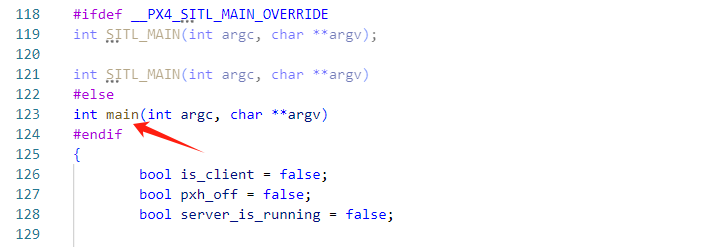

# 简介

在posix平台下（如Ubuntu），系统是已经准备好的，也就是底层已经准备好了，直接由操作系统运行编译生成的可执行文件即可。

# 启动流程

## 入口函数

应用层的入口函数在文件`platforms/posix/src/px4/common/main.cpp`中，入口函数所在位置如下图所示：



### is_client

启动px4固件后，第一次进入该main函数时is_client=false，后续启动各PX4各模块应用程序时is_client=true。

如果启动的程序为PX4内部线程，为了避免与linux已经运行的线程重名，会将PX4内部线程取别名，也就会添加前缀`px4-`，这类线程启动后也会进入这个main函数，例如px4-mavlink，这类线程就是client线程（is_client=true）！

### 传参

在vscode通过调试方式启动仿真后，对于非client线程，该函数的参数为：

- argv[0]=~/PX4-Autopilot/build/px4_sitl_default/bin/px4：可执行程序名；
- argv[1]=~/PX4-Autopilot/ROMFS/px4fmu_common：路径；

对于client线程，在启动脚本中启动，传入的参数有：

- argv[0]：线程名称，例如参数线程为px4-param；

- argv[1~n]：脚本中启动线程时给定的参数。

例如在脚本中`param compare SYS_AUTOSTART $SYS_AUTOSTART`，传入的参数为`px4-param --instance 0 compare SYS_AUTOSTART 4001`。


### 创建符合链接

创建链接，通过调用如下函数实现：

```c++
ret = create_symlinks_if_needed(data_path);
```


- dest目录为`~/PX4-Autopilot/build/px4_sitl_default/rootfs/etc`
- src目录为`~/PX4-Autopilot/ROMFS/px4fmu_common`

> 相当于：
>
> ```
> ln -s ~/PX4-Autopilot/ROMFS/px4fmu_common ~/PX4-Autopilot/build/px4_sitl_default/rootfs/etc
> ```


### 主程序初始化

```c++
px4::init_once();
px4::init(argc, argv, "px4");
```

其中px4::init_once()和px4::init()函数定义在`platforms/posix/src/px4/common/px4_posix_impl.cpp`文件中。

其中init_once()函数主要用于初始化工作队列、系统时钟、uorb、logger等中间件模块。

```c++
void init_once()
{
	_shell_task_id = pthread_self();

	work_queues_init();
	hrt_work_queue_init();

	px4_platform_init();
}
```

其中init()函数主要打印PX4的logo、设置线程名称。

```c++
void init(int argc, char *argv[], const char *app_name)
{
	printf("\n");
	printf("______  __   __    ___ \n");
	printf("| ___ \\ \\ \\ / /   /   |\n");
	printf("| |_/ /  \\ V /   / /| |\n");
	printf("|  __/   /   \\  / /_| |\n");
	printf("| |     / /^\\ \\ \\___  |\n");
	printf("\\_|     \\/   \\/     |_/\n");
	printf("\n");
	printf("%s starting.\n", app_name);
	printf("\n");

	// set the threads name
#ifdef __PX4_DARWIN
	(void)pthread_setname_np(app_name);
#else
	(void)pthread_setname_np(pthread_self(), app_name);
#endif
}
```


## 启动脚本

编译完成后生成可执行程序为/bin/px4。

程序启动后，就可以运行rcS启动脚本，rcS脚本的启动调用是在应用层入口函数内。

启动rcS的代码如下：

```c++
if (commands_file.empty()) {
    commands_file = "etc/init.d-posix/rcS";
}

ret = run_startup_script(commands_file, absolute_binary_path, instance);
```

这里：

- commands_file启动脚本，即`etc/init.d-posix/rcS`；
- absolute_binary_path表示绝对路径，即`PX4-Autopilot/build/px4_sitl_default`；
- instance程序实例号，这里启动第一个px4程序则为0。


# 打印信息

启动仿真程序后，我们可以通过终端打印的信息来查看启动流程。

## 入口函数

仿真程序启动后，首先进入main函数（`platforms/posix/src/px4/common/main.cpp`），然后调用`px4::init(argc, argv, "px4");`打印了PX4的LOGO信息，如下：

```bash
______  __   __    ___ 
| ___ \ \ \ / /   /   |
| |_/ /  \ V /   / /| |
|  __/   /   \  / /_| |
| |     / /^\ \ \___  |
\_|     \/   \/     |_/

px4 starting.
```


## 运行启动脚本

在main函数中，打印要运行的shell命令并运行至`ret = system(shell_command.c_str());`处调用rcS脚本。

```bash
INFO  [px4] startup script: /bin/sh etc/init.d-posix/rcS 0
```


