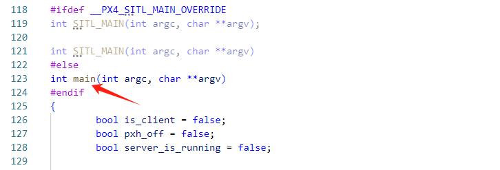

# 启动流程简述


# 应用层启动流程

## 启动平台程序

PX4仿真启动流程与真机启动有点不一样，在真机飞控嵌入式硬件平台需要先启动Nuttx系统，而仿真是直接运行在Linux上的，二者都是满足posix接口标准的系统，PX4的应用层程序是基于posix接口的。

## 启动rcS

平台程序启动后，就可以运行rcS启动脚本，rcS脚本的启动调用是在应用层入口函数内。

应用层的入口函数在文件`platforms/posix/src/px4/common/main.cpp`中，入口函数所在位置如下图所示：



启动rcS的代码如下：

```c++
		if (commands_file.empty()) {
			commands_file = "etc/init.d-posix/rcS";
		}
```


## 运行脚本

在Ubuntu启动仿真时，要运行的相关脚本所在路径为ROMFS/px4fmu_common/init.d-posix。

### 运行rcS脚本

rcS脚本为：ROMFS/px4fmu_common/init.d-posix/rcS。


### 运行仿真脚本

仿真脚本为：ROMFS/px4fmu_common/init.d-posix/px4-rc.simulator。

