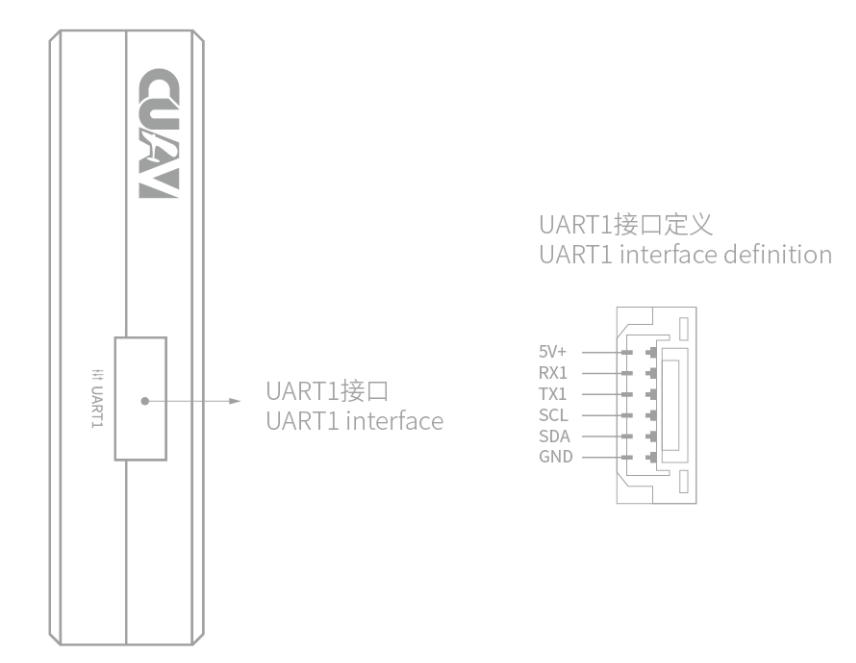
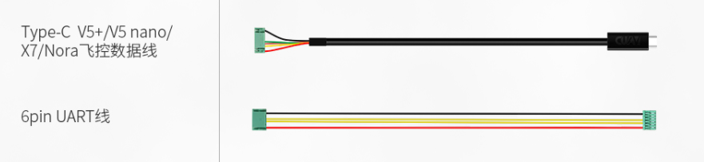

# RTK

RTCM协议

## 雷迅C-RTK9P

C-RTK 9P定位系统采用双端（基站端和移动端）相同设计，并且双端均采用相同固件，您只需加载不同的配置参数即可完成快速切换。

### 接口说明

模块包括了一个Type-C，一个UART1。

### 硬件连接

1. 机载端

- V5+：1）可使用type-C飞控数据线，连接RTK模块的Type-C与飞控的GPS&Safety即可。

  

- 

2. 地面端

地面端连接较为简单，只需要使用Type-C转USB线连接地面站电脑与RTK模块即可。连接完成后，启动地面站，会自动读取地面RTK模块数据，并通过数据链（mavlink协议）发送至飞控。

### 定位解算状态

- 定位解算中

  

- 定位完成

  

- 进入RTK

  完成RTK定位后，机载RTK模块的RTK灯亮绿色，地面站GPS状态为3D RTK GPS Lock(fixed)

  

