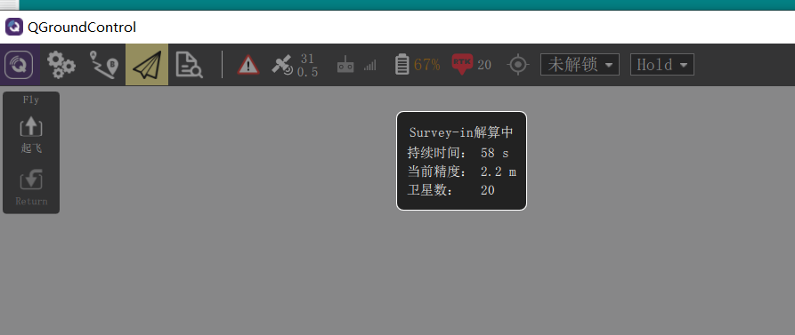
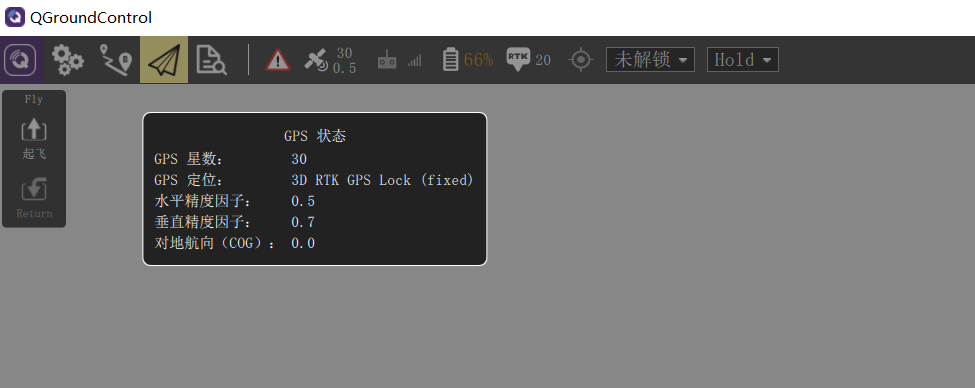

# RTK

RTCM协议

## 雷迅C-RTK9P

C-RTK 9P定位系统采用双端（基站端和移动端）相同设计，并且双端均采用相同固件，您只需加载不同的配置参数即可完成快速切换。

### 接口说明

模块包括了一个Type-C，一个UART1。

### 硬件连接

#### 机载端

- V5+飞控连接

  可使用type-C飞控数据线，连接RTK模块的Type-C与飞控的GPS&Safety即可。

  

#### 地面端

地面端连接较为简单，只需要使用Type-C转USB线连接地面站电脑与RTK模块即可。连接完成后，启动地面站，会自动读取地面RTK模块数据，并通过数据链（mavlink协议）发送至飞控。

### 定位解算状态

- 定位解算中

  

  `RTK`图标显示的是地面RTK模块的状态，只要地面RTK模块接入，地面站就会显示其状态信息。

- 定位完成

  

- 进入RTK

  完成RTK定位后，机载RTK模块的RTK灯亮绿色，地面站GPS状态为3D RTK GPS Lock(fixed)

  

## 双路GPS模块连接配置

PX4中，GPS可以连接两路，一个作为main（主）GPS_1实例，一个作为辅助GPS_2实例。这两个实例可以通过参数配置映射到具体连接串口。

例如GPS_1实例对应连接GPS1/safty串口的模块，则GPS_1_CONFIG=GPS1，若GPS_1实例对应连接UART4串口的模块，则GPS_1_CONFIG=GPS2。

> 但好像只有主GPS连接RTK GPS模块才可以进入RTK定位。

如果需要同时连接普通GPS模块和RTK模块，且需要进行RTK定位，则根据需要两个模块的连接线，进行对应连接和配置。

**配置示例一**

- 接线对应：普通GPS可以连接GPS1接口，RTK模块连接UART4

- 参数配置：GPS_2_CONFIG_=GPS1，GPS_1_CONFIG_=GPS2

